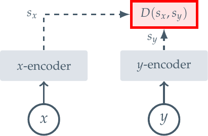
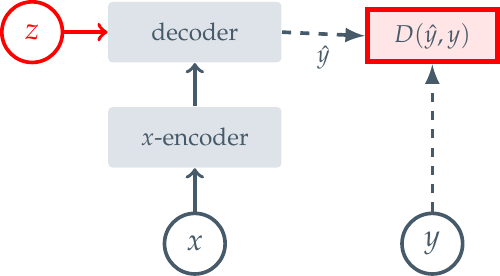
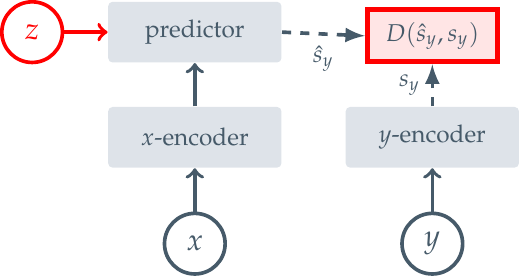

<!-- fullWidth: false tocVisible: false tableWrap: true -->
# Day 2: 自监督学习版图——SimCLR、MAE 与 I-JEPA

日期: **2026-07-10 周五**  
主题: **对比 contrastive learning、masked reconstruction 与 joint-embedding prediction**  
前置笔记: [Day 1: I-JEPA 必读部分提取笔记](day01_what_is_JEPA.md)

参考资料:

- SimCLR: *A Simple Framework for Contrastive Learning of Visual Representations*  
  <https://arxiv.org/abs/2002.05709>
- MAE: *Masked Autoencoders Are Scalable Vision Learners*  
  <https://arxiv.org/abs/2111.06377>
- I-JEPA: *Self-Supervised Learning from Images with a Joint-Embedding Predictive Architecture*  
  <https://arxiv.org/abs/2301.08243>

> 今天不追求记住所有模型细节，只抓住三个问题：**模型看到了什么、模型要预测什么、loss 比较什么。**

---

## 0. 今天只抓一个问题

**SimCLR、MAE 和 I-JEPA 都没有人工类别标签，它们从哪里获得训练信号？**

（自监督）它们都从数据本身构造监督目标，但构造目标的方式不同。

```text
SimCLR: 同一图像的两个增强视图应该拥有相近表征
MAE:    可见 patch 应该能够恢复被遮挡 patch 的像素
I-JEPA: context 的表征应该能够预测 target block 的抽象表征
```

一句话概括三条路线：

> **SimCLR 学“哪些视图应该相似”，MAE 学“缺失像素长什么样”，I-JEPA 学“缺失区域在语义空间中应该是什么”。**

---

## 1. 什么是自监督学习

### 1.1 “自监督”不是“没有监督目标”

监督学习通常依赖人工标注：

```text
图像 x + 人工标签 y -> 模型预测类别 y_hat -> 比较 y_hat 和 y
```

自监督学习不要求人工提供类别标签，而是从输入数据自身构造训练目标：

```text
原始数据 x
   -> 经过增强、遮挡或切分，构造输入 view/context
   -> 从同一份数据构造 positive view、pixel target 或 latent target
   -> 计算自监督 loss
```

因此，最准确的说法是：

> 自监督学习没有人工语义标签，但仍然有由数据本身产生的训练目标。

### 1.2 预训练和下游任务的关系

自监督预训练阶段通常只使用大量无标签数据。训练完成后，再用少量标签检查表征是否有用：

```text
无标签数据
   -> 自监督预训练 encoder
   -> 得到 representation
   -> linear probe / fine-tuning
   -> 分类、检测、分割、动作识别或规划任务
```

这里真正想学到的不是“把预训练任务做得多漂亮”，而是一个能迁移到其他任务的 encoder。

---

## 2. 三类视觉自监督学习路线

可以先把视觉自监督学习压缩成下面这张地图：

```text
视觉自监督学习
│
├─ A. 对比式联合嵌入：SimCLR
│    两个增强视图 -> 两个 embedding
│    正样本拉近，负样本推远
│
├─ B. 掩码生成式重建：MAE
│    可见 patches -> decoder
│    重建被遮挡 patches 的像素
│
└─ C. 联合嵌入预测：I-JEPA
     context representation -> predictor
     预测 target blocks 的 representation
```

需要注意一个术语边界：

- **Contrastive learning** 描述的是训练信号：用正负样本关系学习表征。
- **Masked reconstruction** 描述的是任务：遮住输入的一部分，再重建原始数据。
- **Joint embedding** 是更宽的架构概念：把不同输入映射到同一个表征空间再比较。
- SimCLR 也属于 joint-embedding 方法，但它采用对比损失；I-JEPA 则在 joint-embedding 空间里进行预测，因此叫 **joint-embedding predictive architecture**。

论文 Figure 2 用三张图概括了这些架构差异。

### 2.1 Joint-Embedding Architecture



它把两个相关视图分别编码，然后比较二者的 embedding。SimCLR 是这条路线的代表之一。

### 2.2 Generative Architecture



它直接预测数据空间中的目标。对 MAE 来说，目标就是被遮挡 patch 的原始像素。

### 2.3 Joint-Embedding Predictive Architecture



它不恢复目标 `y` 本身，而是预测目标的表征 `s_y`。I-JEPA 是这条路线在图像上的实现。

---

## 3. SimCLR：通过“视图一致性”学习表征

### 3.1 SimCLR 的核心问题

SimCLR 问的是：

> 同一张图像经过两种随机增强后，模型还能认出它们来自同一个样本吗？

例如，对一张狗的照片做两次随机增强：

```text
原图 x
├─ 随机裁剪 + 翻转 + 颜色扰动 -> view_i
└─ 随机裁剪 + 模糊 + 颜色扰动 -> view_j
```

虽然两个视图在像素层面可能差异很大，但它们仍来自同一张图像，所以应当具有相近的语义表征。

### 3.2 SimCLR 的训练流程

```text
同一张原始图像 x
       │
       ├─ augmentation t_i -> x_i -> encoder f -> h_i -> projector g -> z_i
       │
       └─ augmentation t_j -> x_j -> encoder f -> h_j -> projector g -> z_j

                         z_i 和 z_j 是正样本对
                 其他图像的 embedding 是负样本
```

各部分作用：

| 模块 | 输入 | 输出 | 作用 |
|---|---|---|---|
| Data augmentation | 原始图像 `x` | 两个随机视图 `x_i, x_j` | 人为规定模型应该忽略哪些变化 |
| Encoder `f` | 增强视图 | 表征 `h` | 学习可迁移的图像特征 |
| Projection head `g` | 表征 `h` | 对比空间向量 `z` | 在预训练时计算对比损失 |
| Contrastive loss | 正样本对与负样本 | 标量 loss | 拉近正样本，推远负样本 |

下游使用时，通常保留 encoder 输出 `h`，丢弃 projection head。

### 3.3 什么是正样本和负样本

对一个 batch 中的图像：

- 同一张原图产生的两个增强视图是 **positive pair**。
- 来自其他原图的视图通常被当作 **negative samples**。

训练方向可以直观写成：

```text
sim(z_i, z_j) 变大：同一图像的两个视图靠近
sim(z_i, z_k) 变小：不同图像的视图分开
```

这里的 `sim` 通常是归一化向量之间的 cosine similarity。

### 3.4 NT-Xent / InfoNCE 损失

对正样本对 `(i, j)`，SimCLR 的损失可以理解成：

```math
L_{i,j}
= -log
  \frac{exp(sim(z_i,z_j)/tau)}
       {\sum_{k \neq i} exp(sim(z_i,z_k)/tau)}
```

符号含义：

- `sim(z_i, z_j)`：两个向量的相似度。
- `tau`：temperature，控制相似度分布的尖锐程度。
- 分子：正样本对的相似度。
- 分母：当前 view 与 batch 中其他候选 view 的相似度总和。

优化这个式子，相当于要求模型在一批候选样本中识别出真正匹配的正样本。

### 3.5 SimCLR 实际学到了什么

模型被训练成对数据增强保持不变：

```text
颜色变化了        -> 仍应识别为同一语义对象
裁剪位置变化了    -> 仍应识别为同一语义对象
轻微模糊或翻转了  -> 仍应得到相近表征
```

因此，augmentation 不只是数据扩充，它实际上定义了模型需要学习的 **invariance**。

如果增强设计合理，模型会忽略无关变化；如果增强设计不合理，也可能删除任务需要的信息。例如，在颜色本身决定类别的任务中，过强的颜色扰动可能伤害表征。

### 3.6 SimCLR 的优点与局限

| 优点 | 局限 |
|---|---|
| 目标直观，语义表征通常较强 | 对数据增强策略非常敏感 |
| 不需要重建所有像素细节 | 原始 SimCLR 依赖大量负样本和较大 batch |
| 易于通过相似度理解训练过程 | 可能把语义相同的其他样本误当作负样本，即 false negatives |
| 适合实例级辨别和检索 | 学到什么 invariance 很大程度由人工增强决定 |

### 3.7 用“输入—目标—loss”概括 SimCLR

```text
输入：同一图像生成的两个随机增强视图
目标：同一图像的两个 embedding 相近，不同图像的 embedding 相对分开
loss：NT-Xent / InfoNCE 对比损失
```

---

## 4. MAE：通过“遮挡后重建像素”学习表征

### 4.1 MAE 的核心问题

MAE 问的是：

> 只看到图像中少量可见 patch，模型能否恢复被遮挡区域的原始像素？

它借鉴了 BERT 的 masked modeling 思路，但把 token 换成图像 patch。

### 4.2 MAE 的训练流程

```text
原始图像
   -> 切成固定大小的 patches
   -> 随机遮挡大部分 patches，原论文常用 75% mask ratio
   -> encoder 只处理可见 patches
   -> 加入 mask tokens 和位置信息
   -> lightweight decoder 重建被遮挡 patches
   -> 在 masked patches 上计算 pixel MSE
```

ASCII 流程图：

```text
image -> patchify -> [可见 patch + 被遮挡 patch]
                         │
                  只把可见 patch
                  送入 encoder
                         │
                    latent tokens
                         │
             加回 mask tokens 和位置编码
                         │
                       decoder
                         │
              重建 masked patch pixels
```

### 4.3 为什么 encoder 只处理可见 patch

MAE 的一个重要设计是：被遮挡的 patch 不进入 encoder。

这样做有两个作用：

1. 避免 encoder 在大量 mask token 上浪费计算。
2. 迫使 encoder 从少量可见内容中提取足够的信息。

较重的 encoder 负责学习表征，较轻的 decoder 负责完成像素重建。预训练结束后，decoder 通常被丢弃，只保留 encoder。

### 4.4 像素重建损失

设被遮挡 patch 的集合为 `M`，真实像素为 `x_p`，模型重建结果为 `x_hat_p`，则可以写成：

```math
L_{MAE}
= \frac{1}{|M|}
  \sum_{p \in M}
  ||x_p - \hat{x}_p||_2^2
```

关键点：

- loss 主要计算在被遮挡的 patch 上。
- 比较发生在 **pixel space**。
- 模型必须恢复目标区域的颜色、纹理、边缘等可见细节。

### 4.5 MAE 实际学到了什么

要重建大面积缺失内容，模型不能只复制邻近像素，它需要理解一定的图像结构：

```text
看到车轮和道路 -> 推断被遮挡区域可能是汽车车身
看到头部和四肢 -> 推断被遮挡区域可能属于动物
看到建筑轮廓   -> 推断缺失区域的边缘和纹理
```

但是，像素损失会同时要求模型关注很多低层细节。这些细节对重建是必要的，却不一定都对语义分类或规划有用。

### 4.6 MAE 的优点与局限

| 优点 | 局限 |
|---|---|
| 训练目标简单，不需要构造负样本 | pixel loss 会重视颜色、纹理等低层细节 |
| 高遮挡率降低 encoder 计算量 | 像素中存在多种合理结果时，逐像素误差可能鼓励平均化预测 |
| 对数据增强的依赖比 SimCLR 小 | 重建质量好不必然等于语义表征最好 |
| 非常适合大规模 ViT 预训练 | 训练时需要 decoder，尽管下游阶段通常丢弃它 |

### 4.7 用“输入—目标—loss”概括 MAE

```text
输入：图像中随机保留的可见 patches
目标：被遮挡 patches 的原始像素
loss：masked patches 上的像素级 MSE
```

---

## 5. I-JEPA：通过“context 预测 target 表征”学习表征

### 5.1 I-JEPA 的核心问题

I-JEPA 问的是：

> 根据图像中可见 context 的抽象表征，能否预测其他 target blocks 的抽象表征？

它和 MAE 都会隐藏部分图像信息，但二者的目标空间完全不同：

```text
MAE:    预测被遮挡区域的 pixels
I-JEPA: 预测 target blocks 的 representations
```

### 5.2 I-JEPA 的训练流程

```text
同一张图像
│
├─ context blocks
│    -> context encoder
│    -> context representations
│    -> predictor + target position tokens
│    -> predicted target representations
│
└─ 完整图像
     -> target encoder
     -> 从输出中选取 target-block representations
     -> stop-gradient，作为训练目标

predicted target representations
        与
target representations
        计算 representation-space loss
```

更紧凑地表示：

```text
context -> encoder -> predictor -> z_hat_target
full image/target -> EMA target encoder -> z_target

loss = distance(z_hat_target, stop_grad(z_target))
```

### 5.3 三个关键模块

| 模块 | 输入 | 输出 | 更新方式 |
|---|---|---|---|
| Context encoder | 可见 context patches | context representations | 通过反向传播更新 |
| Predictor | context representations + target 位置信息 | predicted target representations | 通过反向传播更新 |
| Target encoder | 完整图像；随后从输出中选取 target 位置 | target representations | 不直接反传，用 context encoder 的 EMA 更新 |

target encoder 的参数更新可写为：

```math
theta_{target}
<- m * theta_{target}
 + (1-m) * theta_{context}
```

其中 `m` 是接近 1 的 momentum coefficient。这样得到的 target 比直接使用快速变化的 student 参数更平滑。

### 5.4 Representation-space loss

设第 `m` 个 target block 的真实表征为 `z_m`，预测表征为 `z_hat_m`，则学习版公式为：

```math
L_{I-JEPA}
= \frac{1}{M}
  \sum_{m=1}^{M}
  distance(\hat{z}_m, stopgrad(z_m))
```

I-JEPA 论文采用的是 target patch representations 上的平均 **L1 distance**。最关键的不是 L1 这个具体形式，而是：

> loss 比较的是预测表征和目标表征，不是预测像素和真实像素。

### 5.5 为什么 latent target 更偏向语义

一个被遮挡区域在像素空间里可能有大量不可预测的细节：

- 物体表面的精确纹理；
- 光照造成的细微颜色变化；
- 草地、树叶或毛发的高频结构；
- 传感器噪声。

但是，它在抽象表征空间中可能仍有稳定的语义：

```text
精确像素未知，但可以判断这里是“一辆车的一部分”
纹理细节未知，但可以判断这里是“动物身体区域”
背景噪声未知，但可以判断这里与当前场景结构一致
```

因此，I-JEPA 希望模型把容量用于预测可预测的抽象信息，而不是重建所有低层细节。

### 5.6 I-JEPA 的优点与局限

| 优点 | 局限 |
|---|---|
| 不需要恢复所有像素细节 | target 表征本身也是学习得到的，训练设计更复杂 |
| 不依赖 SimCLR 式的大量负样本 | 必须处理表征坍塌和目标稳定性问题 |
| 对手工 view augmentation 的依赖较弱 | masking strategy 会显著影响任务难度和语义层次 |
| 目标形式更接近 latent world model | 图像版 I-JEPA 预测空间区域，不等于已经学会时间动力学或动作条件预测 |

### 5.7 用“输入—目标—loss”概括 I-JEPA

```text
输入：图像中的 context patches 及 target 的位置信息
目标：target encoder 输出的 target-block latent representations
loss：预测表征与目标表征之间的 L1 distance
```

---

## 6. 今日要求的核心对比表

### 6.1 最小三列表：输入、目标、loss

| 方法 | 输入 | 训练目标 | 典型 Loss |
|---|---|---|---|
| SimCLR | 同一张图像经过两次随机增强得到的两个视图 | 同一图像的两个 embedding 相近，并相对远离其他图像的 embedding | NT-Xent / InfoNCE 对比损失 |
| MAE | 图像中少量可见 patches | 被遮挡 patches 的原始像素 | masked pixel MSE |
| I-JEPA | context patches + target 位置信息 | target encoder 产生的 target-block latent representations | representation-space L1 distance |

### 6.2 扩展对比表

| 对比维度 | SimCLR | MAE | I-JEPA |
|---|---|---|---|
| 学习范式 | 对比式联合嵌入 | 掩码生成式重建 | 联合嵌入预测 |
| 数据如何变成训练任务 | 对同一图像做两次随机增强 | 随机遮挡大量 patches | 采样 context block 和多个 target blocks |
| 模型主要看到什么 | 两个增强视图 | 可见 patches | context patches |
| 要预测或约束什么 | 不同样本之间的相对相似关系 | 缺失区域的像素值 | 缺失区域的 latent representation |
| loss 所在空间 | embedding space | pixel space | learned representation space |
| 是否需要负样本 | 原始 SimCLR 需要 | 不需要 | 不需要 |
| 是否依赖强数据增强 | 较强 | 较弱 | 较弱，不以人工 view augmentation 为核心 |
| 是否需要 decoder/predictor | projection head | reconstruction decoder | latent predictor |
| target 是否固定 | 正负样本关系由 batch 和增强决定 | 原图像素是固定目标 | target encoder 表征随 EMA 缓慢变化 |
| 防止平凡解的主要方式 | 正负样本对比 | 必须重建真实像素 | EMA target encoder、stop-gradient、predictor 与 masking 等共同设计 |
| 更偏向学习什么 | 对增强不变的实例语义 | 图像结构与像素细节 | context 可预测的抽象语义 |
| 典型风险 | false negatives、增强偏置 | 过度关注低层细节 | collapse、mask 太简单或太困难、目标语义不稳定 |

---

## 7. 用同一张图像理解三种方法

假设输入是一张“草地上奔跑的狗”的照片。

### 7.1 SimCLR 怎么看

```text
view A：裁剪出狗的头部，颜色偏暗
view B：包含整只狗，经过翻转和模糊

训练要求：embedding(A) 与 embedding(B) 接近
```

它学习的是：即使视角、颜色和裁剪不同，这两个 view 仍属于同一个图像实例。

### 7.2 MAE 怎么看

```text
只显示少量 patch：狗头、草地和一条腿
遮住其余大部分区域

训练要求：恢复被遮挡区域的 RGB 像素
```

它既要判断那里可能是狗的身体，也要尽量恢复毛发、草地颜色和边缘等细节。

### 7.3 I-JEPA 怎么看

```text
context：狗头、草地和场景中的可见区域
target：狗身体所在的若干区域

训练要求：预测这些 target regions 的抽象表示
```

它不必决定每一根毛发的准确像素，更关心目标区域在语义和结构上应该具有怎样的表征。

### 7.4 这个例子说明了什么

```text
SimCLR 的不确定性被“增强不变性”处理
MAE 的不确定性被要求在像素空间中重建
I-JEPA 尝试在 latent space 中忽略难以预测的细节
```

---

## 8. 最容易混淆的四组关系

### 8.1 SimCLR 和 I-JEPA 都比较 embedding，为什么不是同一种方法

共同点：

- 二者都在 representation space 中计算 loss。
- 二者都不直接重建完整图像像素。

核心区别：

```text
SimCLR：比较两个增强视图的 embedding，并使用样本间对比关系
I-JEPA：从 context representation 预测 target representation
```

SimCLR 的问题更像“这两个 view 是否属于同一个实例”；I-JEPA 的问题更像“根据已知 context，另一个区域的 latent state 应该是什么”。

### 8.2 MAE 和 I-JEPA 都做 masking，核心差别在哪里

共同点：

- 都隐藏图像的一部分。
- 都要求模型利用可见区域推断不可见区域。

核心区别只有一句话：

```text
MAE 恢复 target 的 pixels；I-JEPA 预测 target 的 representations。
```

这会改变模型承担的不确定性：MAE 要解释细节，I-JEPA 可以在 target encoder 的抽象空间里忽略一部分难以预测的细节。

### 8.3 Projection head、decoder 和 predictor 是否一样

不一样：

| 模块 | 所属方法 | 主要任务 | 下游是否通常保留 |
|---|---|---|---|
| Projection head | SimCLR | 把 encoder feature 映射到对比损失空间 | 通常丢弃 |
| Reconstruction decoder | MAE | 从 latent tokens 重建像素 | 通常丢弃 |
| Predictor | I-JEPA | 根据 context representations 预测 target representations | 预训练核心模块，下游通常主要使用 encoder |

### 8.4 “不重建像素”是否一定更好

不是。目标选择取决于任务：

- 如果下游任务需要细粒度纹理和局部结构，像素重建可能很有价值。
- 如果更关心高层语义、状态预测或规划，latent prediction 可能更合适。
- 实际效果还受到模型规模、数据、mask 策略、优化方法和评估任务影响。

因此，不能简单说 `I-JEPA > MAE > SimCLR`。今天要理解的是它们施加学习压力的方式不同，而不是给三种方法排绝对名次。

---

## 9. 它们和 world model 有什么关系

### 9.1 三种方法分别提供什么能力

| 方法 | 主要提供的能力 | 与 world model 的距离 |
|---|---|---|
| SimCLR | 对观测变化保持稳定的表征 | 得到 state representation，但没有显式预测未来状态 |
| MAE | 从部分观测恢复完整观测的能力 | 学到空间结构，但目标仍是像素重建 |
| I-JEPA | 从 context representation 预测 target representation | 目标形式最接近 latent state prediction，但图像版仍不是动作条件动力学模型 |

### 9.2 I-JEPA 为什么更像 world model 的起点

一个用于规划的 latent world model 通常需要：

```text
当前观测 o_t
   -> encoder
   -> latent state z_t

latent state z_t + action a_t
   -> dynamics model
   -> predicted next latent state z_hat_{t+1}

planner 在 latent space 中比较候选动作结果
```

I-JEPA 已经采用“用 context 预测 latent target”的训练思想，因此比纯像素重建更接近抽象状态预测。但必须明确：

> **I-JEPA 本身不是完整 world model。** 它没有自动提供动作条件 `a_t`、长期时间动力学、reward/cost，也没有 planner。

后续从 I-JEPA 走向 V-JEPA 和 action-conditioned world model，需要继续加入：

1. 时间维度；
2. 动作条件；
3. 多步 latent dynamics；
4. 目标函数或 reward；
5. CEM、MPC 或其他 planner。

### 9.3 迁移到机器人或无线信道的例子

机器人视频：

```text
context = 当前几帧视觉观测
target  = 未来视频区域或未来时刻的 latent state
action  = 机器人执行的控制动作
```

无线信道：

```text
context = 已测量位置、历史时刻和环境信息的 channel features
target  = 未测位置或未来时刻的 channel latent representation
action  = 测量路径、波束选择或资源分配决策
```

这两个例子共同指向：先学习紧凑、可预测的 latent state，再让 dynamics 和 planner 在这个空间中工作。

---

## 10. 常见误区

### 误区 1：自监督学习完全没有标签

更准确的说法：没有人工类别标签，但有从数据自身构造的 pseudo-target 或 matching relation。

### 误区 2：SimCLR 直接预测图像类别

错误。预训练阶段 SimCLR 优化的是不同视图之间的 embedding 关系，不使用人工类别标签。

### 误区 3：MAE 的目标是预测一个语义 embedding

错误。标准 MAE 直接重建 masked patches 的像素值，loss 在 pixel space。

### 误区 4：I-JEPA 预测被遮挡区域的像素

错误。I-JEPA 预测 target encoder 给出的 latent representations。

### 误区 5：I-JEPA 就是在预测未来视频

错误。I-JEPA 是图像方法，主要预测同一图像中 target blocks 的表征。V-JEPA 才把 JEPA 思想扩展到视频时空内容。

### 误区 6：只要使用 EMA teacher 就绝不会 collapse

过度简化。EMA 和 stop-gradient 提供稳定目标，但非坍塌训练还依赖 predictor、架构、归一化、masking strategy 等整体设计。表征坍塌会在 Day 4 单独学习。

### 误区 7：latent prediction 一定优于 pixel reconstruction

错误。二者保留的信息和适用任务不同，需要用具体下游评估判断。

---

## 11. 五个理解检查

### 1. 三种方法的监督信号分别来自哪里

```text
SimCLR：同一图像不同增强视图之间的匹配关系
MAE：被遮挡区域的真实像素
I-JEPA：target encoder 产生的目标区域表征
```

### 2. 哪种方法明确使用 batch 中的负样本

原始 SimCLR。MAE 和 I-JEPA 不依赖负样本完成各自的训练目标。

### 3. 哪两种方法都使用 masking

MAE 和 I-JEPA。但 MAE 的 target 是 pixels，I-JEPA 的 target 是 representations。

### 4. 哪两种方法的 loss 在 representation space

SimCLR 和 I-JEPA。但 SimCLR 学的是视图间对比关系，I-JEPA 学的是 context-to-target prediction。

### 5. 为什么 I-JEPA 更容易和 latent world model 联系起来

因为它训练 predictor 根据 context representation 预测 target representation，目标形式已经是 latent-space prediction，而不是原始像素重建。但完整 world model 仍需时间、动作和规划模块。

---

## 12. 不看笔记时应该能复述的版本

### 12.1 30 秒版本

> 自监督学习从数据自身构造训练目标。SimCLR 把同一图像的两个增强视图作为正样本，用对比损失让它们的表征接近；MAE 遮挡大量图像 patch，再根据可见 patch 重建缺失像素；I-JEPA 同样从部分图像预测另一部分，但预测的是 target encoder 给出的抽象表征，而不是像素。因此，三者最关键的区别是监督目标分别是视图关系、原始像素和 latent representation。

### 12.2 三行记忆版

```text
SimCLR = augment -> compare embeddings
MAE    = mask -> reconstruct pixels
I-JEPA = mask/context -> predict target embeddings
```

### 12.3 最短关键词

```text
SimCLR：视图一致性
MAE：像素重建
I-JEPA：表征预测
```

---

## 13. 今日练习与完成标准

### 13.1 口头练习

不看上文，回答下面三个问题：

1. SimCLR 的正样本对是怎么构造的？
2. MAE 和 I-JEPA 虽然都遮挡图像，为什么学习目标不同？
3. I-JEPA 为什么比 MAE 更容易与 latent world model 联系起来？

### 13.2 纸笔练习

分别画出三条流程：

```text
SimCLR：image -> two views -> encoder -> embeddings -> contrastive loss
MAE：image -> visible patches -> encoder -> decoder -> pixels -> MSE
I-JEPA：context -> encoder -> predictor -> target embedding -> L1
```

### 13.3 今日完成标准

- [ ] 能用一句话解释什么是自监督学习。
- [ ] 能不看笔记说出 SimCLR、MAE、I-JEPA 的输入、目标和 loss。
- [ ] 能解释为什么 SimCLR 依赖 augmentation。
- [ ] 能解释 MAE 与 I-JEPA 的核心差异不只是 mask 形状，而是 target space。
- [ ] 能说明 I-JEPA 还不等于完整的 world model。

---

## 14. 与 Day 3 的衔接

Day 3 将专门比较 MAE 与 I-JEPA。开始前先记住今天留下的主线：

```text
二者都从可见区域推断不可见区域
        ↓
MAE 在 pixel space 完成重建
I-JEPA 在 representation space 完成预测
        ↓
目标空间不同，会改变模型关注的信息和处理不确定性的方式
```

明天最值得进一步追问的两个问题：

1. 如果同一个被遮挡区域存在多种合理像素结果，pixel loss 会怎样处理？
2. target encoder 的 latent representation 为什么可以过滤一部分不可预测细节？

---

## 15. 今日日志模板

```text
日期：2026-07-10
主题：自监督学习版图——SimCLR / MAE / I-JEPA

今天最重要的一句话：
SimCLR 学视图关系，MAE 重建像素，I-JEPA 预测表征。

我现在能讲清楚：
1. 
2. 
3. 

我还不清楚：
1. 
2. 

今天的产出文件：
notes/day02_self_supervised__learning.md

下一步：
画出 MAE 与 I-JEPA 的两张并排流程图，进入 Day 3。
```
