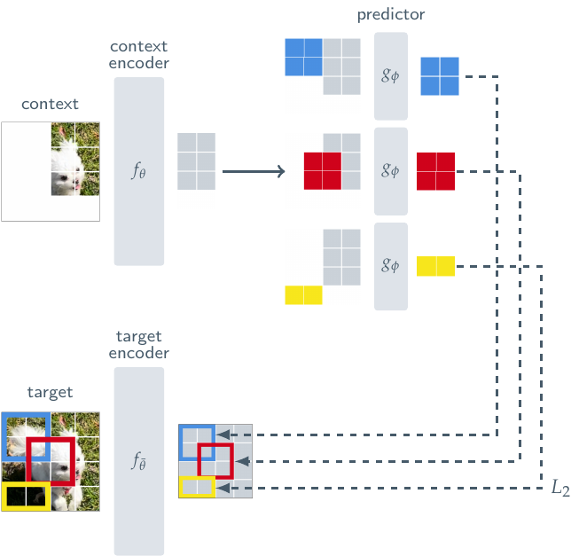

<!-- fullWidth: false tocVisible: false tableWrap: true -->
# Day 4: 表征坍塌——为什么只预测 latent 不一定会 collapse

日期: **2026-07-12 周日**  
主题: **理解 BYOL、DINO 与 I-JEPA 中 online/context encoder、target encoder、stop-gradient、EMA 和 predictor 的作用**  
前置笔记:

- [Day 2: 自监督学习版图](day02_self_supervised__learning.md)
- [Day 3: MAE vs I-JEPA](day03_mae_vs_ijepa.md)

参考资料:

- BYOL: *Bootstrap Your Own Latent: A New Approach to Self-Supervised Learning*  
  <https://arxiv.org/abs/2006.07733>
- DINO: *Emerging Properties in Self-Supervised Vision Transformers*  
  <https://arxiv.org/abs/2104.14294>
- SimSiam: *Exploring Simple Siamese Representation Learning*  
  <https://arxiv.org/abs/2011.10566>
- I-JEPA: *Self-Supervised Learning from Images with a Joint-Embedding Predictive Architecture*  
  <https://arxiv.org/abs/2301.08243>

> 今天只抓一个问题：**如果预测目标也是模型自己产生的 latent，为什么模型不把所有输入都映射成同一个向量，从而轻松得到零 loss？**

---

## 0. 今天的直接答案

先给结论：

> **只做 latent matching 的目标函数通常确实存在坍塌解；BYOL、DINO 和 I-JEPA 不是因为“坍塌在数学上不可能”而成功，而是通过不对称的双分支、stop-gradient、缓慢变化的 EMA target、predictor，以及各自的输出分布或 masking 设计，使实际训练不容易走向这个平凡解。**

必须同时记住两句话：

```text
第一句：constant representation 通常是 latent matching 的一个平凡最优解。
第二句：一个解存在，不代表梯度下降在实际训练动态中一定会到达它。
```

因此，今天不是寻找一个神奇的“防坍塌开关”，而是理解多种机制如何共同改变优化路径。

---

## 1. 什么是 representation collapse

### 1.1 完全坍塌

假设 encoder 是 `f`，输入图像为 `x`，输出 representation 为：

```math
z=f(x)
```

正常情况下，不同输入应该产生有差异的 representation：

```text
狗的图像    -> z_dog
汽车图像    -> z_car
建筑图像    -> z_building
```

如果模型对所有输入都输出同一个常数向量 `c`：

```math
f(x)=c, \quad \forall x
```

那么：

```text
狗      -> c
汽车    -> c
建筑    -> c
任何图片 -> c
```

这种情况叫作 **complete representation collapse（完全表征坍塌）**。

此时 representation 不再包含任何区分输入的信息，下游分类器也无法判断输入是什么。

### 1.2 为什么 loss 很小也可能什么都没学到

假设目标只是让两个相关 view 的 representations 相等：

```math
L=||f(x_1)-f(x_2)||^2
```

如果：

```math
f(x)=c, \quad \forall x
```

那么：

```math
L=||c-c||^2=0
```

Loss 达到最小值，但模型没有学习任何语义。

所以：

> **低预训练 loss 只说明模型满足了训练方程，不自动说明 representation 有信息。**

### 1.3 不完全坍塌或维度坍塌

坍塌不一定表现为所有向量完全相同。还可能出现：

- 只有少数维度发生变化，其余维度几乎恒定；
- 所有向量都集中在很小的子空间；
- representation covariance 的大部分特征值接近零；
- 向量之间的 cosine similarity 几乎都接近 1。

例如一个 128 维 representation 实际只使用一个维度：

```text
z = [变化值, 0, 0, 0, ..., 0]
```

这叫作 dimensional collapse。模型并非完全常数，但表示容量被严重浪费。

---

## 2. 为什么 SimCLR 和 MAE 的平凡解更容易被排除

先用 Day 2、Day 3 的方法建立对照。

### 2.1 SimCLR 依靠负样本关系

SimCLR 不只要求正样本接近，还要求正样本在其他候选 view 中具有更高的相对相似度。

如果所有输出都等于 `c`：

```text
positive similarity = 1
negative similarity = 1
```

模型无法从所有候选 view 中识别正确 positive，NT-Xent loss 不会达到理想值。

所以 SimCLR 使用：

```text
正样本拉近 + 负样本相对分开
```

显式排斥了所有样本完全相同的表示。

### 2.2 MAE 使用固定、非恒定的像素 target

MAE 的 target 是原始图像中不同位置的真实像素：

```text
狗的 target pixels != 汽车的 target pixels
```

如果 decoder 对所有输入都输出同一个常量 patch，它无法同时重建不同图片和不同位置的像素，因此 pixel MSE 通常会很大。

MAE 的 target 来自外部固定数据，而不是模型当前生成的 latent，所以常数表示很难在重建任务上取得零误差。

### 2.3 Latent self-distillation 为什么更危险

BYOL、DINO 和 I-JEPA 的 target 由另一个神经网络分支产生：

```text
student/online/context branch -> prediction
teacher/target branch         -> latent target
```

如果两条分支共同变成常数：

```text
prediction = c
target     = c
```

那么 latent matching loss 可以很小。

因此，无负样本 latent prediction 的关键问题不是“能不能把两个 view 拉近”，而是：

> 如何让它们在匹配的同时，仍然保留样本之间和空间位置之间的差异。

---

## 3. 一个最容易坍塌的对称结构

考虑两个完全对称、同时反向传播更新的 encoder：

```text
view 1 -> encoder A -> z1 ┐
                          ├-> minimize ||z1-z2||²
view 2 -> encoder B -> z2 ┘
```

如果两边都可以自由移动，它们只需要达成一致，并不一定要保持输入信息。

最简单的“一致”方案就是：

```text
encoder A 对所有输入输出 c
encoder B 对所有输入输出 c
```

这像两个人互相抄答案，但没有标准答案：

```text
A 改成什么，B 就跟着改
B 改成什么，A 也跟着改
最后两人可以一致写一个没有信息的固定答案
```

BYOL、DINO 和 I-JEPA 的第一步，就是打破这种完全对称、同时追逐的更新方式。

---

## 4. Stop-gradient：让 target 在当前 step 中成为固定参照

### 4.1 Stop-gradient 的定义

设 `sg(z)` 表示 stop-gradient：

前向传播时：

```math
sg(z)=z
```

反向传播时：

```math
\frac{\partial\,sg(z)}{\partial z}=0
```

也就是说：

- forward 时仍然读取 target value；
- backward 时不通过 target branch 更新参数。

### 4.2 加入 stop-gradient 后的数据流

```text
online view -> online encoder -> predictor -> prediction
                                            │
                                            ▼
                                     matching loss
                                            ▲
                                            │
target view -> target encoder -> target representation
                                  │
                             stop-gradient
```

反向传播只沿左侧进行：

```text
loss -> predictor -> online/context encoder
```

不会沿右侧进行：

```text
loss -X-> target encoder
```

### 4.3 Stop-gradient 解决了什么

在一个训练 step 内，online branch 面对的是一个暂时固定的目标：

```text
target 不会因为当前 loss 同时移动
online branch 必须主动去预测 target
```

这打破了两个分支完全对称、互相追逐的更新。

类比：

```text
没有 stop-gradient：两个人一边互相看答案，一边同时改答案
有 stop-gradient：当前轮固定老师答案，学生先完成匹配
```

### 4.4 Stop-gradient 不等于冻结 teacher 一辈子

Stop-gradient 只表示：

```text
target encoder 不通过当前 matching loss 的反向传播更新
```

在 BYOL、DINO 和 I-JEPA 中，target encoder 仍然会通过 EMA 得到新参数。

所以：

```text
不接收 gradient update != 永远不更新
```

### 4.5 Stop-gradient 单独是否保证不坍塌

不能这样断言。

即使 target branch stop-gradient，如果 target 本身已经对所有输入输出同一个 `c`，online branch 仍然可以学习输出 `c`。

因此 stop-gradient 的作用是：

> 打破同步更新的对称性并稳定当前目标，而不是从数学上消灭常数解。

SimSiam 表明，在合适的 predictor、stop-gradient、归一化和优化设置下，即使没有 EMA teacher 也可以学到非坍塌表征。这进一步说明关键在整体训练动力学，而不是某个单独组件的神奇作用。

---

## 5. EMA target encoder：提供缓慢变化的 teacher

### 5.1 EMA 更新公式

设：

- `theta`：online/context encoder 参数；
- `xi`：target encoder 参数；
- `m`：momentum coefficient，通常接近 1。

更新公式：

```math
\xi \leftarrow m\xi+(1-m)\theta
```

例如 `m = 0.99` 时：

```text
新 target 参数
= 99% 旧 target 参数
+ 1% 当前 online 参数
```

### 5.2 EMA 为什么比直接复制更稳定

如果每一步都直接令：

```text
target = online
```

target 会随着 noisy gradient 快速变化，online branch 相当于追逐一个不断跳动的目标。

EMA 会对多个历史时刻的 online parameters 做平滑：

```text
target_t
≈ 当前 online 的一小部分
 + 之前多个 online 状态的加权平均
```

因此 target encoder 可以理解为：

- online encoder 的时间集成；
- 一个低通滤波版本；
- 一个变化更慢的参考网络。

### 5.3 EMA 带来的时间尺度不对称

```text
Online encoder：每个 step 通过 gradient 快速更新
Target encoder：通过 EMA 缓慢跟随
```

于是训练变成：

```text
快速 student 预测缓慢 teacher
```

而不是：

```text
两个同速网络同时追逐彼此
```

### 5.4 Teacher 是否拥有人工真值

没有。这里的 teacher 不是人工标注老师，也不是一个预先训练好的完美模型。

它只是：

```text
online encoder 历史状态的平滑版本
```

称它为 teacher，是因为它在当前 step 提供 target，而不是因为它天然更正确。

### 5.5 EMA 单独是否保证不坍塌

也不能这样断言。

如果 online encoder 长期朝常数表示发展，EMA target 最终也可能跟随到常数表示。因此：

> EMA 提供稳定性和时间不对称，但不是对非坍塌的独立数学证明。

实际成功依赖 EMA 与 predictor、stop-gradient、归一化、数据视图或 masking 任务等共同作用。

---

## 6. Predictor：让 online branch 主动解决一个映射问题

### 6.1 为什么只在 online branch 放 predictor

以 BYOL 为例：

```text
Online branch：encoder -> projector -> predictor
Target branch：encoder -> projector
```

两条分支不完全相同，online branch 多一个 predictor `q`：

```math
prediction=q_\theta(z_{online})
```

然后去匹配：

```math
stopgrad(z_{target})
```

### 6.2 Predictor 的作用直觉

如果直接要求 online representation 与 target representation 完全相同，网络两边非常对称。

加入 predictor 后，online encoder 不必把自己的 representation 直接压成 target 的即时副本，而是可以：

```text
Online representation
   -> predictor 学习映射
   -> Target representation
```

Predictor 可以吸收一部分在线表示与目标表示之间的变换，让 encoder 保留更有用的结构。

### 6.3 为什么预训练后通常丢弃 predictor

Predictor 是为当前 latent prediction 目标服务的训练模块：

```text
预训练：encoder -> predictor -> latent matching loss
下游：  encoder -> downstream head
```

它类似 SimCLR 的 projection head、MAE 的 reconstruction decoder：帮助定义预训练任务，但最终希望保留的是 encoder 学到的通用 representation。

### 6.4 Predictor 是否单独保证不坍塌

也不是。

如果 encoder 和 target 都输出常数，predictor 仍然可能把常数映射到常数。因此应当记成：

> Predictor 引入了结构和优化上的不对称，并帮助 online branch 适配缓慢 teacher；它是整体防坍塌机制的一部分，不是单独的充分条件。

---

## 7. BYOL：没有负样本的双分支 latent matching

### 7.1 BYOL 的完整流程

对同一张图像产生两个增强 view：

```text
                         同一张图像 x
                       ┌───────┴───────┐
                       ▼               ▼
                   view v            view v'
                       │               │
                       ▼               ▼
              online encoder       target encoder
                   f_theta              f_xi
                       │               │
                       ▼               ▼
              online projector      target projector
                   g_theta              g_xi
                       │               │
                       ▼               ▼
              online predictor      target z'
                   q_theta              │
                       │            stop-gradient
                       ▼               │
                 prediction p          │
                       └───────┬───────┘
                               ▼
                    normalized matching loss

target parameters：xi <- m*xi + (1-m)*theta
```

实际训练还会交换两个 view 的方向，形成对称 loss：

```text
online(v) 预测 target(v')
online(v') 预测 target(v)
```

### 7.2 BYOL 的 loss

设 online prediction 为 `p`，target projection 为 `z'`，先做 L2 normalization：

```math
\bar{p}=\frac{p}{||p||_2},
\qquad
\bar{z}'=\frac{z'}{||z'||_2}
```

损失可以写成：

```math
L_{BYOL}=||\bar{p}-stopgrad(\bar{z}')||_2^2
```

它等价于最小化一个与负 cosine similarity 相关的目标。

### 7.3 BYOL 为什么没有使用 negatives

BYOL 不要求：

```text
其他图片必须被推远
```

它只要求 online branch 预测 target branch 对另一个 view 的表示。

这避免了：

- 大 batch 只是为了提供更多 negatives；
- 语义相同图片被当作 false negatives。

但同时也使 collapse 成为核心问题。

### 7.4 对 BYOL 的准确理解

不要把 BYOL 简化成：

```text
只要 EMA 就不会 collapse
```

更准确的说法是：

```text
stop-gradient
+ online/target 参数更新不对称
+ online-only predictor
+ target EMA
+ normalization 和网络训练动态
+ 两个信息相关但外观不同的 views
共同形成了实际有效的非坍塌学习过程
```

关于 BYOL 为什么不坍塌，后续研究从 predictor、BatchNorm、优化隐式正则化、目标网络和特征统计等角度给出了多种分析。学习阶段最安全的结论是：**不存在一个可以脱离其他条件、单独解释全部现象的简单组件。**

---

## 8. DINO：用 teacher distribution、centering 和 sharpening 控制输出

### 8.1 DINO 的基本结构

DINO 也使用 student-teacher 架构：

```text
同一图像的多个 crops
│
├─ global/local crops -> student network -> student logits -> softmax
│
└─ global crops       -> teacher network -> center + sharpen -> softmax

student distribution 与 stop-gradient teacher distribution 做 cross-entropy
teacher parameters 由 student parameters 的 EMA 更新
```

Student 通常会看到 global crops 和 local crops；teacher 通常只处理 global crops。Student 被训练成从不同尺度和局部视图预测 teacher 对全局视图给出的输出分布。

### 8.2 DINO 的输出不是人工类别标签

DINO head 会输出一组 logits，然后转换成概率分布：

```math
P_s(x)^{(i)}
=
\frac{\exp(g_s(x)^{(i)}/\tau_s)}
{\sum_k \exp(g_s(x)^{(k)}/\tau_s)}
```

Teacher 的 logits 会先减去一个 running center，再使用 teacher temperature：

```math
P_t(x)^{(i)}
=
\frac{\exp((g_t(x)^{(i)}-c^{(i)})/\tau_t)}
{\sum_k \exp((g_t(x)^{(k)}-c^{(k)})/\tau_t)}
```

这里的输出维度不是人工类别，而是模型自组织形成的表示维度或 prototype-like outputs。

### 8.3 DINO loss

Student 预测 teacher distribution：

```math
L_{DINO}
=-\sum_i P_t(x')^{(i)}\log P_s(x)^{(i)}
```

Teacher distribution 使用 stop-gradient，teacher 参数通过 student 的 EMA 更新。

### 8.4 DINO 中的两类 collapse

概率输出可能出现两种极端：

1. 所有样本都输出几乎相同的均匀分布；
2. 所有样本都集中到同一个输出维度。

DINO 使用 centering 和 sharpening 的平衡来处理这些趋势。

### 8.5 Centering 的作用

Teacher logits 的 running center 可以写成：

```math
c \leftarrow m_c c
 +(1-m_c)\frac{1}{B}\sum_{b=1}^{B}g_t(x_b)
```

然后 teacher logits 在 softmax 前减去 `c`。

直觉上，centering 会抑制某些输出维度长期对所有样本占据绝对优势，帮助不同维度在数据分布上得到使用。

### 8.6 Sharpening 的作用

Teacher 使用较低 temperature，使输出分布更尖锐：

```text
高 temperature -> 分布更平、更接近 uniform
低 temperature -> 分布更尖、更有选择性
```

Sharpening 可以避免 teacher 对所有样本只提供完全均匀、没有区分度的目标。

### 8.7 两者为什么要平衡

DINO 论文强调，centering 和 sharpening 对输出分布有相反方向的影响：

- centering 抑制单个维度支配，但单独使用可能推动过于均匀的输出；
- sharpening 避免完全均匀，但单独使用可能让输出集中到少数维度；
- 两者结合，再配合 EMA teacher 和多视图训练，维持有区分度的输出。

因此 DINO 的防坍塌设计比一句“teacher-student”更具体：

```text
EMA teacher
+ stop-gradient
+ multi-crop view prediction
+ teacher centering
+ teacher sharpening
```

---

## 9. I-JEPA：把双分支自蒸馏用于空间 target prediction

### 9.1 I-JEPA 的双分支对应关系

I-JEPA 可以用相似的 student-teacher 视角理解：

| 自蒸馏术语 | I-JEPA 中的模块 |
|---|---|
| Student / online encoder | Context encoder |
| Student prediction head | Predictor |
| Teacher encoder | Target encoder |
| Teacher update | Context encoder 参数的 EMA |
| Teacher target | Target-block representations |
| Stop-gradient | Target representations 不参与反向传播 |

### 9.2 I-JEPA 完整数据流

```text
                               同一张图像 x
                       ┌────────────┴────────────┐
                       │                         │
                       ▼                         ▼
                 context mask              完整图像输入
                       │                         │
                       ▼                         ▼
              Context Encoder f_theta   Target Encoder f_xi
                       │                         │
                       ▼                         ▼
          context representations h_C   full-image representations
                       │                         │
             + target positions                 │
                       │              select target positions T
                       ▼                         │
                 Predictor q_psi                ▼
                       │               target representations s_T
                       ▼                         │
         predicted representations s_hat_T   stop-gradient
                       └────────────┬────────────┘
                                    ▼
                           Representation L1 loss

Target update：xi <- m*xi + (1-m)*theta
```

I-JEPA 原始训练结构：



### 9.3 I-JEPA 的 loss

```math
L_{I-JEPA}
=\frac{1}{|T|}
 \sum_{p\in T}
 ||\hat{s}_p-stopgrad(s_p)||_1
```

其中：

```math
\hat{s}_T=q_\psi(f_\theta(x_C),pos_T)
```

```math
s_T=select_T(f_\xi(x))
```

### 9.4 I-JEPA 中哪些设计有助于非坍塌学习

#### 1. Target branch stop-gradient

当前 step 的 target representation 是固定参考，不能通过 loss 与 context branch 同时朝一个常数移动。

#### 2. EMA target encoder

Target representations 来自 context encoder 历史状态的平滑版本，变化更慢。

#### 3. Predictor asymmetry

只有 context branch 需要通过 predictor 将 context representations 映射到 target representation space。

#### 4. Context-target 信息不对称

Context encoder 看不到 target 内容，却需要预测 target encoder 在对应位置产生的表示。这不是简单复制同一个输入的 embedding。

#### 5. Multi-block masking

多个较大 target blocks 和信息充分的 context 形成非平凡空间预测任务。不同图片、不同位置和不同 target blocks 会产生丰富的训练约束。

#### 6. ViT token 与位置结构

Predictor 需要为不同 target positions 产生不同 patch-level representations，而不是只输出一个全局常数向量。

### 9.5 是否可以说 I-JEPA 从数学上绝不会 collapse

不可以。

如果：

```math
f_\theta(x_C)=c,
\quad
f_\xi(x)=c,
\quad
q_\psi(c,pos_T)=c
```

那么 latent matching loss 仍可能是零。

所以 constant solution 在目标函数层面仍然存在。更准确的表述是：

> I-JEPA 的非对称架构、EMA teacher、stop-gradient、predictor 和 masking 任务共同塑造训练动态，使模型在实践中能够学习非坍塌 representation；不能把其中任何单个组件说成绝对保证。

---

## 10. BYOL、DINO、I-JEPA 对照表

| 维度 | BYOL | DINO | I-JEPA |
|---|---|---|---|
| 输入关系 | 同一图像的两个增强 views | 同一图像的 global/local crops | 同一图像的 context 与 target regions |
| Online/student 输入 | 一个增强 view | global + local crops | context patches |
| Target/teacher 输入 | 另一个增强 view | global crops | 完整图像，输出后选择 target positions |
| Online 特有模块 | Predictor | Student head；无 BYOL 式同形 predictor 概念 | Predictor |
| Target 形式 | Normalized projected vector | Centered、sharpened probability distribution | Target patch representations |
| Loss | Normalized MSE / cosine-style | Cross-entropy | Representation L1 |
| Negatives | 不需要 | 不需要 | 不需要 |
| Stop-gradient | Target output | Teacher output | Target output |
| Teacher 更新 | Online 参数 EMA | Student 参数 EMA | Context encoder 参数 EMA |
| 显式输出分布控制 | 主要依赖归一化和训练设计 | Centering + sharpening | 没有 DINO 式 centering/sharpening |
| 预测任务 | 跨增强 view 表征匹配 | 跨尺度 crop 分布匹配 | Context-to-target spatial representation prediction |
| 下游主要保留 | Encoder | Backbone/encoder | Encoder |

共同骨架：

```text
快速更新的 student/online/context branch
              │
              ├─ predictor or student head
              │
              ▼
          预测 latent target
              ▲
              │
缓慢更新且 stop-gradient 的 teacher/target branch
```

差别在于它们如何构造 target，以及如何维持 target distribution 的信息量。

---

## 11. 五种机制分别解决什么问题

| 机制 | 主要作用 | 不能单独保证什么 |
|---|---|---|
| Stop-gradient | 阻止 target branch 被当前 loss 同步拖动，打破梯度对称 | 不能保证 target 本身永不变成常数 |
| EMA teacher | 提供平滑、滞后的目标，形成快 student/慢 teacher | 不能阻止长期共同走向常数 |
| Predictor asymmetry | 让 online branch 主动学习到 teacher space 的映射 | 常数输入仍可被映射为常数 |
| Centering/sharpening | 控制 DINO teacher 输出在维度间的使用和置信度 | 不是 BYOL/I-JEPA 的通用同款组件 |
| View/masking task | 迫使模型从不同但相关的信息预测目标，提供数据变化和结构约束 | 如果任务设计不合理，仍可能学到捷径或退化表示 |

最重要的理解是：

```text
防坍塌不是单个开关
而是目标、架构、梯度路径、参数更新和数据任务共同形成的训练动力学
```

---

## 12. 为什么 teacher 不会只是复制 student 的错误

Teacher 确实来源于 student，所以不能把它当成外部真理。

但 teacher 与 student 的关系不是当前 step 的直接复制：

```text
Student：根据当前 batch 的 gradient 快速变化
Teacher：聚合多个历史 student 状态，缓慢变化
```

Teacher 提供的是一种 temporal consistency：

```text
当前 student 必须预测一个历史平滑参考
而不是只与当前自己立即达成一致
```

这类似 self-distillation：

1. 初始 teacher 与 student 参数相同或接近；
2. student 在不同 view/context 上接受预测任务；
3. teacher 平滑吸收 student 学到的新结构；
4. 新 teacher 再为后续 student 提供更稳定目标；
5. 两者形成 bootstrap 过程。

这里的风险仍然存在：如果 bootstrap 方向错误，teacher 也会积累错误。因此实际系统还需要合理的 normalization、温度、mask、数据增强、优化超参数和评估监控。

---

## 13. 怎么判断模型是否发生了 collapse

仅观察训练 loss 不够。Collapse 时 loss 可能非常低。

### 13.1 Batch feature standard deviation

对一个 batch 的 representations `Z ∈ R^{B×D}`，计算每个维度在 batch 方向上的标准差：

```math
std_d = std(Z_{:,d})
```

如果大量维度的 `std_d` 接近 0，说明不同样本在这些维度上几乎没有差异。

### 13.2 Pairwise cosine similarity

随机取不同图片的 representations，计算：

```math
cos(z_i,z_j)
```

如果几乎所有不同样本的 cosine similarity 都接近 1，可能发生完全或严重坍塌。

### 13.3 Covariance eigenvalues

计算 feature covariance：

```math
C=\frac{1}{B-1}(Z-\bar{Z})^T(Z-\bar{Z})
```

观察其 eigenvalue spectrum：

- 多个特征值具有合理大小：representation 使用多个方向；
- 只有极少特征值非零：发生 dimensional collapse；
- 所有特征值接近零：接近完全坍塌。

### 13.4 Effective rank

可以根据 covariance singular values 估计有效秩。有效秩远低于 representation dimension，说明模型只使用了很小的子空间。

### 13.5 Downstream evaluation

最终仍要检查 representation 是否支持：

- linear probe；
- k-nearest-neighbor classification；
- retrieval；
- segmentation 或 detection；
- 目标任务的 fine-tuning。

如果预训练 loss 很低，但 linear probe 接近随机猜测，需要警惕 collapse 或其他无用捷径。

### 13.6 只看 feature norm 为什么不够

所有样本可能拥有相同但非零的向量：

```text
z_i = [1, 1, 1, ..., 1]
```

此时 feature norm 不为零，但 representation 仍然完全坍塌。因此必须检查样本间方差和 covariance，而不是只看向量大小。

---

## 14. 用 PyTorch 风格伪代码理解 stop-gradient 与 EMA

### 14.1 BYOL 风格

```python
# online branch: receives gradients
h_online = online_encoder(view_1)
z_online = online_projector(h_online)
p_online = predictor(z_online)

# target branch: no gradients
with torch.no_grad():
    h_target = target_encoder(view_2)
    z_target = target_projector(h_target)

loss = normalized_mse(p_online, z_target)

optimizer.zero_grad()
loss.backward()
optimizer.step()

# target parameters are updated by EMA, not optimizer gradients
for target_param, online_param in pairs:
    target_param = m * target_param + (1 - m) * online_param
```

### 14.2 I-JEPA 风格

```python
# context/student branch
h_context = context_encoder(context_patches)
z_pred = predictor(h_context, target_positions)

# target/teacher branch
with torch.no_grad():
    z_full = target_encoder(full_image)
    z_target = select_target_positions(z_full, target_positions)

loss = l1_loss(z_pred, z_target)

optimizer.zero_grad()
loss.backward()       # updates predictor + context encoder
optimizer.step()

ema_update(target_encoder, context_encoder, momentum=m)
```

这段伪代码最重要的不是语法，而是两条更新路径：

```text
Gradient update：predictor + online/context encoder
EMA update：target encoder
```

---

## 15. 常见误区

### 误区 1：Stop-gradient 表示 target branch 前向传播也停止

错误。Target branch 仍正常计算 representation，只是 backward 时梯度为零。

### 误区 2：Target encoder 永远不更新

错误。它不通过 loss gradient 更新，但通过 online/context encoder 参数的 EMA 更新。

### 误区 3：EMA teacher 是一个预训练好的真老师

错误。Teacher 是 student 历史参数的平滑版本，没有外部人工标签。

### 误区 4：只要使用 EMA，就从数学上不可能 collapse

错误。Constant solution 仍可能存在；EMA 主要改变稳定性和时间尺度。

### 误区 5：Stop-gradient 单独就是完整解释

不完整。它打破梯度对称，但不能单独保证 target 保持多样性。

### 误区 6：没有负样本就一定会 collapse

错误。BYOL、DINO、SimSiam 和 I-JEPA 说明，在合适的不对称架构和训练动力学下，无负样本方法也能学习有用表征。

### 误区 7：Loss 不下降表示 collapse

错误。Collapse 的典型危险恰恰可能是 loss 很低但 features 没有方差。判断 collapse 必须检查 representation statistics 和下游性能。

### 误区 8：所有 feature norm 很大就没有 collapse

错误。所有样本可以共享同一个非零大向量，仍然是完全坍塌。

### 误区 9：DINO 的输出维度就是人工类别

错误。DINO 没有使用人工类别标签，其 teacher distribution 是模型自组织形成的输出。

### 误区 10：I-JEPA 的 target encoder 只读取 target crop

不准确。Target encoder 处理完整图像，然后从 representation grid 中选择 target positions。

---

## 16. 七个理解检查

### 1. 为什么单纯最小化两个 latent 的距离存在平凡解

如果所有输入都映射到相同常数 `c`，任意两个 latent 的距离都是零。

### 2. Stop-gradient 在 forward 和 backward 中分别做什么

Forward 返回原始 target value；backward 将该分支梯度设为零。

### 3. Stop-gradient 后 target encoder 如何学习

在 BYOL、DINO 和 I-JEPA 中，target/teacher 参数通过 online/student/context 参数的 EMA 更新。

### 4. EMA target 的核心价值是什么

它提供 student 历史状态的平滑版本，使 target 变化更慢，形成快 student、慢 teacher 的时间尺度不对称。

### 5. Predictor 为什么只放在 online/context branch

它让 online branch 主动学习从自身 representation 到 teacher representation 的映射，打破两条分支完全对称。

### 6. DINO 额外使用什么输出分布控制

Teacher centering 和低温 sharpening；二者平衡输出维度支配与完全均匀分布的风险。

### 7. I-JEPA 为什么不需要 SimCLR 式 negatives

它通过 context-to-target latent prediction 学习，不以实例间相对排斥作为目标；非坍塌训练由双分支不对称、EMA、stop-gradient、predictor 和 masking 任务共同支持。

---

## 17. 今日计划要求的正式回答

### 为什么只预测 latent 不一定会坍塌

> 仅最小化两个 latent representations 之间的距离，确实存在所有输入都映射到同一常数向量的坍塌解。但是，BYOL、DINO 和 I-JEPA 没有使用两个完全对称并同时反向传播的网络。它们将训练分成快速更新的 online/student/context branch 与缓慢更新的 target/teacher branch：target output 被 stop-gradient，当步只作为固定参照；target parameters 通过 online parameters 的 EMA 更新，从而形成稳定且滞后的目标；online branch 还需要经过 predictor 或 student head 主动预测 teacher representation。DINO 进一步通过 centering 与 sharpening 控制 teacher 输出分布，I-JEPA 则通过 context-target 信息不对称和 multi-block spatial prediction 提供非平凡约束。这些机制共同改变优化动态，使模型在实践中能够保持有差异的 representations。需要强调的是，stop-gradient、EMA 或 predictor 中任何一个都不能单独构成“绝不坍塌”的数学保证，constant solution 在目标函数层面仍可能存在，因此还必须通过 feature variance、covariance spectrum 和下游评估检查表示是否真正有信息。

### 口头精简版

> Latent matching 有常数解，但实际方法通过固定当前 teacher、缓慢更新 teacher、让 student 单向预测 teacher，并利用多视图或 context-target 任务保持数据差异，使优化过程不容易走向常数表示。EMA 和 stop-gradient是整体训练动力学的一部分，不是单独的防坍塌魔法。

---

## 18. 不看笔记时应该能复述的版本

### 18.1 30 秒版本

> 表征坍塌是指不同输入都得到相同或低秩 representation。无负样本 latent matching 确实存在这个平凡解。BYOL、DINO 和 I-JEPA 使用 stop-gradient，使 teacher 在当前 step 中成为固定目标；再用 EMA 让 teacher 缓慢跟随 student，并用 predictor 打破结构对称。DINO 还使用 centering 和 sharpening，I-JEPA 使用 context-to-target multi-block prediction。它们共同让实际优化保持非坍塌特征，但任何单个组件都不是绝对保证，因此还要检查 batch variance、covariance 和下游性能。

### 18.2 四行记忆版

```text
Collapse：所有输入 -> 同一个或低秩 latent
Stop-gradient：当前 step 不让 target 被 loss 推着走
EMA teacher：用历史 student 构造缓慢、稳定的目标
Predictor/task design：打破对称并形成非平凡预测任务
```

### 18.3 最短主线

```text
目标函数允许 collapse
不代表优化一定到达 collapse
非对称架构 + 稳定 teacher + 合理任务共同决定训练路径
```

---

## 19. 今日练习与完成标准

### 19.1 纸笔练习

画出三张图：

1. 一个会直接 collapse 的对称 latent matching 结构；
2. BYOL 的 online-target 双分支和 EMA 更新；
3. I-JEPA 的 context-target 双分支和梯度路径。

### 19.2 思考练习

不看上文回答：

1. 为什么 `loss = 0` 不代表 encoder 学到了有用表征？
2. Stop-gradient 与冻结 target encoder 有什么区别？
3. 如果 target encoder 最终也输出常数，EMA 能否自动修复？
4. 为什么 DINO 同时需要 centering 和 sharpening？
5. 为什么只检查 feature norm 无法发现 collapse？

### 19.3 完成标准

- [ ] 能写出常数表示为什么让 latent matching loss 为零。
- [ ] 能解释 stop-gradient 的 forward/backward 行为。
- [ ] 能写出 target encoder 的 EMA 更新公式。
- [ ] 能区分 gradient update 和 EMA update。
- [ ] 能画出 BYOL 的 online-target 数据流。
- [ ] 能说明 DINO centering 与 sharpening 的作用。
- [ ] 能把 BYOL 的 student-teacher 术语映射到 I-JEPA 模块。
- [ ] 能说出至少三种 collapse 检查指标。
- [ ] 不再说“EMA 单独保证不会 collapse”。

---

## 20. 与 Day 5 的衔接：为什么需要理解 ViT token

Day 4 把 I-JEPA 看成：

```text
context representations
   -> predictor
   -> target patch representations
```

但还留下几个结构问题：

- 一张图像如何变成 patch tokens？
- 每个 token 为什么知道自己的空间位置？
- Transformer block 如何让远距离 patches 交换信息？
- `CLS token` 与 patch tokens 有什么区别？
- I-JEPA 为什么主要预测 patch-level target representations？

Day 5 将复习：

```text
image
 -> patches
 -> patch embeddings
 -> positional embeddings
 -> Transformer blocks
 -> output features
```

---

## 21. 今日日志模板

```text
日期：2026-07-12
主题：表征坍塌、stop-gradient 与 EMA teacher

今天最重要的一句话：
Latent matching 存在坍塌解，但实际训练路径由非对称架构、稳定 teacher 和预测任务共同决定。

我现在能解释：
1. 什么是 complete collapse：
2. 什么是 dimensional collapse：
3. Stop-gradient 的作用：
4. EMA target encoder 的作用：
5. Predictor 的作用：
6. 为什么不能说 EMA 单独保证不坍塌：

我会用这些指标检查 collapse：
1.
2.
3.

我还不清楚：
1.
2.

今天的产出文件：
notes/day04_representation_collapse.md

下一步：
手写 ViT 数据流：image -> patches -> tokens -> features。
```
