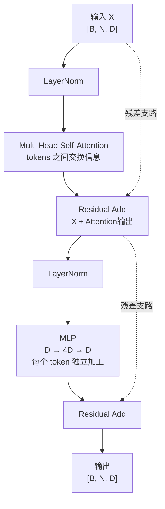

<!-- fullWidth: false tocVisible: false tableWrap: true -->
# Day 5: ViT 基础——一张图像如何变成 patch tokens 和 features

日期: **2026-07-13 周一**  
主题: **理解 patch embedding、positional embedding、CLS token 与 Transformer block，并手写完整 ViT 数据流**  
前置笔记:

- [Day 3: MAE vs I-JEPA](day03_mae_vs_ijepa.md)
- [Day 4: 表征坍塌](day04_representation_collapse.md)

参考资料:

- ViT: *An Image is Worth 16x16 Words: Transformers for Image Recognition at Scale*  
  <https://arxiv.org/abs/2010.11929>
- Transformer: *Attention Is All You Need*  
  <https://arxiv.org/abs/1706.03762>
- I-JEPA: *Self-Supervised Learning from Images with a Joint-Embedding Predictive Architecture*  
  <https://arxiv.org/abs/2301.08243>

> 今天只抓一个问题：**ViT 如何把形状为 `[B, C, H, W]` 的图像，逐步变成一串能够表达图像内容与空间关系的 token features？**

---

## 0. 今天的直接答案

ViT 的主线可以先压缩成六步：

```text
图像
 -> 切成固定大小的 patches
 -> 每个 patch 展平并线性投影成 token
 -> 加入位置编码，告诉模型每个 token 来自哪里
 -> 可选地在序列最前面加入 CLS token
 -> 多个 Transformer blocks 让所有 tokens 交换信息
 -> 得到包含全局上下文的 token features
```

以最经典的输入为例：

```text
输入图像：         [B, 3, 224, 224]
patch 大小：       16 × 16
patch 网格：       14 × 14
patch 数量：       196
每个 patch 原始维度：3 × 16 × 16 = 768
embedding 维度：   D = 768
加入 CLS 后序列：  [B, 197, 768]
经过 ViT encoder：[B, 197, 768]
```

最重要的认识是：

> **ViT 没有把二维图像“神秘地”交给 Transformer。它先把图像改写成一个 token 序列；Transformer 处理的始终是序列。**

---

## 0.1 今天的进度安排（约 2 小时）

考虑到这是第一次系统学习 ViT，今天不追求记住所有模型变体，只完成一条闭环：**能看懂 shape，能画出数据流，能把 ViT 接回 I-JEPA。**

| 时间 | 学习内容 | 必须留下的结果 |
|---:|---|---|
| 0–20 分钟 | 阅读第 1–3 节 | 手算 `224/16`，写出 `[B,3,224,224] -> [B,196,768]` |
| 20–40 分钟 | 阅读第 4–5 节 | 用两句话区分 position embedding 与 CLS token |
| 40–75 分钟 | 阅读第 6–10 节 | 手写 attention 公式，并标出 `[N,N]` 权重矩阵 |
| 75–95 分钟 | 阅读第 11–12 节 | 不看答案画一次完整 ViT 数据流 |
| 95–110 分钟 | 阅读第 14–15 节 | 解释 I-JEPA 为什么预测 patch-level features |
| 110–120 分钟 | 完成第 20 节练习与日志 | 至少做对 Shape tracing，并记录两个疑问 |

如果今天只有 60 分钟，执行最小版本：

```text
第 1–5 节：理解 patches、embedding、position、CLS
第 11–12 节：抄写一次并默画一次完整数据流
第 14 节：理解这些 tokens 如何进入 I-JEPA
```

今天暂时不要求：

- 推导完整反向传播；
- 背诵 ViT-B、ViT-L、ViT-H 的所有配置；
- 阅读复杂高效 attention 变体；
- 运行大规模训练；
- 记住每一种位置编码的实现细节。

---

## 1. 先建立张量语言

### 1.1 图像张量的四个维度

PyTorch 中一批图像通常写成：

```text
x.shape = [B, C, H, W]
```

其中：

| 符号 | 含义 | 例子 |
|---|---|---|
| `B` | batch size，一次处理多少张图 | `32` |
| `C` | channel 数 | RGB 图像为 `3` |
| `H` | 图像高度 | `224` |
| `W` | 图像宽度 | `224` |

所以：

```text
[32, 3, 224, 224]
```

表示一次输入 32 张 RGB 图像，每张图像大小为 `224 × 224`。

### 1.2 ViT 希望得到什么形状

标准 Transformer 通常接收：

```text
[B, N, D]
```

其中：

| 符号 | 含义 |
|---|---|
| `B` | batch size |
| `N` | token 数量，也叫 sequence length |
| `D` | 每个 token 的 embedding 维度 |

因此，ViT 的第一项任务就是完成：

```text
[B, C, H, W] -> [B, N, D]
```

这就是 patch embedding 的工作。

---

## 2. Patch：把图像变成“视觉单词”

### 2.1 为什么要切 patch

语言 Transformer 的输入是一串词或 subword tokens：

```text
[我] [喜欢] [机器] [学习]
```

图像没有天然的单词边界。ViT 采用一个简单做法：把图像划分成不重叠的小方块，每个小方块当作一个视觉 token 的原始内容。

```text
image -> patch_1, patch_2, ..., patch_N
```

patch 不是语义上完整的物体。一个 patch 可能只覆盖：

- 一小块狗毛；
- 一段车轮边缘；
- 天空与建筑的交界；
- 一块没有明显语义的纹理。

物体级语义通常要等多个 patch tokens 通过 self-attention 交换信息后才逐渐形成。

### 2.2 Patch 数量怎么计算

设图像大小为 `H × W`，patch 大小为 `P × P`，且 `H`、`W` 都能被 `P` 整除，则：

```math
N=\frac{H}{P}\times\frac{W}{P}
```

对于 `224 × 224` 图像与 `16 × 16` patch：

```math
N=\frac{224}{16}\times\frac{224}{16}=14\times14=196
```

空间网格可以想成：

```text
row 0:  p_0    p_1    ... p_13
row 1:  p_14   p_15   ... p_27
...
row 13: p_182  p_183  ... p_195
```

### 2.3 Patch size 的直觉

patch size 决定了视觉序列的粒度。

| Patch size | Token 数量 | 优点 | 代价 |
|---|---:|---|---|
| 小 | 多 | 保留更细的局部结构 | attention 更贵 |
| 大 | 少 | 计算更便宜 | 小物体和细节更容易丢失 |

对固定图像尺寸，patch 边长减半会让 token 数约变成 4 倍。例如：

```text
224 / 16 = 14 -> 14 × 14 = 196 tokens
224 / 8  = 28 -> 28 × 28 = 784 tokens
```

而 self-attention 的 token 关系矩阵大小是 `N × N`：

```text
196² = 38,416
784² = 614,656
```

因此 patch 更小虽然更精细，却会显著增加计算量和显存占用。

---

## 3. Patch embedding：从像素块到 D 维 token

### 3.1 展平一个 patch

一个 RGB patch 的形状是：

```text
[C, P, P]
```

将它展平后，维度为：

```math
P^2C
```

例如 `C=3, P=16`：

```math
16\times16\times3=768
```

因此每个 patch 最初可以看成一个 768 维像素向量。

### 3.2 线性投影

设第 `i` 个展平 patch 为 `x_i`，它的维度是 `P²C`。使用可学习矩阵 `E` 投影到模型维度 `D`：

```math
e_i=x_iE+b
```

其中：

```text
x_i: [P²C]
E:   [P²C, D]
b:   [D]
e_i: [D]
```

对所有 patches 批量处理：

```text
[B, N, P²C] -> Linear(P²C, D) -> [B, N, D]
```

这个输出就是 patch embeddings。

### 3.3 为什么叫 embedding

Embedding 的含义不是“已经获得了高级语义”，而是：

> 把原始对象映射到模型内部统一使用的向量空间。

刚经过 patch embedding 的 token 主要还是局部像素的线性组合。它还没有充分理解整幅图像。高级语义来自后续多个 Transformer blocks 的上下文建模。

### 3.4 Conv2d 实现与手工 patchify 等价

工程中通常不用循环逐块切 patch，而是使用：

```python
nn.Conv2d(
    in_channels=3,
    out_channels=D,
    kernel_size=P,
    stride=P,
)
```

当 `kernel_size=P` 且 `stride=P` 时，每个卷积窗口恰好覆盖一个不重叠 patch，并输出一个 `D` 维向量。

```text
[B, 3, 224, 224]
 -> Conv2d(3, 768, kernel=16, stride=16)
 -> [B, 768, 14, 14]
 -> flatten spatial dimensions
 -> [B, 768, 196]
 -> transpose
 -> [B, 196, 768]
```

注意：

> **Conv2d patch embedding 使用了卷积这个算子，但它不等于传统 CNN 的层级卷积特征提取器。这里主要是高效完成“分块 + 共享线性投影”。**

---

## 4. Positional embedding：token 必须知道自己来自哪里

### 4.1 为什么仅有 patch 内容还不够

Self-attention 本身根据 token 内容计算关系。如果没有位置编码，模型无法仅凭序列机制可靠地区分：

```text
patch A 在左上，patch B 在右下
```

和：

```text
patch B 在左上，patch A 在右下
```

图像的空间排列显然很重要：眼睛在鼻子上方和鼻子在眼睛上方不是同一种结构。

### 4.2 加法形式

设 patch embedding 序列为：

```math
X_{patch}\in\mathbb{R}^{N\times D}
```

位置编码为：

```math
E_{pos}\in\mathbb{R}^{N\times D}
```

输入 Transformer 前执行：

```math
X_0=X_{patch}+E_{pos}
```

相加不会改变形状：

```text
[B, N, D] + [1, N, D] -> [B, N, D]
```

位置编码会通过 batch broadcast 共享给每张图像。

### 4.3 为什么用相加而不是拼接

相加有三个直觉优势：

1. 不增加 token 维度 `D`；
2. 每个 token 从第一层开始同时包含内容与位置线索；
3. 后续线性投影能够联合使用两类信息。

但不能把结果机械地理解为前一半存内容、后一半存位置。两类信息处于同一个 `D` 维表示中。

### 4.4 常见位置编码

| 类型 | 核心想法 | 备注 |
|---|---|---|
| Learned absolute | 每个位置直接学习一个向量 | 原始 ViT 的典型选择 |
| Sinusoidal | 用不同频率的正弦余弦编码位置 | 无需学习参数 |
| Relative position | 关注 token 之间的相对位移 | 常用于改进空间泛化 |
| 2D sin-cos | 分别编码行列位置 | 视觉自监督方法中常见 |

今天先掌握统一原则：

> **内容 embedding 回答“这里是什么”，位置 embedding 回答“这里在哪里”。**

### 4.5 图像分辨率改变怎么办

如果 learned positional embedding 是按 `14 × 14` 网格训练的，而测试时变成 `16 × 16` 网格，位置数量不一致。常见做法是把二维位置网格插值到新尺寸。

这说明 learned absolute position embedding 与训练分辨率存在一定绑定关系。插值是实用方案，但不是完全没有代价的数学等价变换。

---

## 5. CLS token：一个可学习的全局汇总位置

### 5.1 CLS token 是什么

CLS token 是一个可学习向量：

```math
x_{cls}\in\mathbb{R}^{D}
```

它不对应图像中的任何 patch，也不包含某块真实像素。它被放在 patch 序列最前面：

```text
[CLS], patch_1, patch_2, ..., patch_N
```

于是序列长度从 `N` 变成 `N+1`：

```text
[B, 196, 768] -> [B, 197, 768]
```

CLS 自己也有对应的位置 embedding。

### 5.2 CLS 如何获得全局信息

在每一层 self-attention 中，CLS token 可以读取所有 patch tokens，patch tokens 也可以与 CLS 交互。经过多层后，CLS feature 有机会汇总全局信息。

```text
初始 CLS：一个所有样本共享的可学习向量
经过 block 1：吸收一部分 patches 信息
经过 block 2：继续整合上下文
...
最终 CLS：依赖当前输入图像的全局 feature
```

初始 CLS 对不同图像相同，但最终 CLS 不同，因为它与不同图像的 patch tokens 进行了交互。

### 5.3 CLS 不是唯一池化方法

获取图像级表示至少有两种常见方法：

```text
方法 A：使用最终 CLS token
方法 B：对所有最终 patch tokens 做 mean pooling
```

两者都可能有效，具体取决于模型设计和训练目标。不能把“ViT 必须有 CLS token”当成定律。

### 5.4 I-JEPA 为什么更关心 patch tokens

I-JEPA 的预训练任务要预测被遮挡空间区域的 target representations。空间区域与 patch positions 对应，因此它主要操作 patch-level tokens：

```text
context patch tokens + target positions
 -> predictor
 -> predicted target patch tokens
```

CLS 更适合图像级汇总，而 I-JEPA 训练信号需要保留“哪个空间位置被预测”的结构。因此理解 I-JEPA 时，不能只盯着 CLS。

---

## 6. Transformer block 的总结构

### 6.1 一个 block 做两件事

一个典型 ViT Transformer block 包含：

1. Multi-Head Self-Attention：让不同 tokens 交换信息；
2. MLP / Feed-Forward Network：对每个 token 独立进行非线性特征变换。

配合 LayerNorm 与 residual connection，常见 pre-norm 写法为：

```math
X'=X+\operatorname{MSA}(\operatorname{LN}(X))
```

```math
X_{out}=X'+\operatorname{MLP}(\operatorname{LN}(X'))
```

形状始终保持：

```text
[B, N, D] -> [B, N, D]
```

这里“形状不变”不等于“内容不变”。每个 token 的向量已经融合并变换了信息。

### 6.2 数据流图

```text
X [B, N, D]
 |
 +------------------------------+
 |                              |
 v                              |
LayerNorm                        |
 |                              |
Multi-Head Self-Attention        |
 |                              |
Dropout                          |
 |                              |
 +---------- residual add <------+
 |
 v  X'
 |
 +------------------------------+
 |                              |
 v                              |
LayerNorm                        |
 |                              |
MLP: D -> rD -> D                |
 |                              |
Dropout                          |
 |                              |
 +---------- residual add <------+
 |
 v
X_out [B, N, D]
```

---

## 7. Self-attention：每个 patch 应该看哪些 patch

### 7.1 Q、K、V 的直觉

对每个输入 token `x_i`，通过三个可学习线性投影得到：

```math
q_i=x_iW_Q,\quad k_i=x_iW_K,\quad v_i=x_iW_V
```

可以用一个不完全严格但有帮助的类比：

- Query：我正在寻找什么信息？
- Key：我能以什么特征被其他 token 找到？
- Value：如果你关注我，我实际提供什么内容？

### 7.2 注意力公式

把所有 token 的 Q、K、V 堆叠成矩阵：

```math
Q=XW_Q,\quad K=XW_K,\quad V=XW_V
```

scaled dot-product attention 为：

```math
\operatorname{Attention}(Q,K,V)
=\operatorname{softmax}\left(\frac{QK^\top}{\sqrt{d_h}}\right)V
```

逐步看形状。单个 attention head 中：

```text
Q: [B, N, d_h]
K: [B, N, d_h]
V: [B, N, d_h]

Q @ K^T:          [B, N, N]
softmax 后权重：  [B, N, N]
权重 @ V:         [B, N, d_h]
```

`[N, N]` 的第 `i` 行表示：第 `i` 个 token 更新自己时，对所有 `N` 个 tokens 分别分配多少注意力。

### 7.3 一个 patch 如何变成上下文化 feature

假设某个 patch 位于狗耳朵边缘。刚进入 ViT 时，它可能只含局部纹理。经过 self-attention 后，它可以结合：

- 附近的头部轮廓；
- 远处的另一只耳朵；
- 身体区域；
- 背景区域；
- CLS 汇总 token。

因此它从“局部像素块表示”逐渐变成“位于某个对象结构中的局部表示”。

### 7.4 为什么除以根号 `d_h`

当维度增大时，点积值的幅度通常也会增大。如果直接送入 softmax，分布可能过早变得极端，导致梯度不稳定。除以 `sqrt(d_h)` 用于控制数值尺度。

### 7.5 Attention weight 不是完整解释

注意力权重只能表示信息聚合中的一部分关系。模型的结果还依赖：

- value vectors；
- output projection；
- residual path；
- MLP；
- 多层组合。

所以“某个 attention map 很亮”不能单独证明模型真正使用了某种人类可解释概念。

---

## 8. Multi-head attention：同时学习多种关系

### 8.1 为什么需要多个 head

单个 attention head 只在一个子空间中计算关系。Multi-head attention 把 `D` 维拆成 `h` 个 head：

```math
d_h=\frac{D}{h}
```

例如：

```text
D = 768
h = 12
d_h = 64
```

张量变换为：

```text
[B, N, 768]
 -> project Q/K/V
 -> [B, N, 12, 64]
 -> transpose
 -> [B, 12, N, 64]
```

每个 head 独立产生 `[B, N, 64]` 输出，然后拼回：

```text
12 × 64 -> 768
```

最后再经过一个 output projection。

### 8.2 多头的正确理解

可以直觉上说不同 heads 有机会关注不同关系，例如局部纹理、长距离对称或对象边界。但训练并没有规定“第 1 个 head 必须看边缘，第 2 个必须看颜色”。

因此：

> **多头提供了多个关系建模子空间，不保证每个 head 自动获得清晰、固定的人类语义。**

---

## 9. MLP：每个 token 自己做非线性加工

### 9.1 MLP 不负责 token 间通信

Self-attention 在 tokens 之间混合信息；MLP 对每个 token 使用相同的网络独立处理：

```math
\operatorname{MLP}(x)=W_2\,\sigma(W_1x+b_1)+b_2
```

常见维度变化为：

```text
D -> 4D -> D
```

例如：

```text
768 -> 3072 -> 768
```

激活函数常使用 GELU。

### 9.2 Attention 与 MLP 的职责对照

| 模块 | 主要职责 | 是否混合不同 token |
|---|---|---|
| Self-attention | 决定从其他位置读取什么信息 | 是 |
| MLP | 对每个位置的 feature 做非线性变换 | 否 |

一个便于记忆的说法：

```text
Attention：开会交流。
MLP：每个人会后独立整理和加工信息。
```

---

## 10. Residual connection 与 LayerNorm

### 10.1 Residual connection

Residual connection 写成：

```math
y=x+F(x)
```

它让 block 学习在原表示上增加一个更新量，而不必每层都从头重建表示。

主要作用包括：

- 给梯度提供更直接的传播路径；
- 让深层网络更容易优化；
- 保留上一层已有信息。

不能理解为 residual path 会让网络“什么都不变”。只要 `F(x)` 学到有效更新，表示仍会逐层演化。

### 10.2 LayerNorm

LayerNorm 通常沿每个 token 的 feature dimension 归一化。对一个 `D` 维 token：

```math
\operatorname{LN}(x)
=\gamma\odot\frac{x-\mu}{\sqrt{\sigma^2+\epsilon}}+\beta
```

其中均值与方差在该 token 的 `D` 个 feature dimensions 上计算。

LayerNorm 的目的主要是稳定数值尺度与优化过程。它不是把所有 tokens 变成相同向量，也不是 BatchNorm。

### 10.3 Pre-norm 与 post-norm

今天只需识别两种顺序：

```text
Pre-norm:  x + Sublayer(LN(x))
Post-norm: LN(x + Sublayer(x))
```

现代 ViT 实现常见 pre-norm。读代码时要看清具体实现，不要只凭模型名称猜测。

---

## 11. 一次完整的 ViT 数据流：逐步追踪 shape

现在把所有模块串起来。设：

```text
B = 32
C = 3
H = W = 224
P = 16
D = 768
L = 12 blocks
h = 12 heads
```

### Step 1：输入图像

```text
x: [32, 3, 224, 224]
```

### Step 2：patch embedding

```text
Conv2d(3, 768, kernel_size=16, stride=16)
```

输出：

```text
[32, 768, 14, 14]
```

### Step 3：展平空间网格

```text
[32, 768, 14, 14]
 -> [32, 768, 196]
 -> transpose
 -> [32, 196, 768]
```

现在 196 是 token 维，768 是 feature 维。

### Step 4：加入 CLS token

```text
CLS parameter: [1, 1, 768]
expand batch:  [32, 1, 768]
concat:        [32, 197, 768]
```

### Step 5：加入 positional embedding

```text
pos_embed: [1, 197, 768]

[32, 197, 768] + [1, 197, 768]
 -> [32, 197, 768]
```

### Step 6：进入 12 个 Transformer blocks

每层输入输出形状相同：

```text
block 1:  [32, 197, 768] -> [32, 197, 768]
block 2:  [32, 197, 768] -> [32, 197, 768]
...
block 12: [32, 197, 768] -> [32, 197, 768]
```

### Step 7：取最终 features

图像级任务可以取：

```text
z_cls = x[:, 0]        -> [32, 768]
```

patch-level 任务可以取：

```text
z_patch = x[:, 1:]     -> [32, 196, 768]
```

如果不使用 CLS，可对 patch tokens 平均：

```text
z_mean = z_patch.mean(dim=1) -> [32, 768]
```

---

## 12. 今日要求的手写 ViT 数据流

### 12.1 完整版

```mermaid
flowchart TB
    A["输入图像<br/>[B, 3, 224, 224]"]
    B["切分 P×P patches<br/>14×14 = 196 块"]
    C["展平每个 patch<br/>[B, 196, 16×16×3]"]
    D["Patch Embedding<br/>Linear 768→D"]
    E["Patch tokens<br/>[B, 196, D]"]
    F["在序列开头拼接 CLS<br/>[B, 197, D]"]
    G["加 Positional Embedding<br/>[B, 197, D]"]
    H["L 个 Transformer Blocks<br/>Attention 交流 + MLP 加工"]
    I["上下文化 tokens<br/>[B, 197, D]"]
    J["取第 0 个 token<br/>CLS feature [B, D]"]
    K["取第 1–196 个 tokens<br/>Patch features [B, 196, D]"]

    A -->|Patchify| B
    B --> C
    C --> D
    D --> E
    E --> F
    F --> G
    G --> H
    H --> I
    I -->|x[:, 0]| J
    I -->|x[:, 1:]| K
```

下面固定使用 `224×224` RGB 图像、`P=16`、`D=768`，逐个操作追踪维度：

| 步骤 | 执行操作 | 输入维度 | 输出维度 | 哪个维度发生变化 |
|---:|---|---|---|---|
| 0 | 读取一批图像 | — | `[B,3,224,224]` | 建立 batch、channel、高、宽 |
| 1 | 按 `16×16` 划分 patch 网格 | `[B,3,224,224]` | `[B,14,14,3,16,16]` | 高宽变成 `14×14` 个网格位置，每格保留 `3×16×16` 像素 |
| 2 | 合并网格并展平每个 patch | `[B,14,14,3,16,16]` | `[B,196,768]` | `14×14→196`，`3×16×16→768` |
| 3 | `Linear(768,768)` patch embedding | `[B,196,768]` | `[B,196,768]` | Shape 碰巧不变，但最后 768 维已被可学习投影 |
| 4 | 扩展可学习 CLS 参数 | `[1,1,768]` | `[B,1,768]` | 只沿 batch 维复制视图 |
| 5 | 在 token 维拼接 CLS | `[B,1,768]` + `[B,196,768]` | `[B,197,768]` | token 数 `196→197` |
| 6 | 加位置编码 | `[B,197,768]` + `[1,197,768]` | `[B,197,768]` | Shape 不变，只加入位置内容 |
| 7 | 输入 Transformer blocks | `[B,197,768]` | `[B,197,768]` | Shape 不变，token features 被上下文化 |
| 8A | 取 `x[:,0,:]` | `[B,197,768]` | `[B,768]` | 只保留 CLS token，去掉 token 轴 |
| 8B | 取 `x[:,1:,:]` | `[B,197,768]` | `[B,196,768]` | 去掉 CLS，保留 196 个 patch features |

实际代码经常用一次卷积合并步骤 1–3：

```text
[B, 3, 224, 224]
  └─ Conv2d(3, 768, kernel_size=16, stride=16)
      -> [B, 768, 14, 14]
  └─ flatten(2)
      -> [B, 768, 196]
  └─ transpose(1, 2)
      -> [B, 196, 768]
```

### 12.1.1 单个 Transformer Block 内部



阅读这张图时只记两句话：

```text
Attention：不同 tokens 互相交流。
MLP：每个 token 分别加工自己刚获得的信息。
```

### 12.1.2 单个 Transformer Block 每一步的精确维度

继续设：

```text
N = 197
D = 768
h = 12 heads
d_h = D/h = 64
MLP hidden dimension = 4D = 3072
```

| 步骤 | 执行操作 | 输入维度 | 输出维度 | 说明 |
|---:|---|---|---|---|
| 1 | 第一次 LayerNorm | `[B,197,768]` | `[B,197,768]` | Shape 不变 |
| 2 | QKV 联合线性投影 | `[B,197,768]` | `[B,197,2304]` | `2304=3×768`，同时生成 Q、K、V |
| 3 | 拆出 Q、K、V 与 12 个 heads | `[B,197,2304]` | 三个 `[B,12,197,64]` | `768=12×64` |
| 4 | 计算 `QKᵀ` | Q、K：`[B,12,197,64]` | `[B,12,197,197]` | 每个 head 得到一个 token-to-token 关系矩阵 |
| 5 | 除以 `√64` 并做 softmax | `[B,12,197,197]` | `[B,12,197,197]` | Shape 不变，变成注意力权重 |
| 6 | 注意力权重乘 V | 权重 `[B,12,197,197]`，V `[B,12,197,64]` | `[B,12,197,64]` | 每个 head 为每个 token 聚合 value |
| 7 | 拼接 12 个 heads | `[B,12,197,64]` | `[B,197,768]` | `12×64→768` |
| 8 | Attention 输出投影 | `[B,197,768]` | `[B,197,768]` | Shape 不变 |
| 9 | 第一次 residual add | 两个 `[B,197,768]` | `[B,197,768]` | attention 输出与 block 输入逐元素相加 |
| 10 | 第二次 LayerNorm | `[B,197,768]` | `[B,197,768]` | Shape 不变 |
| 11 | MLP 第一层 | `[B,197,768]` | `[B,197,3072]` | feature 维度扩大 4 倍 |
| 12 | GELU / Dropout | `[B,197,3072]` | `[B,197,3072]` | Shape 不变 |
| 13 | MLP 第二层 | `[B,197,3072]` | `[B,197,768]` | feature 维度缩回 D |
| 14 | 第二次 residual add | 两个 `[B,197,768]` | `[B,197,768]` | 得到当前 block 的最终输出 |

维度主线可以压缩为：

```text
[B,197,768]
  -> Q/K/V: 3 × [B,12,197,64]
  -> attention scores: [B,12,197,197]
  -> heads output: [B,12,197,64]
  -> concat: [B,197,768]
  -> MLP expand: [B,197,3072]
  -> MLP project: [B,197,768]
```

### 12.2 最短版

```text
image
 -> patches
 -> patch embeddings
 -> + position
 -> Transformer blocks
 -> contextualized patch features / global feature
```

### 12.3 必须能说出的关键区别

```text
patch：图像中的原始像素块。
patch embedding：原始像素块经过线性投影后的 D 维向量。
patch token feature：经过位置编码和 Transformer blocks 后的上下文化向量。
```

这三个词不能混用。

---

## 13. ViT 与 CNN 的最小对比

| 维度 | CNN | ViT |
|---|---|---|
| 基本操作 | 局部卷积 | patch embedding + self-attention |
| 早期感受野 | 天然局部 | 单层全局 attention 可连接所有 tokens |
| 空间先验 | 平移等变、局部性较强 | 先验较弱，需要位置编码与数据学习 |
| 特征组织 | 常形成多尺度 feature maps | 常保持 token sequence |
| 长距离关系 | 通过堆叠逐渐扩大感受野 | attention 可直接建立长距离关系 |
| 计算瓶颈 | 与卷积核和 feature map 有关 | 标准 attention 对 token 数为二次复杂度 |

不要得出“ViT 一定优于 CNN”或“ViT 完全没有视觉先验”的简单结论。Patch 划分、二维位置编码、训练增强等仍然引入了视觉结构；实际性能取决于模型、数据、训练方案和任务。

---

## 14. 为什么 ViT 特别适合解释 I-JEPA

### 14.1 Mask 可以直接定义在 token 网格上

图像被变成 `14 × 14` patch 网格后，可以在网格上选择：

```text
context positions：允许 context encoder 看到的位置
target positions：要求 predictor 预测的位置
```

这比“遮住一片抽象的连续信号”更容易实现和索引。

### 14.2 Target 是 position-specific representation

I-JEPA 不是只要求一个全局向量相似，而是要预测特定 target positions 的 representations：

```text
prediction at target position j
        vs
target-encoder feature at position j
```

位置编码因此十分关键。Predictor 必须知道它当前要预测哪个位置。

### 14.3 Patch token 已经包含上下文

Target encoder 输出的某个 patch feature 并不只代表该 patch 的孤立像素。经过 Transformer 后，它已经融合了全图上下文。

因此 I-JEPA 预测的是：

```text
上下文化的 target patch representation
```

而不是：

```text
孤立 patch 的原始 RGB 值
```

这正是它与 MAE 像素重建的重要差别之一。

### 14.4 Day 4 的“ViT token 与位置结构”是什么意思

Day 4 提到 ViT token 与位置结构有助于形成非平凡预测任务。更准确地说：

- context 与 target 来自不同空间位置；
- predictor 接收 target position 信息；
- target token 是上下文化表示；
- 多个 target blocks 提供多样的空间预测约束。

但 ViT 本身不是防坍塌证明。它只是为结构化的 context-to-target prediction 提供了合适表示单位。

---

## 15. 用一个 4 × 4 toy patch 网格理解 I-JEPA 接口

假设图像被切成 16 个 patches：

```text
p00 p01 p02 p03
p10 p11 p12 p13
p20 p21 p22 p23
p30 p31 p32 p33
```

设 target block 是右下角：

```text
p22 p23
p32 p33
```

context encoder 看到其余允许的 context patches，得到：

```text
z_context: [B, N_context, D]
```

target encoder 对完整图像形成 patch features，再选出 target positions：

```text
z_target: [B, 4, D]
```

predictor 接收 context features 与右下角四个 target position embeddings，输出：

```text
z_pred: [B, 4, D]
```

训练时比较：

```math
\mathcal{L}=\frac{1}{4}\sum_{j\in\mathcal{T}}\ell(z_j^{pred},\operatorname{sg}(z_j^{target}))
```

这里最关键的 shape 检查是：

```text
z_pred.shape == z_target.shape
```

而不是要求 `N_context == N_target`。

---

## 16. 最小 PyTorch 实现：只看数据流

下面的代码用于理解 shape，不是完整生产级 ViT。

```python
import torch
import torch.nn as nn


class PatchEmbedding(nn.Module):
    def __init__(self, image_size=224, patch_size=16, in_channels=3, dim=768):
        super().__init__()
        assert image_size % patch_size == 0
        self.grid_size = image_size // patch_size
        self.num_patches = self.grid_size ** 2
        self.proj = nn.Conv2d(
            in_channels,
            dim,
            kernel_size=patch_size,
            stride=patch_size,
        )

    def forward(self, x):
        x = self.proj(x)       # [B, D, H/P, W/P]
        x = x.flatten(2)       # [B, D, N]
        x = x.transpose(1, 2)  # [B, N, D]
        return x


class TinyViTEncoder(nn.Module):
    def __init__(
        self,
        image_size=224,
        patch_size=16,
        dim=768,
        depth=4,
        num_heads=12,
        mlp_ratio=4,
    ):
        super().__init__()
        self.patch_embed = PatchEmbedding(image_size, patch_size, 3, dim)
        num_patches = self.patch_embed.num_patches

        self.cls_token = nn.Parameter(torch.zeros(1, 1, dim))
        self.pos_embed = nn.Parameter(torch.zeros(1, num_patches + 1, dim))

        layer = nn.TransformerEncoderLayer(
            d_model=dim,
            nhead=num_heads,
            dim_feedforward=dim * mlp_ratio,
            activation="gelu",
            batch_first=True,
            norm_first=True,
        )
        self.blocks = nn.TransformerEncoder(layer, num_layers=depth)
        self.norm = nn.LayerNorm(dim)

    def forward(self, x):
        x = self.patch_embed(x)            # [B, N, D]
        cls = self.cls_token.expand(x.size(0), -1, -1)
        x = torch.cat([cls, x], dim=1)     # [B, N+1, D]
        x = x + self.pos_embed             # [B, N+1, D]
        x = self.blocks(x)                 # [B, N+1, D]
        x = self.norm(x)

        cls_feature = x[:, 0]              # [B, D]
        patch_features = x[:, 1:]           # [B, N, D]
        return cls_feature, patch_features


model = TinyViTEncoder()
images = torch.randn(2, 3, 224, 224)
cls_feature, patch_features = model(images)

print(cls_feature.shape)    # torch.Size([2, 768])
print(patch_features.shape) # torch.Size([2, 196, 768])
```

### 16.1 读代码时必须检查的地方

1. `flatten(2)` 展平的是两个空间维度，不是 batch 或 channel；
2. `transpose(1, 2)` 把 `[B, D, N]` 改成 `[B, N, D]`；
3. CLS 需要沿 batch 维扩展，但仍共享同一组可学习参数；
4. 位置编码的 token 数必须和序列长度一致；
5. `batch_first=True` 才使标准层接收 `[B, N, D]`；
6. patch features 与 CLS feature 的用途不同。

---

## 17. 参数与计算量的基本直觉

### 17.1 Patch embedding 参数量

Conv2d patch embedding 参数量为：

```math
D\times C\times P\times P + D
```

当 `D=768, C=3, P=16`：

```math
768\times3\times16\times16+768=590,592
```

### 17.2 Self-attention 为什么怕 token 太多

注意力权重矩阵形状为 `[N, N]`，所以标准 self-attention 中与 token 关系相关的时间和内存开销随 `N²` 增长。

因此增加图像分辨率或减小 patch size 都可能迅速提高成本。

### 17.3 D 与 N 不要混淆

```text
N：有多少个 tokens，主要受分辨率和 patch size 影响。
D：每个 token 有多少维 features，主要受模型宽度影响。
```

`N` 增大表示序列更长；`D` 增大表示每个 token 更宽。两者都会提高成本，但方式不同。

---

## 18. 常见误区

### 误区 1：一个 patch 就是一个像素

错误。一个 patch 包含 `P × P × C` 个像素值。

### 误区 2：Patch embedding 已经是高级语义 feature

不准确。它首先只是局部像素块的可学习线性投影，高级语义依赖后续上下文建模与训练目标。

### 误区 3：Position embedding 改变 token 数量

错误。它通常与 token embedding 逐元素相加，不改变 `[B, N, D]` 的形状。

### 误区 4：CLS token 是图像中心的 patch

错误。CLS 是额外的可学习 token，不对应任何真实空间 patch。

### 误区 5：最终 CLS 对所有图像都相同

错误。初始参数相同，但经过与当前图像 patch tokens 的交互后，最终 CLS 依赖输入。

### 误区 6：Self-attention 只看邻近 patches

标准全局 self-attention 可以直接连接序列中的任意两个 tokens。

### 误区 7：MLP 负责不同 patches 之间的信息交流

错误。标准 block 中 token 间交流主要由 self-attention 完成，MLP 对每个 token 独立应用。

### 误区 8：每个 attention head 一定对应一种清晰语义

错误。多头提供多个子空间，但没有自动的人类语义分工保证。

### 误区 9：Transformer block 输出 shape 不变，所以什么都没学

错误。维度不变只表示接口一致，向量内容可以发生很大变化。

### 误区 10：ViT 必须使用 CLS token

错误。Mean pooling 或其他聚合方法也可以构造图像级表示。

### 误区 11：I-JEPA 预测 CLS token 就足够了

不准确。I-JEPA 的核心训练任务围绕特定空间 target blocks 的 patch-level representations。

### 误区 12：I-JEPA 的 target patch feature 只包含该 patch 的局部信息

错误。Target encoder 的 self-attention 会使该 feature 融合全图上下文。

---

## 19. 八个理解检查

### 1. `224 × 224` 图像用 `16 × 16` patch，一共有多少 patch tokens

```text
14 × 14 = 196
```

如果加入一个 CLS token，序列长度为 197。

### 2. 为什么 patch embedding 后要 transpose

Conv2d 输出通常是 `[B, D, H/P, W/P]`，空间展平后为 `[B, D, N]`；Transformer 的 batch-first 接口需要 `[B, N, D]`。

### 3. 没有 positional embedding 会缺少什么

模型缺少明确的空间位置线索，难以区分相同内容在不同排列位置形成的不同结构。

### 4. CLS token 从哪里获得图像信息

它在 Transformer blocks 中通过 self-attention 与 patch tokens 交互，逐层汇总当前输入的信息。

### 5. Attention 矩阵为什么是 `N × N`

序列中每个 query token 都要对所有 key tokens 计算一个关系分数，因此有 `N` 个 query 乘 `N` 个 key。

### 6. Attention 与 MLP 分别做什么

Attention 在不同 token 之间聚合信息；MLP 对每个 token 的 feature 独立做非线性变换。

### 7. I-JEPA 为什么需要 target positional information

相同 context 可能被要求预测不同空间位置；predictor 必须知道当前输出对应哪个 target position。

### 8. Patch feature 与 raw patch 有什么区别

Raw patch 是局部 RGB 数值；最终 patch feature 是经过投影、位置编码和多层全局上下文交互后的 latent representation。

---

## 20. 三个纸笔练习

### 练习 1：Shape tracing

输入：

```text
B = 8
image = 96 × 96 RGB
patch = 8 × 8
D = 192
使用 CLS token
```

请填写：

```text
输入图像 shape：
patch 网格大小：
patch 数量 N：
每个 raw patch 的维度：
patch embedding 后 shape：
加入 CLS 后 shape：
一个 block 输出 shape：
最终 patch features shape：
```

答案：

```text
[8, 3, 96, 96]
12 × 12
N = 144
3 × 8 × 8 = 192
[8, 144, 192]
[8, 145, 192]
[8, 145, 192]
[8, 144, 192]
```

### 练习 2：Attention shape

设：

```text
B = 2, N = 197, D = 768, heads = 12
```

请写出：

```text
d_h：
Q 每头 shape：
QK^T 每头 shape：
所有 heads 的 attention matrix shape：
拼接所有 heads 后 shape：
```

答案：

```text
d_h = 64
[2, 197, 64]
[2, 197, 197]
[2, 12, 197, 197]
[2, 197, 768]
```

### 练习 3：把 ViT 接到 I-JEPA

请用下列符号画图：

```text
x, context_mask, target_mask,
context_encoder, target_encoder,
predictor, stop-gradient, EMA, loss
```

最低要求：

- context encoder 不看到 target pixels；
- target encoder 产生 target patch features；
- predictor 知道 target positions；
- `z_pred` 与 `z_target` shape 一致；
- optimizer 不通过 target branch 反向更新 target encoder；
- target encoder 参数由 EMA 更新。

---

## 21. 不看笔记时应该能复述的版本

### 21.1 30 秒版本

ViT 先把图像切成不重叠 patches，再用共享线性投影把每个 patch 变成 D 维 token。由于 self-attention 本身不直接知道二维位置，需要给 tokens 加位置编码。可选的 CLS token 用于汇总图像级信息。每个 Transformer block 先通过 multi-head self-attention 在 tokens 间交换信息，再通过 MLP 对每个 token 做非线性加工，并用 LayerNorm 和 residual connection 稳定训练。最终既可以取 CLS 作为全局 feature，也可以保留所有 patch features；I-JEPA 主要使用后者预测特定空间 target representations。

### 21.2 五行记忆版

```text
Patchify 决定 token 数 N。
Patch embedding 决定每个 token 的维度 D。
Position embedding 告诉 token 自己在哪里。
Attention 负责 tokens 之间交流，MLP 负责各自加工。
I-JEPA 用上下文化 patch features 作为空间预测目标。
```

### 21.3 最短主线

```text
pixels -> local tokens -> position-aware tokens -> contextualized features
```

---

## 22. 今日完成标准

- [ ] 能从 `[B, C, H, W]` 推导 patch embedding 后的 `[B, N, D]`。
- [ ] 能用 `N=(H/P)(W/P)` 计算 patch 数量。
- [ ] 能解释 Conv2d 为什么能实现 patch embedding。
- [ ] 能区分 raw patch、patch embedding 和 contextualized patch feature。
- [ ] 能解释 positional embedding 的必要性。
- [ ] 能解释 CLS token 不对应真实 patch。
- [ ] 能写出 scaled dot-product attention 公式。
- [ ] 能追踪 Q、K、V 与 attention matrix 的 shape。
- [ ] 能区分 attention 与 MLP 的职责。
- [ ] 能画出 residual 和 LayerNorm 的位置。
- [ ] 能手写 `image -> patches -> tokens -> features` 完整数据流。
- [ ] 能解释 I-JEPA 为什么关注 patch-level target representations。

完成今天的最低门槛不是“看完本文”，而是关掉笔记后独立画出第 12.1 节的数据流，并正确标出每一步 shape。

---

## 23. 与 Day 6 的衔接：拆开 I-JEPA 四个模块

现在已经知道 ViT encoder 可以输出：

```text
patch features: [B, N, D]
```

Day 6 将把这些 features 放回 I-JEPA 的完整训练结构：

```text
context encoder
 -> 输入哪些 visible patches
 -> 输出 z_context

target encoder
 -> 如何产生 target features
 -> 为什么 stop-gradient
 -> 如何 EMA 更新

predictor
 -> 如何结合 z_context 与 target positions
 -> 输出 z_pred

mask sampler
 -> 如何选择 context block 与 target blocks
```

Day 6 最需要持续检查的是每个模块的：

```text
输入内容
输入 shape
输出内容
输出 shape
是否接收 gradient
参数如何更新
```

---

## 24. 今日日志模板

```text
日期：2026-07-13
主题：ViT 基础与 token 数据流

今天学到的核心概念：
ViT 先将图像变成带位置信息的 patch token 序列，再用 Transformer blocks 得到上下文化 features。

我能举出的例子：
224 × 224 RGB 图像使用 16 × 16 patches，会产生 196 个 patch tokens；加入 CLS 后序列长度为 197。

我现在能独立写出的 shape：
1. image：
2. patch embedding：
3. 加 CLS：
4. 加位置编码：
5. attention matrix：
6. final patch features：

我还不清楚的点：
1.
2.

今天的产出文件或结果：
notes/day05_vit_basics.md

明天第一步：
画出 I-JEPA 的 context encoder、target encoder、predictor 和 mask sampler，并标出每个模块的输入输出。
```
