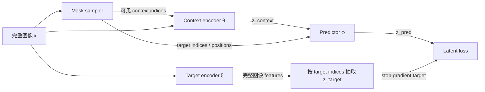

<!-- fullWidth: false tocVisible: false tableWrap: true -->
# Day 10：I-JEPA Predictor——如何从 context 与目标位置预测 target representation

计划日期：**2026-07-18 周六**  
实际接续日期：**2026-07-21 周二**  
主题：**理解 predictor 为什么需要 target position embedding，并能追踪 `z_context + target_position -> z_pred` 的完整数据流**

前置笔记：

- [Day 5：ViT 基础](day05_vit_basics.md)
- [Day 6：I-JEPA 架构拆解](day06_ijepa_architecture.md)
- [Day 8：Mask strategy](day08_mask_strategy.md)
- [Day 9：EMA target encoder](day09_ema_target_encoder.md)

参考资料：

- I-JEPA 论文：*Self-Supervised Learning from Images with a Joint-Embedding Predictive Architecture*  
  <https://arxiv.org/abs/2301.08243>
- I-JEPA 官方仓库  
  <https://github.com/facebookresearch/ijepa>
- Predictor 官方实现：`VisionTransformerPredictor`  
  <https://github.com/facebookresearch/ijepa/blob/main/src/models/vision_transformer.py>
- 官方训练循环  
  <https://github.com/facebookresearch/ijepa/blob/main/src/train.py>

> 今天只抓一个问题：**predictor 既看不到 target pixels，又要对多个 target positions 分别作答，它究竟如何知道“现在要猜哪里”？**

---

## 0. 先看真实代码路径：官方 Predictor 的内部数据流

以下按官方 `VisionTransformerPredictor.forward(x, masks_x, masks)` 拆解。

### Step 1：把 encoder features 投影到 predictor 维度

```python
x = self.predictor_embed(x)
```

Shape：

```text
[B, N_c, D_e] -> [B, N_c, D_p]
```

为什么降维：

- predictor 是预训练辅助模块，不是最终部署 backbone；
- 较小的 `D_p` 可以降低 attention 和 MLP 计算量；
- 避免让 predictor 过重，让主要表示能力更多沉淀在 encoder 中。

最后一点是设计直觉，不是数学保证：小 predictor 仍然可以学到复杂映射。

### Step 2：给 context representations 补回空间位置

```python
x_pos_embed = self.predictor_pos_embed.repeat(B, 1, 1)
x += apply_masks(x_pos_embed, masks_x)
```

Predictor 显式加入自己维度下的位置编码，使 Transformer 知道每个 context representation 来自图像哪里。

### Step 3：抽取 target positions 的位置编码

```python
pos_embs = self.predictor_pos_embed.repeat(B, 1, 1)
pos_embs = apply_masks(pos_embs, masks)
```

常见 shape：

```text
完整位置表：[B, N, D_p]
目标位置表：[K×B, N_t, D_p]
```

`K` 是 target block 数量。

### Step 4：构造待预测 tokens

```python
pred_tokens = self.mask_token.repeat(
    pos_embs.size(0), pos_embs.size(1), 1
)
pred_tokens += pos_embs
```

此时每个 target token 只有：

```text
“我是待预测槽位”的共享参数 + “我位于哪里”的位置编码
```

没有 target pixel content，也没有 `z_target`。

### Step 5：为每个 target block 复制 context，并拼接 token 序列

```python
x = x.repeat(len(masks), 1, 1)
x = torch.cat([x, pred_tokens], dim=1)
```

对一个 target block：

```text
[context tokens | target query tokens]
```

对 `K` 个 target blocks，可以理解为形成 `K` 个独立预测问题：

```text
问题 1：[同一 context | target block 1 positions]
问题 2：[同一 context | target block 2 positions]
...
问题 K：[同一 context | target block K positions]
```

### Step 6：通过 narrow Transformer

```python
for blk in self.predictor_blocks:
    x = blk(x)
x = self.predictor_norm(x)
```

Self-attention 允许：

- target query tokens 读取 context tokens；
- 不同 target query tokens 互相交流，保持一个 block 内预测的一致性；
- context tokens 在 predictor 内进一步基于目标问题重组信息。

### Step 7：只取 target 部分并投影回 encoder 维度

```python
x = x[:, N_ctxt:]
x = self.predictor_proj(x)
return x
```

Shape：

```text
[K×B, N_c + N_t, D_p]
    -> slice target
[K×B, N_t, D_p]
    -> Linear(D_p -> D_e)
[K×B, N_t, D_e]
```

最终 `z_pred` 与从 target encoder 抽取的 `z_target` 在 shape、target block 顺序和 token 顺序上严格对齐。

---

## 1. Transformer 如何把 context 信息写入 target tokens

一个 target query token 的初始值是：

```math
q_j^{(0)} = m + p_j
```

它与 context tokens 一起进入 self-attention。某层中，该 token 会生成 Query，并对所有 context Key 计算相关性：

```math
\alpha_{ji}
=\operatorname{softmax}_i\left(
\frac{(q_jW^Q)(c_iW^K)^\top}{\sqrt{d_h}}
\right)
```

再聚合 context Value：

```math
\tilde q_j
=\sum_{i\in C}\alpha_{ji}(c_iW^V)
```

因为 `q_j` 包含位置 `p_j`，不同目标位置会产生不同 Query，也就可能关注不同 context tokens。

```text
初始 target token：只有“待预测 + 位置”
        ↓ 反复读取 context 并非线性变换
最终 target token：融合 context 证据后，对该位置 latent 的预测
```

严格来说，官方实现使用整段 self-attention，而不是只让 target 对 context 做一次 cross-attention；上式只是突出 target 从 context 读取信息的核心路径。

---

## 2. Shape 追踪：单个 target block

假设：

```text
B   = 2
N   = 196       # 14 × 14 patch grid
N_c = 120       # context tokens
N_t = 28        # 当前 target block tokens
D_e = 768       # encoder dim
D_p = 384       # predictor dim
```

| 步骤 | 输入 shape | 输出 shape |
|---|---|---|
| Context encoder | image + context indices | `[2,120,768]` |
| Predictor input projection | `[2,120,768]` | `[2,120,384]` |
| Context position gather | `[2,196,384]` | `[2,120,384]` |
| Target position gather | `[2,196,384]` | `[2,28,384]` |
| Shared mask token expand | `[1,1,384]` | `[2,28,384]` |
| Target query construction | mask + position | `[2,28,384]` |
| Concatenate | `[2,120,384] + [2,28,384]` | `[2,148,384]` |
| Predictor blocks | `[2,148,384]` | `[2,148,384]` |
| Keep target outputs | `[2,148,384]` | `[2,28,384]` |
| Output projection | `[2,28,384]` | `[2,28,768]` |

Target branch：

```text
target_encoder(full image) -> [2,196,768]
gather target positions     -> [2,28,768]
```

于是：

```text
z_pred   [2,28,768]
z_target [2,28,768]
```

不仅 shape 要相同，第 `j` 个预测 token 还必须对应第 `j` 个 target feature 的同一空间位置。

---

## 3. Shape 追踪：多个 target blocks

令 `K=4`，每张图有四个 target blocks，每个 block 经过 batch 对齐后有 `N_t=28` 个 tokens。

概念上可以写成：

```text
z_pred:   [B, K, N_t, D_e]
z_target: [B, K, N_t, D_e]
```

官方实现为了批量计算，常将 target-block 轴与 batch 轴合并：

```text
z_pred:   [K×B, N_t, D_e] = [8,28,768]
z_target: [K×B, N_t, D_e] = [8,28,768]
```

这不是丢失 `K`，而是把 `(target block, image)` 组合成更大的有效 batch。

### 排列顺序为什么重要

假设 `z_pred` 排列为：

```text
[T1-image1, T1-image2, T2-image1, T2-image2, ...]
```

而 `z_target` 错误排列为：

```text
[T1-image1, T2-image1, T3-image1, T4-image1, ...]
```

二者 shape 完全相同，但监督已经错位。

所以必须检查：

```text
1. target block 顺序一致；
2. batch 顺序一致；
3. block 内 token indices 顺序一致；
4. 重复 context 的顺序与 target 展平顺序一致。
```

调试时不要只写：

```python
assert z_pred.shape == z_target.shape
```

还应在 toy indices 上验证真实排列。

---

## 4. 把代码压缩成心智模型

I-JEPA predictor 接收两类信息：

```text
1. context encoder 输出的可见区域 representations：回答“已知什么”；
2. target positions 对应的位置条件 token：回答“要预测哪里”。
```

官方实现中的核心数据流不是简单的向量相加，而是：

```text
z_context [B, N_c, D_e]
    │
    ├─ Linear(D_e -> D_p)
    ├─ 加 context positions 的二维位置编码
    │
    └──────────────┐
                   │ concat
shared mask token + target positions 的二维位置编码
                   │
                   ▼
        narrow Transformer predictor
                   │
        只保留 target token 对应输出
                   │
        Linear(D_p -> D_e)
                   ▼
          z_pred [B, N_t, D_e]
```

其中：

- `D_e`：encoder representation 维度；
- `D_p`：predictor 内部维度，通常比 `D_e` 小；
- `N_c`：context token 数；
- `N_t`：当前 target block 的 token 数。

一句话总结：

> **Context features 提供证据，target positional tokens 提供问题坐标，predictor 用 self-attention 将证据路由到指定坐标并输出该位置应有的 latent representation。**

---

## 5. 今日完成标准

学完后应能独立完成：

- [ ] 解释 predictor 的输入、输出和参数更新方式；
- [ ] 解释为什么没有 target position 时问题定义不完整；
- [ ] 区分 mask token、position embedding 与 target pixel content；
- [ ] 画出 `z_context + target_pos -> z_pred`；
- [ ] 追踪单 target 与多 target 的 shape；
- [ ] 解释官方实现为什么先降维、最后再升维；
- [ ] 解释“知道坐标”为什么不等于“看到答案”；
- [ ] 找出 predictor 中常见的信息泄漏、错位和 batch 排列 bug；
- [ ] 写出一个最小 predictor forward 伪代码。

---

## 6. 90 分钟学习路线

| 时间 | 内容 | 必须留下的结果 |
|---:|---|---|
| 0–15 分钟 | 阅读第 0–4 节 | 能画出真实数据流并追踪 shape |
| 15–35 分钟 | 阅读第 7–10 节 | 能说清“证据”与“问题坐标” |
| 35–55 分钟 | 重画第 0–3 节 | 能独立还原 predictor token 序列 |
| 55–70 分钟 | 阅读第 11–13 节 | 能区分 I-JEPA predictor 与 MAE decoder |
| 70–85 分钟 | 完成第 17 节练习 | 找出三个实现 bug |
| 85–90 分钟 | 完成理解检查和日志 | 留下 Day 11 的 loss 问题 |

如果今天只有 45 分钟：

```text
1. 读第 0、4、8、10 节；
2. 手画一次 predictor token 序列；
3. 完成练习 1 和练习 3；
4. 默写“位置不是内容”。
```

---

## 7. Predictor 在整个 I-JEPA 中处于哪里

先把 Day 8、Day 9 与今天连接起来：



三个模块回答三个不同问题：

| 模块 | 核心问题 | 输出 |
|---|---|---|
| Mask sampler | 猜哪里、能看哪里？ | context/target indices |
| Target encoder | 正确的 latent 答案是什么？ | `z_target` |
| Predictor | 如何从已知内容推断指定位置的答案？ | `z_pred` |

梯度与参数更新：

```text
loss -> predictor φ -> context encoder θ

target encoder ξ：无梯度，由 θ 的 EMA 更新
```

因此 predictor 是学习中的主动推断模块，不只是一个固定 reshape 工具。

---

## 8. 为什么 Predictor 必须知道 target position

### 4.1 同一份 context 可以对应多个问题

假设一张狗的图像中，可见 context 包含身体轮廓、两条腿、地面和部分背景。同一份 `z_context` 可能被要求预测：

```text
左上 target：狗的头部；
右下 target：狗的后腿；
图像顶部 target：天空或背景。
```

如果 predictor 只收到完全相同的 `z_context`，没有任何 target 条件，那么三个任务的输入相同：

```math
g_\phi(z_{context}) = ?
```

确定性函数对同一个输入只能产生同一个输出，无法知道当前问题是左上、右下还是顶部。

加入位置条件后，问题变为：

```math
\hat{z}_{T_k}=g_\phi(z_C, p_{T_k})
```

其中：

- `C`：context positions 集合；
- `T_k`：第 `k` 个 target block 的 positions 集合；
- `z_C`：context encoder 输出；
- `p_{T_k}`：第 `k` 个 target block 的位置编码；
- `\hat{z}_{T_k}`：对应 target positions 的预测 representation。

### 4.2 条件变量使任务成为一个明确函数

可以把它类比为问答：

```text
context = 一张地图上已知的道路、建筑与河流
target position = “请回答坐标 (7, 4)”
z_pred = 模型对该坐标内容的抽象判断
```

只给地图信息但不告诉坐标，问题本身不完整。

### 4.3 位置告诉模型“去哪找关系”

位置条件还允许 self-attention 学会位置相关的推断规则：

```text
目标在物体轮廓延伸方向
    -> 更多关注轮廓附近的 context tokens

目标位于图像上方
    -> 可能更多利用天空、建筑顶部等全局结构

目标位于两段可见物体之间
    -> 学习形状连续性与部件关系
```

所以 target position 是 predictor 的条件变量，也是 attention 路由信息。

---

## 9. 三种容易混淆的东西

### 5.1 Mask index

Mask index 是整数位置集合，例如 `14 × 14` patch 网格中的：

```text
T = [31, 32, 45, 46]
```

它本身只是索引，用于选择对应的位置编码和 target features。

### 5.2 Position embedding

位置编码是索引对应的向量：

```math
p_j \in \mathbb{R}^{D_p}
```

它表达 patch 在二维网格中的位置，不包含当前图像该位置的 RGB 内容。

官方代码中的 `predictor_pos_embed` 是固定的二维 sine-cosine embedding：

```python
self.predictor_pos_embed = nn.Parameter(
    torch.zeros(1, num_patches, predictor_embed_dim),
    requires_grad=False,
)
```

注意：论文常用“positional tokens”描述条件；具体到官方仓库，**共享 mask token 可学习，而这张二维位置编码表固定不更新**。

### 5.3 Shared learnable mask token

官方 predictor 还有一个共享的可学习向量：

```python
self.mask_token = nn.Parameter(
    torch.zeros(1, 1, predictor_embed_dim)
)
```

每个待预测位置的初始 token 为：

```math
q_j = m + p_j
```

其中：

- `m`：所有目标位置共享的可学习 mask token；
- `p_j`：位置 `j` 的位置编码。

共享 `m` 表示“这是一个等待预测的槽位”，`p_j` 表示“这个槽位在哪里”。

| 对象 | 是否因图像内容变化 | 是否因位置变化 | 是否学习 |
|---|---:|---:|---:|
| mask index | 否 | 是 | 否 |
| 2D position embedding | 否 | 是 | 官方实现中否 |
| shared mask token | 否 | 否 | 是 |
| target patch pixels | 是 | 是 | 不是参数，且不能进入 predictor |
| `z_target` | 是 | 是 | 由 EMA target encoder 产生并 stop-gradient |

---

## 10. “知道位置”为什么不等于“看到 target pixels”

### 6.1 位置只携带坐标，不携带样本答案

对数据集中的所有图像，左上角同一个 patch position 都使用相同的位置编码。

```text
图像 A 左上角可能是天空；
图像 B 左上角可能是树叶；
图像 C 左上角可能是墙面。
```

位置向量只能告诉 predictor “这是左上角”，无法告诉它当前样本那里究竟是什么。

### 6.2 内容泄漏的真正形式

以下输入会泄漏答案：

```python
# 错误 1：直接把 target patch embedding 送入 predictor
target_content = patch_embed(target_pixels)
z_pred = predictor(z_context, target_content)

# 错误 2：完整图像先经过 context encoder，再删除 target outputs
all_features = context_encoder(all_patch_tokens)
z_context = gather(all_features, context_indices)

# 错误 3：把 target encoder features 作为 predictor 的输入
z_pred = predictor(z_context, z_target)
```

而下面是合法条件：

```python
target_pos = position_table[target_indices]
z_pred = predictor(z_context, target_pos)
```

### 6.3 Stop-gradient 与输入隔离是两件事

`z_target.detach()` 只切断梯度，不自动消除信息泄漏。

```python
# 仍然错误：即使 detach，也把答案内容交给了 predictor
z_pred = predictor(z_context, z_target.detach())
```

正确设计同时需要：

```text
1. target branch stop-gradient；
2. target content 不进入 predictor；
3. context encoder 在 self-attention 前就排除 target patches。
```

---

## 11. Predictor 与 MAE decoder 的区别

二者结构上可能都使用：

```text
visible tokens + mask/position tokens -> Transformer -> target outputs
```

但训练语义不同：

| 对比项 | MAE decoder | I-JEPA predictor |
|---|---|---|
| 预测目标 | 像素或像素 patch | target encoder representation |
| 输出空间 | input/pixel space | embedding space |
| 需要还原低层细节 | 通常需要 | 不直接要求 |
| 监督来源 | 原图像像素 | EMA target encoder |
| 最终输出 | reconstructed pixels | `z_pred` |
| 主要学习压力 | 重建可见统计与细节 | 推断 latent 中保留的可预测结构 |

因此不能仅凭“都有 mask token 和 Transformer”就把 predictor 称为 pixel decoder。

I-JEPA predictor 也不是语言模型式的 next-token head：

- 它不是按序自回归生成下一个 patch；
- target positions 事先由 mask sampler 给出；
- 多个 target tokens 可以并行预测；
- loss 在 latent representation 上计算。

---

## 12. Predictor 为什么通常比 Encoder 窄

### 12.1 计算角度

Transformer 的主要成本随 token 数与维度增长。把 `D_e` 投影到更小的 `D_p`，可显著减少 predictor 的 attention 和 MLP 成本。

### 12.2 表示学习角度

预训练结束后，通常保留 encoder 用于下游任务，而 predictor 可被丢弃。把更多容量投入 encoder 更符合最终用途。

### 12.3 任务分工角度

```text
encoder：学习可迁移的 representation；
predictor：将 context representation 条件映射到指定 target representation。
```

Predictor 必须足够强，才能让训练任务可解；但如果极其强大，也可能降低 encoder 必须提供高质量信息的压力。

这给出一个可实验问题：

```text
固定 encoder，改变 predictor depth / width，比较：
1. pretraining loss；
2. frozen encoder linear probe；
3. 训练速度与显存。
```

可能出现：更强 predictor 让 loss 更低，但 encoder probe 不一定更好。训练目标拟合能力与 representation 质量不是同一个指标。

---

## 13. Predictor 是不是 World Model

官方仓库把 I-JEPA predictor 描述为一种原始且受限的 world model。这种说法成立的部分是：

```text
部分可观察 context
        +
目标位置条件
        ->
不可见区域的 latent prediction
```

它学习“世界的一部分与另一部分在 representation space 中如何相关”。

但它还不是用于控制的完整 latent world model：

| 能力 | I-JEPA image predictor | 控制用 world model |
|---|---:|---:|
| 从部分观测预测 latent | 是 | 是 |
| 明确时间推进 | 否 | 通常是 |
| 输入 action | 否 | 是 |
| 多步 rollout | 原始 I-JEPA 不要求 | 通常需要 |
| 表达多模态未来 | 确定性 predictor 有限 | 常需随机变量或分布模型 |
| 可供 planner 搜索 | 不能直接 | 目标能力 |

迁移到后续项目时，结构会从：

```math
g_\phi(z_{context}, p_{target})
```

变成类似：

```math
g_\phi(z_t, a_t, \Delta t) \rightarrow \hat z_{t+1}
```

位置条件 `p_target` 与动作条件 `a_t` 都属于“告诉 predictor 当前要回答哪个条件问题”的额外变量，但语义并不相同。

---

## 14. 确定性 Predictor 与不确定性

同一 context 可能对应多个合理 target 内容。例如只看到动物身体时，被遮住的头部纹理和精确朝向可能不唯一。

I-JEPA 的 deterministic predictor 输出一个 latent：

```math
\hat z_T=g_\phi(z_C,p_T)
```

若监督损失偏向逐元素距离，预测会倾向于条件分布中的某种中心答案。关键在于 target encoder 有机会丢弃难以预测的像素细节，让 latent 目标比原始 pixels 更少受多解问题影响。

但这不代表不确定性消失：

- context 仍可能不足；
- target representation 仍可能包含不可预测成分；
- 单一向量不能显式表达多个互斥未来；
- 在视频和 planning 中，多模态未来会更突出。

可复用判断规则：

> **预测空间越抽象，多解的低层细节冲突可能越小；但若任务本身具有多模态语义未来，仍需显式概率、latent variable、energy 或多候选机制。**

---

## 15. 最小伪代码

下面突出 predictor 的结构，不复刻官方 batching 细节：

```python
class MiniPredictor(nn.Module):
    def __init__(self, encoder_dim, predictor_dim, num_patches):
        super().__init__()
        self.in_proj = nn.Linear(encoder_dim, predictor_dim)
        self.mask_token = nn.Parameter(
            torch.zeros(1, 1, predictor_dim)
        )

        # 可使用固定 2D sin-cos positional embedding
        self.register_buffer(
            "pos_embed",
            build_2d_sincos_pos_embed(num_patches, predictor_dim),
        )

        layer = nn.TransformerEncoderLayer(
            d_model=predictor_dim,
            nhead=6,
            batch_first=True,
        )
        self.blocks = nn.TransformerEncoder(layer, num_layers=4)
        self.norm = nn.LayerNorm(predictor_dim)
        self.out_proj = nn.Linear(predictor_dim, encoder_dim)

    def forward(self, z_context, context_idx, target_idx):
        """
        z_context:  [B, N_c, D_e]
        context_idx:[B, N_c]
        target_idx: [B, N_t]
        """
        B, N_c, _ = z_context.shape
        N_t = target_idx.shape[1]

        # 1. context content + context position
        c = self.in_proj(z_context)
        c_pos = batched_gather(self.pos_embed, context_idx)
        c = c + c_pos

        # 2. shared mask token + target position
        t_pos = batched_gather(self.pos_embed, target_idx)
        q = self.mask_token.expand(B, N_t, -1) + t_pos

        # 3. joint self-attention
        tokens = torch.cat([c, q], dim=1)
        tokens = self.norm(self.blocks(tokens))

        # 4. only target-query outputs become predictions
        z_pred = self.out_proj(tokens[:, N_c:])
        return z_pred
```

训练主线：

```python
with torch.no_grad():
    z_full_target = target_encoder(images)
    z_target = gather(z_full_target, target_idx)
    z_target = layer_norm(z_target)

z_context = context_encoder(images, context_idx)
z_pred = predictor(z_context, context_idx, target_idx)

assert z_pred.shape == z_target.shape
loss = smooth_l1_loss(z_pred, z_target)
```

真正实现时还需处理：

- 多个 target blocks；
- 多个 context masks；
- 分布式 batch；
- 不同 mask 长度的对齐或裁剪；
- mixed precision；
- EMA 更新顺序。

---

## 16. Predictor 的关键不变量

### 输入不变量

```text
predictor 可见：
- context encoder representations
- context positions
- target positions

predictor 不可见：
- target pixels
- target patch embeddings
- target encoder representations
```

### Shape 不变量

```text
z_pred.shape == z_target.shape
```

但 shape 相同只是必要条件，还必须位置排列相同。

### 梯度不变量

```text
predictor parameters:     requires_grad=True
context encoder:          receives gradient through predictor
target encoder:           no gradient
position table:           official implementation fixed
shared mask token:        learnable
```

### 语义不变量

```text
第 j 个 z_pred 必须预测与它具有同一 image、target block、patch position 的 z_target。
```

---

## 17. 练习

### 练习 1：先画图，不看答案

补全：

```text
image
  -> context mask
  -> context encoder
  -> __________
  -> project D_e -> D_p
  -> add __________ positions
                       \
                        concat -> predictor blocks -> target outputs
                       /
shared __________ + target __________
```

<details>
<summary>提示 1</summary>

第一条分支提供已知内容；第二条分支提供待回答槽位。

</details>

<details>
<summary>答案</summary>

```text
image
  -> context mask
  -> context encoder
  -> z_context
  -> project D_e -> D_p
  -> add context positions
                       \
                        concat -> predictor blocks -> target outputs
                       /
shared mask token + target positions
```

</details>

### 练习 2：Shape 追踪

已知：

```text
B=4, K=3, N_c=100, N_t=24, D_e=768, D_p=384
```

回答：

1. 单个 target block 的拼接序列 shape 是什么？
2. 合并 `K` 与 batch 后，predictor block 输入 shape 是什么？
3. 最终 `z_pred` shape 是什么？

<details>
<summary>提示</summary>

先算序列长度 `N_c + N_t`，再合并 `K × B`。

</details>

<details>
<summary>答案</summary>

```text
单 block：[4,124,384]
合并 K：[12,124,384]
z_pred：[12,24,768]
```

</details>

### 练习 3：判断是否泄漏

判断以下输入是否合法：

```text
A. predictor(z_context, target_indices)
B. predictor(z_context, position_table[target_indices])
C. predictor(z_context, patch_embed(target_pixels))
D. predictor(z_context, z_target.detach())
E. context_encoder(all_tokens) 后再筛出 context outputs
```

<details>
<summary>答案</summary>

- A：合法，predictor 可由 indices 抽取位置编码；
- B：合法，只要 position table 不含当前样本的 target 内容；
- C：泄漏 target pixel content；
- D：泄漏 target representation，`detach` 只切梯度，不切信息；
- E：泄漏，context outputs 已通过 self-attention 融合 target tokens。

</details>

### 练习 4：找出错位 bug

```python
# pred 的合并顺序：target-major
z_pred = stack([
    pred_t1_img1, pred_t1_img2,
    pred_t2_img1, pred_t2_img2,
])

# target 的合并顺序：image-major
z_target = stack([
    target_t1_img1, target_t2_img1,
    target_t1_img2, target_t2_img2,
])

assert z_pred.shape == z_target.shape
loss = loss_fn(z_pred, z_target)
```

问题在哪里？如何测试？

<details>
<summary>答案</summary>

Shape 相同但 `(target block, image)` 排列不同。可用人为构造的唯一整数 ID 代替 features，例如 `100 × target_id + image_id`，经过所有 repeat/stack/reshape 后检查 `z_pred_id == z_target_id`。

</details>

### 练习 5：为什么没有位置会失败

用一句函数观点解释：为什么同一 `z_context` 对应四个 target blocks 时，predictor 不能只写成 `g(z_context)`？

<details>
<summary>答案</summary>

确定性函数对相同输入产生相同输出；若四个 target 的正确输出不同，就必须加入区分问题的条件变量，如 `g(z_context, target_position)`。

</details>

### 练习 6：设计 predictor capacity 消融

保持数据、mask、encoder、训练步数不变，只改变：

```text
predictor depth ∈ {2, 4, 8}
predictor dim   ∈ {192, 384, 768}
```

至少记录：

```text
pretraining loss
frozen encoder linear-probe accuracy
step time
peak memory
```

先写出你的预测：哪个配置 loss 最低？哪个配置 probe 最好？二者是否一定相同？

---

## 18. 常见误区

### 误区 1：`z_context + target_pos` 是逐元素直接相加

不准确。官方实现会给 context 加它自己的 positions，并用 `mask_token + target_pos` 构造 target query tokens；两类 tokens 在序列维拼接后进入 Transformer。

### 误区 2：Target position embedding 包含 target 内容

错误。它是与二维网格坐标关联的通用向量，不随当前图像内容变化。

### 误区 3：`detach()` 后就不会泄漏

错误。`detach()` 阻断梯度，但数值仍会被 predictor 读取。

### 误区 4：Predictor 输出像素

错误。原始 I-JEPA predictor 输出与 target encoder feature 可比较的 representation。

### 误区 5：Mask token 与 position embedding 是同一个东西

错误。共享 mask token 表示待预测槽位，position embedding 区分槽位的空间位置。

### 误区 6：Predictor 只需要 target positions，不需要 context positions

错误。它也必须知道 context features 分别来自哪里，才能学习空间关系。

### 误区 7：只要 `z_pred.shape == z_target.shape` 就正确

错误。合并 target-block 与 batch 维时可能发生静默错位。

### 误区 8：Predictor 越强，encoder representation 一定越好

不一定。更强 predictor 可能降低训练 loss，但 downstream probe 才能检验 encoder 表征是否更有用。

### 误区 9：Predictor 是 cross-attention decoder

官方实现是把 context tokens 与 target query tokens 拼接后经过 Transformer self-attention。可以从功能上理解为 query 读取 context，但不要把具体实现写成不存在的 cross-attention 模块。

### 误区 10：I-JEPA predictor 已能直接做机器人规划

错误。原始 image predictor 没有 action、时间转移、多步 rollout 与 task cost。

---

## 19. 迁移规则：看到条件预测时应想什么

抽象模式：

```text
已知 representation
        +
问题条件 / 查询 token
        ->
条件化 predictor
        ->
指定对象的 predicted representation
```

三个迁移例子：

### 图像 I-JEPA

```text
context features + spatial target position -> missing-region latent
```

### 视频 JEPA

```text
visible spatio-temporal features
+ masked tubelet space-time positions
-> hidden tubelet latent
```

### Action-conditioned world model

```text
current state latent + action + horizon
-> future state latent
```

识别规则：

> **当同一份已知信息可能对应多个不同问题时，检查 predictor 是否获得了足以区分这些问题的条件变量；同时检查该条件是否偷偷包含答案。**

边界：

- 条件不足，模型无法区分任务；
- 条件过强或含答案，任务会泄漏；
- 条件正确但 context 不充分，目标仍不可预测；
- 确定性输出无法完整表达强多模态结果。

---

## 20. 今日理解检查

不看上文回答：

1. Predictor 的两类核心输入分别是什么？
2. 为什么相同 `z_context` 对多个 target blocks 时必须加入条件？
3. Shared mask token 与 target position embedding 有什么区别？
4. 官方 position embedding 是学习的还是固定的？
5. Predictor 为什么先做 `D_e -> D_p`？
6. Context positions 在 predictor 中有什么作用？
7. “知道 target position”为什么不算泄漏？
8. `z_target.detach()` 为什么仍不能作为 predictor 输入？
9. 官方 predictor 使用 self-attention 还是显式 cross-attention？
10. 多 target 合并 batch 时，为什么 shape 相同仍可能训练错误？
11. Predictor 输出的是 pixels 还是 representations？
12. Predictor 变强后，为什么必须同时看 downstream probe？

完成标准：

- [ ] 能在 60 秒内画完 predictor 内部数据流；
- [ ] 能写出 `q_j = mask_token + pos_j`；
- [ ] 能解释 target query 如何通过 attention 读取 context；
- [ ] 能手算一组单 target 与多 target shapes；
- [ ] 能列出三个信息泄漏案例；
- [ ] 能设计 toy ID 检查 batch 排列；
- [ ] 能说明 I-JEPA predictor 与控制用 world model 的差距。

---

## 21. 不看笔记时应该能复述的版本

### 30 秒版本

I-JEPA predictor 是一个比 encoder 更窄的 ViT。它先把 context encoder features 从 `D_e` 投影到 `D_p`，并加入 context positions；再为每个 target position 构造 `shared mask token + 2D position embedding`，把这些 target query tokens 与 context tokens 拼接后做 self-attention。最后只取 target token outputs，并投影回 `D_e` 得到 `z_pred`。Target position 只说明预测哪里，不包含当前图像该位置的像素，因此不算泄漏。`z_pred` 必须与 `z_target` 在 shape 和位置顺序上严格对齐。

### 五行记忆版

```text
Context representation 提供证据。
Target position 提供问题坐标。
Mask token + position 构成 target query。
Transformer 让 query 从 context 读取信息。
只取 query outputs，投影成 z_pred 与 z_target 对齐。
```

### 最短主线

```text
已知内容 + 要猜的位置 -> latent prediction
```

---

## 22. 与 Day 11 的衔接：如何比较 `z_pred` 与 `z_target`

现在已经知道：

```text
Mask sampler 定义预测问题；
EMA target encoder 产生稳定答案；
Predictor 根据 context 和 target positions 作答。
```

下一步要回答：

```text
z_pred 与 z_target 应采用 MSE、SmoothL1 还是 cosine loss？
不同 loss 对小误差、离群误差和方向/尺度分别敏感什么？
为什么官方训练循环先对 target features 做 LayerNorm？
latent loss 下降为什么不等于 representation 一定更好？
```

---

## 23. 今日学习日志

```text
计划日期：2026-07-18
实际接续日期：2026-07-21
主题：I-JEPA predictor 与 target position

今天学到的核心概念：

我能用自己的话解释 predictor：

target position 不算信息泄漏，因为：

shared mask token 与 position embedding 的区别：

我能手写的数据流：

我还不清楚的点：
1.
2.

今天的产出文件：
notes/day10_predictor_target_position.md

下一步：
学习 latent loss，比较 MSE、SmoothL1 与 cosine loss。
```
