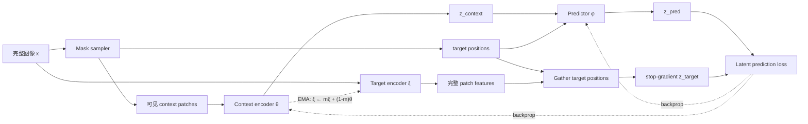

<!-- fullWidth: false tocVisible: false tableWrap: true -->
# Day 7：第 1 周复盘——JEPA 为什么可能更适合 world model

日期：**2026-07-15 周三**  
主题：**压缩前六天知识，形成从 latent prediction 到 world model 的完整判断**

前置笔记：

- [Day 1：什么是 JEPA](day01_what_is_JEPA.md)
- [Day 2：自监督学习版图](day02_self_supervised__learning.md)
- [Day 3：MAE vs I-JEPA](day03_mae_vs_ijepa.md)
- [Day 4：表征坍塌](day04_representation_collapse.md)
- [Day 5：ViT 基础](day05_vit_basics.md)
- [Day 6：I-JEPA 架构拆解](day06_ijepa_architecture.md)

> 今天只回答一个问题：**为什么 JEPA 式 latent prediction 可能是 world model 的良好起点，但还不能直接等同于可规划的 world model？**

---

## 0. 今天的直接答案

JEPA 可能更适合 world model，核心不是“latent 比 pixel 高级”这句口号，而是它把学习压力放在了**从已知信息预测任务相关的抽象状态**上，而不是复原未来所有像素细节。

```text
pixel prediction：
已知观测 -> 预测每个未来像素
             └─ 同时承担纹理、光照、噪声和多种可能未来

JEPA-style latent prediction：
已知观测 -> 表征 -> 预测目标 latent
                    └─ 有机会忽略任务无关且难以预测的细节
```

这为 world model 提供了三个潜在优势：

1. **状态更紧凑**：规划器不必在原始像素空间搜索和比较；
2. **目标更可预测**：模型可以忽略部分不可预测但不重要的视觉细节；
3. **接口容易迁移**：I-JEPA 的 `context + condition -> target latent` 可改造成 `z_t + action -> z_{t+1}`。

但“可能更适合”不等于“已经适合”。原始 I-JEPA 没有显式动作、时间转移、多步 rollout、任务 cost 或 planner。一个 latent 是否真的适合规划，必须用以下结果验证：

```text
action-conditioned prediction error
multi-step rollout error
goal latent distance 与真实任务进度的相关性
最终 control success rate
```

---

## 0.1 今日安排（约 2 小时）

| 时间 | 内容 | 必须留下的结果 |
|---:|---|---|
| 0–20 分钟 | 闭卷回答第 2 节六个问题 | 不看前六天笔记写出第一版答案 |
| 20–45 分钟 | 核对第 1、3 节 | 补全 JEPA、MAE、对比学习的区别 |
| 45–70 分钟 | 复画第 4 节训练图 | 标出输入、target、梯度与 EMA |
| 70–95 分钟 | 完成第 6 节迁移练习 | 写出机器人或无人机的 context、action、target |
| 95–115 分钟 | 完成第 7 节误区判断 | 每题用一句话解释理由 |
| 115–120 分钟 | 填写周复盘与今日日志 | 明确下周最需要补的知识点 |

如果今天只有 60 分钟：

```text
1. 先读第 0、4、5 节；
2. 闭卷画出 I-JEPA 的四模块训练图；
3. 完成第 8 节的一页复盘；
4. 写下明天学习 mask strategy 时最想验证的问题。
```

---

## 1. 第一周知识压缩图

```text
自监督学习
├─ Contrastive：相关 view 拉近，不相关样本推远
├─ Masked reconstruction：从可见部分重建被遮挡输入
└─ Joint-embedding prediction：从 context 表征预测 target 表征
                                      │
                                      v
I-JEPA
├─ ViT 将图像变成带位置的 patch tokens
├─ context encoder 只读取可见 context
├─ target encoder 从完整图像产生 target representations
├─ predictor 使用 context + target positions 作答
├─ loss 对齐 z_pred 与 stop-gradient(z_target)
└─ target encoder 通过 context encoder 的 EMA 更新
                                      │
                                      v
可迁移的抽象
已知 latent + 条件 -> 未知 latent
                                      │
                                      v
Action-conditioned world model
z_t + a_t -> z_{t+1} -> 多步 rollout -> cost -> planner
```

第一周最重要的认知变化是：

> **JEPA 不是一种具体的“补图算法”，而是一类在 representation space 中，根据 context 和条件预测未知 target 的架构思想。**

---

## 2. 六天内容各自解决了什么问题

| Day | 核心问题 | 现在应能给出的答案 |
|---:|---|---|
| 1 | JEPA 预测什么 | 预测 target encoder 给出的 latent representation，而非直接预测 RGB |
| 2 | 它位于哪类自监督方法中 | 属于 joint-embedding predictive 方法，不依赖人工标签，也不必依赖 negatives |
| 3 | 与 MAE 有什么不同 | 两者都 mask，但 MAE 重建像素，I-JEPA 预测上下文化 target features |
| 4 | 为什么不一定坍塌 | 非对称分支、stop-gradient、EMA、predictor、mask 任务和训练动态共同作用；不是单一组件的数学保证 |
| 5 | 图像如何进入模型 | 图像被切为 patches，投影成 tokens，加位置后由 Transformer 形成上下文化 features |
| 6 | I-JEPA 如何训练 | context/predictor 接收梯度，target encoder 生成停止梯度的答案并由 EMA 更新 |

### 2.1 闭卷六问

先遮住答案，用自己的话回答：

1. JEPA 不重建像素，它如何判断预测是否正确？
2. MAE 和 I-JEPA 都使用 mask，根本区别在哪里？
3. Target encoder 为什么可以看完整图像，却不构成 predictor 的信息泄漏？
4. Predictor 为什么必须知道 target positions？
5. Target encoder 为什么不用 optimizer 直接更新？
6. Pretraining loss 下降为什么不能证明 representation 适合 planning？

参考答案：

1. 它把 `z_pred` 与 target encoder 在相同目标位置产生的 `z_target` 比较；
2. 根本区别在预测空间和监督目标：pixel reconstruction 对比 latent representation prediction；
3. Target branch 只产生 stop-gradient 的监督信号，target pixels 没有进入 predictor 的输入路径；
4. 同一组 context 可能对应多个待预测区域，位置条件告诉 predictor 当前要回答哪里；
5. 让 target 缓慢跟随 online/context encoder，可形成更稳定的移动目标；
6. Loss 只验证模型能追随当前 target features，不能自动验证 latent 保留了动作、可达性和任务进度。

---

## 3. MAE、对比学习与 I-JEPA 的统一对比

| 维度 | Contrastive（如 SimCLR） | MAE | I-JEPA |
|---|---|---|---|
| 输入关系 | 同一样本的增强 views | 可见 patches | 可见 context patches |
| 预测/匹配目标 | view-level embeddings | masked pixels | target patch representations |
| 输出空间 | embedding space | pixel space | embedding space |
| 是否常用 negatives | 是 | 否 | 否 |
| 是否需要 target encoder | 不一定 | 否 | 是，通常为 EMA encoder |
| 主要压力 | 区分样本并保持增强不变性 | 恢复局部视觉内容 | 从上下文预测抽象 target features |
| 典型风险 | false negatives、增强偏置 | 过度关注低层细节 | collapse、目标语义不足、mask 难度不当 |

### 3.1 为什么“都用了 mask”不代表任务相同

Mask 只规定模型看哪里、猜哪里，真正决定学习方向的是**猜什么**：

```text
MAE：
visible patches -> decoder -> target RGB values

I-JEPA：
visible context -> predictor -> target encoder features
```

如果 target 是像素，模型会因每个像素误差受罚；如果 target 是 latent，模型只需匹配 target encoder 保留下来的信息。因此，表示质量很大程度取决于 target encoder 学成了什么。

---

## 4. I-JEPA 训练闭环：本周必须会画的图



### 4.1 四个模块表

| 模块 | 输入 | 输出 | 如何更新 | 不能犯的错误 |
|---|---|---|---|---|
| Mask sampler | patch 网格 | context 与 target indices | 无模型梯度 | context 不能偷看 target pixels |
| Context encoder | 可见 context patches | `z_context` | optimizer/backprop | 不能先编码完整图像再删 target tokens |
| Target encoder | 完整图像 | 完整上下文化 features | EMA | 不应由同一 loss 直接反传更新 |
| Predictor | `z_context` + target positions | `z_pred` | optimizer/backprop | 看到位置可以，看到 target pixels 不可以 |

### 4.2 一次训练 step 的不变量

```text
1. context encoder 的输入不包含 target 内容；
2. predictor 知道 target 在哪里，但不知道那里是什么；
3. z_pred 与 z_target 在 batch、block、position、feature 维度上严格对齐；
4. target branch 停止梯度；
5. optimizer 更新 context encoder 和 predictor；
6. EMA 更新 target encoder。
```

---

## 5. 为什么 JEPA 可能更适合 world model

### 5.1 预测空间：从像素转向状态表示

World model 的核心用途通常不是生成一张看起来逼真的未来图，而是支持：

```text
状态估计
未来结果比较
目标距离计算
动作选择
多步规划
```

若 latent 能保留物体、位置、运动与可达性，同时丢弃光照噪声、纹理抖动等任务无关细节，规划会比直接操作高维像素更容易。

### 5.2 不确定性：不必为每种像素细节给出唯一答案

给定相同当前画面，未来可能有多个合理像素结果：

```text
树叶可能向左摆，也可能向右摆；
阴影和反光可能轻微变化；
被遮挡区域可能存在多种纹理；
远处行人的具体姿态不唯一。
```

使用单一 pixel MSE 时，多种未来常被平均成模糊结果。Latent prediction 有机会只预测这些未来共同拥有的抽象结构。不过，这种优势不是自动产生的：若 target latent 仍编码大量不可预测细节，问题仍然存在。

### 5.3 组合接口：从空间条件迁移到动作条件

I-JEPA 的抽象形式是：

```math
\hat z_{target}=g(z_{context}, c_{target})
```

其中 `c_target` 在图像任务中主要是 target position。迁移到动态系统后可写成：

```math
\hat z_{t+1}=f(z_t,a_t)
```

如果做多步 rollout：

```math
\hat z_{t+h}=f(\hat z_{t+h-1},a_{t+h-1})
```

于是一个候选动作序列可以在 latent space 中被快速展开和打分。

### 5.4 JEPA 还缺少什么

| I-JEPA 已有 | 可规划 world model 仍需补充 |
|---|---|
| 图像内 context-to-target prediction | 时间上的 state transition |
| target position 条件 | action condition |
| 单次 latent prediction | multi-step rollout |
| representation loss | task cost / reward / goal distance |
| encoder 与 predictor | planner，如 CEM、MPC 或搜索 |
| linear probe 等表征评估 | control success rate 与闭环评估 |

因此，准确结论是：

> **JEPA 提供了一种有吸引力的状态表征与预测原则；只有加入 action-conditioned dynamics、任务目标和 planner，并通过闭环控制实验后，它才成为可验证的 planning world model。**

---

## 6. 三个迁移例子

### 6.1 机器人视频

```text
context：当前及过去若干帧的视觉 latent
condition：机械臂动作、夹爪开合、时间间隔
target：执行动作后的下一时刻 latent
predictor：action-conditioned latent dynamics
验证：抓取成功率、多步 rollout error、目标状态距离
```

必须保留的信息包括物体位置、抓取关系和遮挡状态；背景纹理或微小光照变化通常不应主导 cost。

### 6.2 无人机导航

```text
context：相机观测、历史轨迹、当前位姿的 latent
condition：速度、航向、爬升/下降动作
target：未来可见场景和状态 latent
predictor：带动作与时间条件的 dynamics model
验证：碰撞率、到达率、路径长度、长 horizon 漂移
```

好的 latent 不只要识别“这是建筑”，还要表达障碍距离、可通行区域和动作造成的视角变化。

### 6.3 无线信道或网络状态

```text
context：历史 CSI、位置、负载或拓扑表征
condition：用户移动、波束/资源调度动作、预测 horizon
target：未来信道或网络状态 latent
predictor：conditioned latent predictor
验证：吞吐量、时延、调度收益、预测误差随 horizon 的变化
```

这里没有 RGB 像素，但 JEPA 的抽象仍成立：从部分观测和条件预测另一个 representation。需要重新定义 mask、encoder 和真正有用的 downstream task。

---

## 7. 本周最容易出现的八个误区

### 误区 1：Latent 一定比 pixel 更语义

错误。Latent 只是内部向量；是否有语义取决于训练目标、数据、架构与评估结果。

### 误区 2：I-JEPA 不重建像素，所以不需要 target

错误。它仍需要 target encoder 生成同一位置的 latent 监督信号。

### 误区 3：Target encoder 看完整图像等于 predictor 偷看答案

错误。信息泄漏取决于 target pixels 是否进入 predictor 的输入路径，而不是监督生成器是否看到了答案。

### 误区 4：Stop-gradient 就足以从理论上保证不坍塌

错误。训练稳定来自多项机制和经验设计，stop-gradient 只是其中一部分。

### 误区 5：EMA target encoder 是一个永久冻结的模型

错误。它不接收反向梯度，但会随 context encoder 的参数平滑更新。

### 误区 6：Loss 下降说明 representation 已经适合下游任务

错误。至少还要做 linear probe、kNN、fine-tuning 或任务级评估。

### 误区 7：I-JEPA 已经能直接进行机器人规划

错误。它没有显式的 action-conditioned temporal dynamics、cost 和 planner。

### 误区 8：只要把 target position 换成 action 就完成迁移

不够。还要处理时序数据、多步误差、动作可控性、随机未来和闭环重规划。

---

## 8. 第一周正式复盘

### 8.1 本周最重要的概念

```text
JEPA 的本质不是重建输入，而是根据 context 与条件，
在 representation space 中预测 target representation。
```

### 8.2 本周最容易混淆的概念

```text
1. masked input 不等于 masked pixel reconstruction；
2. target encoder 看完整图像不等于 predictor 输入泄漏；
3. stop-gradient 不等于 target encoder 永久冻结；
4. latent prediction loss 低不等于 representation 适合 planning；
5. 图像内空间预测不等于带动作的时间 dynamics。
```

### 8.3 本周代码或实验是否跑通

本周以概念闭环为目标，尚未进入 mini-I-JEPA 实现。请填写：

```text
ViT shape tracing：        [ ] 已掌握  [ ] 需复习
I-JEPA 训练图：            [ ] 能闭卷画出  [ ] 需复习
梯度/EMA 路径：            [ ] 能正确标出  [ ] 需复习
MAE 与 I-JEPA 对比：       [ ] 能口头解释  [ ] 需复习
world model 迁移接口：     [ ] 能举例  [ ] 需复习
```

### 8.4 下一周需要降低难度还是加速

建议保持当前节奏，不急于写完整训练代码。第 2 周应把注意力集中在四个会直接影响实现的问题：

1. target block 的尺寸与数量如何影响任务难度；
2. context 太多为什么任务过于简单，太少为什么不可预测；
3. EMA momentum 如何随训练变化；
4. predictor 如何用 target position 生成逐位置输出。

如果第 4 节的训练图还不能闭卷画出，应先复习 Day 6，再进入 Day 8。

---

## 9. 三个闭卷练习

### 练习 1：一句话解释 JEPA

限制：不能使用“高级”“更好”“语义强”这些模糊词。

参考答案：

> JEPA 使用可见 context 的 representation 和目标条件，预测 target encoder 在指定目标上产生的 representation，并在 latent space 中计算误差。

### 练习 2：从 I-JEPA 改成 world model

填空：

```text
I-JEPA：
context patches -> context encoder -> z_context
z_context + __________ -> predictor -> z_target

World model：
observation_t -> encoder -> z_t
z_t + __________ -> dynamics -> z_{t+1}
```

答案：

```text
target position
action_t（以及可选的时间/horizon）
```

### 练习 3：设计最小验证闭环

题目：你声称“这个 JEPA latent 更适合规划”，至少需要哪些证据？

一个合格答案应包含：

```text
1. 与 pixel model 或其他 representation baseline 比较；
2. 单步和多步 latent dynamics error；
3. latent goal distance 是否反映真实任务进度；
4. 相同 planner 预算下的 control success rate；
5. 失败案例：representation、dynamics、cost、search 分别排查。
```

---

## 10. 一分钟口述版本

JEPA 的核心是从 context 和目标条件预测 target representation，而不是复原所有像素。I-JEPA 中，context encoder 只看可见 patches，target encoder 从完整图像产生停止梯度的目标 features，predictor 根据 context features 和 target positions 预测这些 features。Context encoder 与 predictor 通过反向传播更新，target encoder 通过 EMA 更新。相比 pixel prediction，latent prediction 有机会忽略不可预测且与任务无关的细节，形成更紧凑的状态，因此可能更适合作为 world model 的起点。但原始 I-JEPA 只做图像内空间预测，没有 action、时间 dynamics、多步 rollout、cost 和 planner。要用于规划，还必须实现 `z_t + a_t -> z_{t+1}`，并用 rollout error、goal distance 和最终控制成功率验证 latent 是否真的适合 planning。

---

## 11. 今日完成标准

- [ ] 能用一句话定义 JEPA，且明确预测的是 representation。
- [ ] 能解释 MAE 与 I-JEPA 的预测目标差异。
- [ ] 能闭卷画出 context encoder、target encoder、predictor 和 mask sampler。
- [ ] 能标出 optimizer、stop-gradient 与 EMA 路径。
- [ ] 能解释 target position 为什么不是 target pixel 泄漏。
- [ ] 能说出 JEPA 对 world model 的三个潜在优势。
- [ ] 能说出原始 I-JEPA 距可规划 world model 缺少的五个组件。
- [ ] 能把机器人、无人机或无线场景写成 `context + condition -> target latent`。
- [ ] 能提出至少三个 planning-level 评估指标。
- [ ] 能明确表达“可能更适合”而不是未经验证地说“一定更适合”。

今天的最低完成门槛是：关掉前六天笔记，独立画出第 4 节训练图，再口述第 10 节内容。

---

## 12. 本周与今日日志

```text
日期：2026-07-15
主题：第 1 周复盘——JEPA 与 world model

本周最重要的概念：
JEPA 根据 context 和条件，在 latent space 预测 target representation。

本周最容易混淆的概念：
1.
2.

我现在能独立画出的图：
[ ] ViT 数据流
[ ] MAE vs I-JEPA
[ ] I-JEPA 四模块训练图
[ ] z_t + a_t -> z_{t+1} world model

我还不清楚的点：
1.
2.

今天学到的核心概念：
Latent prediction 可能减少对任务无关像素细节的建模压力，但是否适合规划必须通过闭环实验验证。

我能举出的例子：
在机器人场景中，用当前视觉 latent 和动作预测下一时刻 latent，再由 planner 比较候选动作序列。

今天的产出文件或结果：
notes/week01_review.md

明天第一步：
精读 I-JEPA 的 mask strategy，比较 target block scale 与 context scale 如何改变预测难度和语义层次。
```

---

## 13. 与 Day 8 的衔接：Mask strategy

明天进入第二周，先研究一个会直接改变训练任务的问题：

```text
模型到底看多少 context，又要预测多大 target？
```

预先带着三个假设：

1. Target block 太小，模型可能依靠局部纹理或边缘延续完成任务；
2. Context 太多，预测可能过于容易，难以迫使模型学习抽象结构；
3. Context 太少或 target 太大，目标可能高度不确定，训练信号会变得噪声化。

Day 8 的任务不是寻找一个永远正确的 mask ratio，而是理解：

> **Mask strategy 实际上在定义“模型必须利用什么信息，才能预测什么层次的 target”。**
