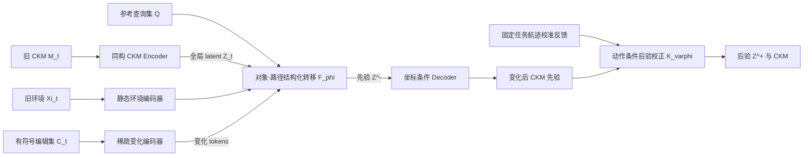

# 面向低空环境变化的三维 CKM 结构化潜在转移与被动校正

## 论文背景、研究动机、技术路线与实验计划

> 文档状态：研究设计草案 v0.2（经理论、实测可行性与审稿视角审阅）  
> 更新时间：2026-07-22  
> 核心场景：低空室外通信、准静态环境变化、三维 CKM 增量维护  
> 推荐英文题目：**Object–Path Structured Latent Transition and Passive Correction for 3D CKM Maintenance in Low-Altitude Networks**  
> 备选题目（仅在补足复信道/PDP 证据或理论界后使用）：**Resolvent-Inspired Latent Updating for 3D CKM Maintenance under Low-Altitude Environmental Changes**

---

## 0. 一页式研究结论

### 0.1 核心问题

低空三维 CKM 通常假设传播环境在建图和使用期间保持不变。然而，集装箱、停放车辆、金属围挡、脚手架、吊臂及临时建筑等准静态变化，会改变 LoS/NLoS 状态和主导反射、绕射路径，使已有 CKM 局部或大范围失效。重新测量并重建整个三维 CKM 成本高、响应慢，也没有利用旧 CKM 中仍然有效的传播知识。

本文研究以下条件更新问题：

\[
\left(M_t,\Xi_t,\mathcal C_t,\mathcal O_{t+1}\right)
\longrightarrow
\widehat M_{t+1},
\]

其中：

- \(M_t\)：环境变化前的三维 CKM；
- \(\Xi_t\)：变化前环境的几何—语义表示；
- \(\mathcal C_t=\operatorname{Diff}(\Xi_t,\Xi_{t+1})\)：已检测到的有符号环境编辑集，而不是对语义标签直接做数值相减；
- \(\mathcal O_{t+1}\)：无人机沿正常任务航迹自然获得的少量通信反馈；
- \(\widehat M_{t+1}\)：变化后的三维 CKM 估计。

### 0.2 唯一核心技术假设

环境变化在物理空间中通常具有局部支撑，但其无线影响可以沿遮挡阴影、反射走廊和绕射边界传播到远处。该影响在三维 CKM 网格中可能是非局部的，却在“变化对象—传播路径—UAV 查询位置”空间中具有稀疏、结构化和可组合的特征。

因此，本文不从零生成新 CKM，而学习一个**对象—路径结构化潜在转移**。令 \(Z_t\) 为覆盖查询域的全局传播 latent/token 集，则

\[
Z_t=E_\theta(M_t,Q),\qquad
Z_{t+1}^{-}=\mathcal F_\phi(Z_t,\Xi_t,\mathcal C_t,Q),
\qquad
\widehat M_{t+1}^{-}(q)=D_\psi(Z_{t+1}^{-},q).
\]

这里最核心的技术变量是 \(\mathcal F_\phi\)，不是 JEPA。JEPA 只是一种候选训练准则，用于检验能否提高低样本和 OOD 表征质量；部署时不保留 target encoder。若严格对照中无独立收益，JEPA 从题目和贡献中删除，不影响主线成立。

### 0.3 在线闭环

本文不再使用不确定度指引采样。无人机按照既定通信或业务航迹飞行，以校准导频、路径增益或可比 RSRP 作为校正观测。反馈必须写成动作—设备状态条件观测模型：

\[
y_k\sim p_\rho\!\left(y_k\mid D_\psi(Z_{t+1}^{-},q_k),a_k,c_k\right),
\qquad
Z_{t+1}^{+}=Z_{t+1}^{-}
+\mathcal K_\varphi\!\left(\{q_k,y_k,a_k,c_k\}_{k=1}^{K},Z_{t+1}^{-}\right),
\]

其中 \(a_k\) 记录波束、MCS 与发射功率，\(c_k\) 记录姿态、同步和射频状态。ACK/NACK、波束索引和 goodput 不与路径增益直接相减：它们默认只做下游验证；若确需同化，分别采用 Bernoulli 或 categorical likelihood。该闭环是“预测—固定任务反馈—后验校正—接纳/回滚”，不是“估计不确定度—主动选点—重新建图”。

### 0.4 预期贡献

1. 定义低空环境变化 episode，并建立变化前后严格配对、可审计且防泄漏的三维 CKM 仿真—实测数据协议。
2. 提出对象—路径结构化 latent transition，把有符号局部环境编辑映射为查询域中的非局部 CKM 增量，并以同骨干无结构模型验证结构本身的作用。
3. 建立基于固定任务通信反馈的动作条件后验校正与接纳/回滚机制，在不执行专门主动采样的情况下维护 CKM。

---

## 1. 研究背景

### 1.1 低空网络为什么需要三维 CKM

低空无人机的链路质量受到建筑高度、屋顶边缘、街谷遮挡、地面散射体和 UAV 高度的共同影响。相比地面二维无线地图，低空 CKM 必须描述不同高度层之间的 LoS/NLoS 转换及多径结构变化。已有工作已从环境几何语义出发构建低空多维无线地图，并指出简单空间插值没有充分利用传播环境与信道之间的联系；真实 UAV 测量也已在校园和农田场景构建路径损耗与 RMS 时延扩展的三维 CKM。

这些工作证明了三维 CKM 的可行性，但其主任务仍是**在给定环境状态下构建地图**，而不是在环境改变后维护已有地图。

### 1.2 从静态 CKM 构建转向动态 CKM 维护

现有动态 CKM/动态信道地图研究已经开始处理动态散射体、同步误差以及 RT 与随机信道模型的在线组合。因此，本文不能把“首次研究动态 CKM”作为创新声明。尚未闭合的问题是：

1. 如何显式利用环境变化对象及其相对传播路径的位置；
2. 如何从旧 CKM 出发预测新 CKM，而不是只估计当前动态路径或重新生成信道快照；
3. 如何在未见场地、未见变化类型和未见变化组合上泛化；
4. 如何利用正常业务反馈修正预测，而不额外规划主动感知航迹。

### 1.3 与前序低空研究的连续性

前序研究可概括为静态环境内的跨高度 CKM 推断：

\[
(\Xi_t,\mathcal O_t,h_q)
\longrightarrow M_t(q),
\]

其中环境 \(\Xi_t\) 在训练和查询期间保持不变。不确定度指引采样解决的是“静态环境中测哪些位置”。

本研究将问题推进为环境状态转移：

\[
(M_t,\Xi_t,\mathcal C_t)
\longrightarrow M_{t+1},
\]

稀疏观测只用于变化后状态校正，而不用于决定下一测点。两项工作的科学问题不同：前者研究空间稀疏性，后者研究环境非平稳性与传播状态更新。

### 1.4 JEPA 的位置与新颖性边界

JEPA 已被用于多天线无线表示学习以及 CSI latent dynamics。因此，本文不能把“首次将 JEPA 用于无线/CKM”作为核心贡献。JEPA 的价值必须通过以下至少一项证据体现：

- 在相同骨干、参数量和训练预算下提升未见场地泛化；
- 提升未见变化类型或变化组合泛化；
- 减少训练所需的配对 episode；
- 提高少量业务反馈下的 latent 校正效率。

若这些证据不成立，论文应删除 JEPA 题目级表述，保留“结构化传播状态更新”作为核心方法。

---

## 2. 研究动机与问题定义

### 2.1 核心矛盾

完整重建能够恢复变化后的 CKM，但需要重新飞测和重新拟合整个三维场；直接沿用旧 CKM 成本最低，却会在受影响区域产生系统性偏差。关键矛盾是：

> 如何保留旧 CKM 中未失效的传播知识，只更新由环境变化引起的传播子空间，并用极少的自然通信反馈校正剩余误差？

### 2.2 现有方法的不足

1. **静态插值或重建方法**只利用变化后测量，忽略旧 CKM 和环境差分。
2. **直接图像式残差预测**可能只学习局部纹理或复制旧地图，缺少变化对象如何作用于传播路径的结构。
3. **动态信道模型**通常着重当前动态散射参数，未必学习“旧 CKM + 显式环境变化 → 新 CKM”的跨场景算子。
4. **主动采样闭环**需要额外飞行或改变任务航迹，且与前序不确定度采样工作重合。
5. **普通时序网络**容易把环境变化、UAV 姿态、同步误差和射频增益漂移混为一体。

### 2.3 研究问题

- **RQ1：可更新性。** 低空环境变化引起的 CKM 转移能否由对象—路径结构化 latent 增量近似，并在留出场地上优于同容量的无结构转移？
- **RQ2：传播结构。** 对象—路径条件是否比普通空间注意力更能预测远距离、非连续影响区？
- **RQ3：JEPA 价值。** JEPA 是否在同骨干监督模型之上带来可重复的 OOD 或数据效率收益？
- **RQ4：被动维护。** 沿既定任务航迹获得的少量校准反馈能否有效修正预测 CKM，并降低下游 outage 或链路自适应损失？
- **RQ5：适用边界。** 在大型金属体、多次散射、环境差分噪声和姿态误差下，模型何时失效？

### 2.4 论文范围

| 范围内 | 暂不作为本文主线 |
|---|---|
| 固定地面 BS、低空 UAV 接收机 | 多 BS 联合调度与六维 X2X CKM |
| 准静态几何/材料变化 | 秒级移动散射体预测 |
| 已知或可观测的环境差分 | 端到端环境变化检测 |
| 路径增益为主，覆盖/outage/SNR/MCS 为任务验证 | 用路径增益结果声称恢复 PDP、波束或完整传播算子 |
| 固定业务航迹中的自然反馈 | 不确定度或信息增益主动选点 |
| latent 状态校正 | 联合材料反演、更新时机和航迹规划 |
| 下游任务只用于验证 | 把轨迹优化作为第二个核心算法 |

---

## 3. 通信与 CKM 系统模型

### 3.1 查询空间

令固定 BS 位置为 \(\mathbf x_b\)，UAV 位置为 \(\mathbf x_q=(x,y,z)\)，频率为 \(f\)。基本查询写为

\[
q=(b,\mathbf x_q,f).
\]

MVP 阶段固定单个 BS 和单频段；UAV 的 roll、pitch、yaw 固定或记录为校准变量。若姿态无法固定，可将其作为条件变量 \(\boldsymbol\omega_q\)，但不能把姿态差异标注为环境变化。

### 3.2 CKM 输出

主论文第一阶段只预测稳定的大尺度信道量：

\[
M_t(q)=\beta_t(q),
\]

其中 \(\beta_t(q)\) 为路径增益或路径损耗。此时主要任务指标限定为覆盖、outage、SNR 或 MCS/goodput，不据此声称恢复多径或波束结构。只有另行采集 2–5 m 稠密评测轨迹，并锁定可重复的宽带/扫波束协议后，才扩展为

\[
M_t(q)=
\left[
\beta_t(q),
\tau_{{\rm rms},t}(q),
\mathbf p_{{\rm beam},t}(q)
\right].
\]

PDP 采用归一化功率或时延统计表征；波束输出采用 top-\(k\) 波束功率/索引。10 m 网格只承担路径增益 MVP，不承担窄阴影边缘、PDP 支持或波束切换边界的主要结论；原始复相位不作为跨架次主要目标。

### 3.3 环境表示

变化前环境表示为

\[
\Xi_t=\{\Xi_t^{\rm occ},\Xi_t^{\rm height},\Xi_t^{\rm material},\Xi_t^{\rm semantic}\}.
\]

环境差分不是把离散语义或材料标签直接相减，而是一个对象级有符号编辑集：

\[
\mathcal C_t
=\operatorname{Diff}(\Xi_t,\Xi_{t+1})
=\{c_j\}_{j=1}^{N_\Delta}.
\]

每个变化对象至少记录：

- 三维包围盒或稀疏体素；
- 前后位置和姿态；
- 长、宽、高；
- 材料类别或粗粒度电磁类别；
- 插入、移除、平移、旋转或材料替换类型；
- 时间戳和变化 ID。

### 3.4 环境差分的来源与成本边界

\(\mathcal C_t\) 不能被当作免费的 oracle。候选来源包括已有施工 BIM/资产台账、固定摄像头或机载视觉/LiDAR 的变化检测，以及受控实验中的人工编辑记录。论文必须逐项报告差分获取的传感器、分辨率、更新周期、传输量、计算时延和人工成本，并与完整三维 CKM 重飞测的航时和测量量形成成本—效用 Pareto 曲线。

本文暂不把变化检测本身作为核心算法，但必须测试漏检、虚警、尺寸误差和定位误差，并设置“拒绝更新、保持 stale CKM”的门槛。若获得 \(\mathcal C_t\) 的代价接近完整 CKM 重测，则增量维护的动机不成立。

### 3.5 Episode 定义

一个训练/测试 episode 是同一场景的一次完整环境转移：

\[
\mathcal E_i=
\left(
\Xi_i^{-},\Xi_i^{+},\mathcal C_i,M_i^{-},M_i^{+},
Q_i,\Omega_i,Y_i^{\rm obs},\Gamma_i
\right),
\]

其中：

- \(Q_i\) 是变化前后完全一致的查询集合；
- \(\Omega_i\subset Q_i\) 是模拟正常任务反馈的固定观测子集；
- \(Y_i^{\rm obs}\) 是 \(\Omega_i\) 上的变化后观测；
- \(\Gamma_i\) 记录姿态、定位、同步、射频增益和气象等混杂变量。

一个 episode 内的数百个相邻网格点不能被当作数百个独立样本；共享场地、日期、配置或基线的 episode 仍需按 5.7 和 9.3 聚类，而不能自动视为相互独立。

### 3.6 物理变化区、CKM 影响区与设备漂移

必须区分：

\[
S_{\rm env}=\{\text{实际发生几何或材料变化的位置}\},
\]

\[
S_{\rm CKM}(\tau)=
\{q:d(M_{t+1}(q),M_t(q))>\tau\}.
\]

阈值 \(\tau\) 由无变化重复测量差异的 95% 分位数确定。\(S_{\rm env}\subset\mathbb R^3\) 是物理环境支撑，而 \(S_{\rm CKM}\subset\mathcal Q\) 是链路查询集合，二者不能直接比较集合大小或面积。本文分别报告归一化物理变化尺度、Fresnel 占据率和受影响查询比例 \(\mu_{\mathcal Q}(S_{\rm CKM})/\mu_{\mathcal Q}(\mathcal Q)\)。

“设备漂移”指环境未变时，由射频前端温度、自动增益、发射功率、振荡器/同步、天线安装或电池状态变化造成的公共或缓慢测量偏移。它不是传播环境变化。A–B–A、参考接收机、预热校准及设备状态元数据共同用于识别该混杂；无法归因的 episode 不写入全局 CKM。

---

## 4. 核心方法：对象—路径结构化潜在转移

### 4.1 Resolvent 只作为受约束的物理动机

在固定角频率 \(\omega\)、统一计算域、离散基及边界/PML 条件下，将几何变化编码为公共网格上的材料或占据系数变化。设可逆离散波动矩阵满足

\[
\mathbf A_t(\omega)\mathbf e_t=\mathbf s,
\qquad
\mathbf G_t(\omega)=\mathbf A_t^{-1}(\omega).
\]

若

\[
\mathbf A_{t+1}=\mathbf A_t+\Delta\mathbf A_t,
\]

则精确 resolvent 恒等式为

\[
\mathbf G_{t+1}
=\mathbf G_t-\mathbf G_t\Delta\mathbf A_t\mathbf G_{t+1}.
\]

若前后状态采用不同网格或计算域，必须先定义共同基上的投影，否则不能直接使用该恒等式。更重要的是，路径增益是复传播响应的非线性功率映射：本文不把标量 CKM \(M_t\) 或学习到的 latent 等同于 Green 算子，不声称网络求解 Maxwell 方程，也不声称 latent 更新满足精确 resolvent 恒等式。该式只启发“旧传播状态—有符号局部扰动—新传播状态”的双侧依赖结构；是否有效由同骨干消融和 OOD 实验判定。因此，`resolvent` 默认不进入主标题。

### 4.2 全局 latent 状态与总体架构

令参考查询集合为 \(Q=\{q_\ell\}_{\ell=1}^{N_Q}\)。CKM encoder 输出覆盖整个查询域的 token 集，而不是彼此独立、无法全局校正的单点状态：

\[
Z_t=E_\theta(M_t,Q)=\{z_t(q_\ell)\}_{\ell=1}^{N_Q}.
\]

总体数据流为：



核心预测器只有 \(\mathcal F_\phi\)：

\[
Z_{t+1}^{-}=\mathcal F_\phi(Z_t,H_t,C_t,Q),
\quad
H_t=E_\Xi(\Xi_t),
\quad
C_t=E_\Delta(\mathcal C_t).
\]

反馈模块 \(\mathcal K_\varphi\) 更新同一个全局 token 集 \(Z\)，因而少量已观测位置可以通过学习到的对象—路径关系影响未观测查询；它不改变任务航迹。

### 4.3 变化 token 与可审计路径描述符

第 \(j\) 个编辑 token 写为

\[
c_j=E_\Delta\!\left(mathbf x_j,\text{bbox}_j,
m_j^{-},m_j^{+},\text{edit-type}_j\right),
\qquad j=1,\ldots,N_\Delta,
\]

并保留插入、移除、移动和材料替换的方向信息。令 \(\mu_j\) 表示对象体积或体素支撑测度，避免把一个大对象和一个小体素视为同等扰动。

对直达路径，令 \(D_q=\|\mathbf x_q-\mathbf x_b\|\)，\(s_{qj}\) 为变化对象中心在 BS–UAV 线段上的投影距离，\(\rho_{qj}\) 为到该线段的垂直距离。仅在 \(0<s_{qj}<D_q\) 时定义

\[
r_F(q,j)=
\sqrt{\lambda s_{qj}(D_q-s_{qj})/D_q}.
\]

MVP 描述符采用

\[
r_{qj}=\left[
d_{{\rm BS},j}/\lambda,
d_{j,q}/\lambda,
s_{qj}/D_q,
\rho_{qj}/r_F(q,j),
I_{\rm segment\;intersection},
\Delta h_j,
\text{edit-type}_j
\right].
\]

当对象投影不在线段内部时，将 Fresnel 归一化项置为预定义哨兵值并由显式 mask 标记，不能对无定义的 \(r_F\) 直接计算比值。

反射和绕射描述符只有在实现显式候选路径生成器 \(\mathcal P_t(q)\) 后才加入。\(\mathcal P_t(q)\) 只能由 \(\Xi_t\)、\(\mathcal C_t\) 和预先固定的几何规则生成，禁止使用 \(M_{t+1}\) 或变化后真值路径；否则删除反射/绕射指示量，避免标签泄漏。

### 4.4 对象—路径结构化转移块

普通 softmax 会把多个变化 token 归一化为凸平均，难以表达变化数量、体积及总扰动幅度。本文采用非归一化、有支撑测度的门控更新。对第 \(\ell\) 个查询 token：

\[
a_{\ell j}^{(k)}=
\sigma\!\left(
g_\phi(z_t(q_\ell),z^{(k)}(q_\ell),c_j,r_{q_\ell j})
\right),
\]

\[
\delta z_{\ell}^{(k+1)}=
-\sum_{j=1}^{N_\Delta}
\mu_j a_{\ell j}^{(k)}
B_\phi^{\rm out}(z_t(q_\ell),r_{q_\ell j})
\left[
C_\phi(c_j)\odot
b_\phi^{\rm in}(z^{(k)}(q_\ell),r_{q_\ell j})
\right],
\]

\[
z^{(k+1)}(q_\ell)=z_t(q_\ell)+\delta z_{\ell}^{(k+1)}.
\]

\(C_\phi(c_j)\) 保留编辑方向；当 \(N_\Delta=0\) 时严格定义 \(\delta z=0\)。双侧因子化只模仿 \(\mathbf G_t\Delta\mathbf A_t\mathbf G_{t+1}\) 的依赖结构，不是物理算子等式。

默认只使用一次更新。共享参数块可 unroll \(k=1,2,3\) 次，以检验迭代式 latent refinement 是否改善预测；不能把第 \(k\) 次更新解释为第 \(k\) 阶散射项，也不声明其具有 resolvent/Neumann 迭代收敛性。

### 4.5 JEPA 是可被否决的训练选项

Online 与 EMA target encoder 必须同构，并接收相同类型的 CKM 输入；环境和编辑信息只进入 predictor 分支：

\[
Z_t=E_\theta(M_t,Q),
\qquad
Z_{t+1,T}^{*}=
\operatorname{sg}\!\left[
\operatorname{Select}_{Q_T}E_{\bar\theta}(M_{t+1},Q)
\right],
\]

\[
\widehat Z_{t+1,T}=
\operatorname{Select}_{Q_T}
\left[\mathcal F_\phi(Z_t,H_t,C_t,Q)\right],
\qquad
\bar\theta\leftarrow m\bar\theta+(1-m)\theta.
\]

\(\mathcal F_\phi\) 本身就是 JEPA predictor，不再另外定义一个功能重复的 \(P_\phi\)。目标位置编码只说明“预测哪里”，不能携带 \(M_{t+1}\) 内容。

Target block \(Q_T\) 在采集和训练前按两类区域分层抽取：由 \(\Xi_t,\mathcal C_t\) 和预设几何规则得到的变化邻近/候选传播走廊，以及均匀背景区域。禁止根据变化后真实误差事后选择 target block，从而防止“绝大多数区域未变化，直接复制旧图”的捷径。

\[
\mathcal L_{\rm JEPA}
=\frac{1}{|Q_T|}
\sum_{q\in Q_T}
\|\widehat z_{t+1}(q)-z_{t+1}^{*}(q)\|_1,
\]

\[
\mathcal L_{\rm map}
=\frac{1}{|Q_T|}
\sum_{q\in Q_T}w_q
\left[
\lambda_1|\widehat M_{t+1}(q)-M_{t+1}(q)|
+\lambda_2|\widehat M_{t+1}(q)-M_{t+1}(q)|^2
\right],
\]

\[
\mathcal L_0=
\|\widehat M_{t+1}-M_t\|_1,
\quad \mathcal C_t=\varnothing,
\qquad
\mathcal L=\lambda_J\mathcal L_{\rm JEPA}
+\mathcal L_{\rm map}+\lambda_0\mathcal L_0.
\]

\(w_q\) 可在训练时用真实变化幅度平衡变化区与背景区，但不作为推理输入。原方案中的“变化残差损失”与普通地图误差代数等价，故不重复加入。

JEPA 必须接受以下同架构、同数据、同训练 FLOPs 对照：\(\lambda_J=0\)、去除 EMA target、JEPA-only、JEPA + dense supervision、MAE 预训练和随机初始化监督 transition。只有跨场地/变化组合 OOD 或低 episode 数据曲线出现稳定收益时，才保留 JEPA 题目级表述。

### 4.6 动作条件被动后验校正

主校正观测限定为经校准且与 CKM 输出同量纲的路径增益/RSRP。观测模型为

\[
y_k\sim p_\rho\!\left(
y_k\mid D_\psi(Z_{t+1}^{-},q_k),a_k,c_k,b_k^{\rm dev}
\right),
\]

其中 \(a_k\) 为波束、MCS 和发射功率，\(c_k\) 为姿态、速度、同步及接收机状态，\(b_k^{\rm dev}\) 为由参考接收机和校准序列估计的公共设备偏移。对高斯路径增益观测，可使用标准化 innovation：

\[
r_k=
\frac{y_k-h_\rho(D_\psi(Z_{t+1}^{-},q_k),a_k,c_k,b_k^{\rm dev})}
{\sigma_{\rho,k}}.
\]

观测 token \(o_k=E_o(q_k,r_k,a_k,c_k)\) 经过集合校正器，输出对全局 token 集的查询相关更新：

\[
\delta Z_{\rm obs}=\mathcal K_\varphi(\{o_k\}_{k=1}^{K},Z_{t+1}^{-}),
\qquad
Z_{t+1}^{+}=Z_{t+1}^{-}+\delta Z_{\rm obs}.
\]

ACK/NACK 若被同化应采用 Bernoulli likelihood，波束索引应采用 categorical likelihood；二者不能写成路径增益数值残差。默认把它们留给下游任务验证。

设备公共偏移与空间传播变化在没有参考节点或重叠观测时可能不可辨识。此时系统只保留临时局部校正，不声称完成“环境—设备分离”。只有当留出反馈的似然/误差改善、参考节点稳定且校正幅度通过门限时，才接纳写入；否则拒绝或回滚到最近一次验证通过的 CKM。

### 4.7 部署数据流

训练完成后删除 target encoder。部署流程为：

```text
最近一次验证通过的 CKM
→ 获取并质控有符号环境编辑集
→ 生成变化后 CKM 先验
→ 支持正常覆盖/链路自适应决策
→ 沿既定任务航迹获得校准通信反馈
→ 条件似然校正全局 latent
→ 用时间上后续且未参与校正的反馈验证
→ 接纳、仅临时使用或回滚
```

---

## 5. 数据集设计

### 5.1 采集前必须锁定的射频—飞行配置

在以下字段全部冻结并通过 E0 重复性试验前，不开始正式采集，也不根据结果事后改变网格：

| 字段 | 采集前状态 | 决定的实验量 |
|---|---|---|
| 中心频率与许可频段 | 待设备选型后锁定 | 波长、Fresnel 尺度与传播机制 |
| 有效带宽、波形与同步 | 待锁定 | 是否只能做路径增益，或可做 PDP/RMS-DS |
| 天线方向图、极化、安装与波束数 | 待锁定 | 姿态容差、扫波束时长与可重复性 |
| 单样本积分/驻留时间与采样率 | 待锁定 | 参考点密度和每状态测量时长 |
| 航速、转弯半径、爬升时间 | 待锁定 | 航迹时长和位置配准误差 |
| 单架次安全续航与电池策略 | 待锁定 | 一个状态需要的 sortie 数 |
| RTK/时钟/功率校准流程 | 待锁定 | A–B–A 接纳阈值与设备漂移识别 |

参数锁定后再依据 \(\lambda\)、预期阴影边界宽度、天线方向图和采样时长复核 10 m 全局网格与 2–5 m 局部剖面是否足够。

### 5.2 仿真数据

#### MVP 规模

- 5 个基础数字孪生场景；
- 每个场景 100–200 个单因素变化，合计 500–1000 个变化 episode；
- 至少 10% 为无变化对照；
- 水平查询间距 5–10 m；10、25、40 m 与实测同域，60 m 仅作为明确标注的高度 OOD，不混入常规测试；
- 仿真频率、带宽、天线与接收处理严格复制 5.1 中锁定的实测配置。

#### 完整论文规模

- 建议 30–50 个独立基础布局，而不是只在同一场景生成大量物体位姿；
- 3000–5000 个变化 episode；
- 场景覆盖校园建筑边缘、低层街谷、物流/施工区和开阔对照区；
- 测试布局、变化家族和组合应完整留出。

#### 仿真变化类型

1. 金属板或围挡插入/移除；
2. 车辆、货车或集装箱平移；
3. 面板或反射结构旋转；
4. 相同几何下材料类别替换；
5. 多对象组合变化，仅用于组合泛化测试；
6. 无变化对照。

单因素原则是指一个标签只改变预先定义的一个物理因素。物体、设备增益、天气和 UAV 姿态若同时变化，必须分别记录且该 episode 不进入干净因果训练集。

### 5.3 两级实测设计：少量稠密真值 + 多条固定任务航迹

推荐在具有建筑边缘和部分 NLoS 的低空室外场地执行，而不是把 351 个点都当作悬停测点。

| 层级 | 用途 | 参考设计 |
|---|---|---|
| Dense-GT | 训练/评估变化后完整 path-gain CKM | \(80\times120\) m，10 m 参考网格；10、25、40 m 三高度；每高度 \(9\times13=117\) 点，三维状态共 351 个参考位置；连续栅格航线采样 |
| Local-dense | 评估遮挡边界与影响 support | 2–5 m 间距的固定剖面；必须在看见变化后信道标签前，依据几何和预设传播走廊预注册 |
| Mission-sparse | 训练/评估被动校正 | 完全固定的任务航迹和反馈预算 \(K\)；另设不参与校正的验证航迹/时间段 |

Dense-GT 的 A–B–A 优先按高度拆成短时配对 block，避免把三高度约 3.5 km 的栅格航迹塞进一个不可控的长时间配对。每状态时长必须在飞行前用

\[
T_{\rm state}=
L_{\rm route}/v+N_{\rm turn}t_{\rm turn}
+N_h t_{\rm climb}+N_{\rm sample}t_{\rm sample}
\]

核算，并满足预设的安全电量裕度。若不满足，应缩小 ROI、采用连续采样、按高度分块或减少 Dense-GT 配置，不能在采集后把跨电池、跨时段地图假装成一次短时状态。

Mission-sparse 用于更多自然变化和连续维护实验；它不提供完整 CKM 真值，因此只在留出航迹误差、outage/goodput 和校正接纳率上评价，不能替代 Dense-GT 的全图主终点。

### 5.4 变化对象、episode 口径与资源核算

严格受控 A–B–A 只使用安全、快速、可复位的对象：\(2\times2\) m 或 \(4\times3\) m 金属板，以及条件允许时的单辆货车/单个集装箱。对象尺寸同时用米制尺寸、波长归一化尺寸和第一 Fresnel 区占据率报告。

15–25 m 车辆队列、脚手架、高位幕布、吊臂及大型施工状态难以快速复原，应放入独立的自然变化时间序列/外部测试集，不与严格配对受控 episode 混合。

必须区分四种计数：

- **逻辑 episode group**：同一 `site–configuration–campaign` 的完整三维环境转移；
- **A–B–A acquisition block**：某一高度的一次 A1–B–A2（无变化为 A1–A2–A3）配对；
- **altitude-state acquisition**：某一高度、某一状态的一张栅格图；
- **sortie**：一次实际起降；一个 altitude-state acquisition 可能需要多个 sortie。

可执行的 MVP 是 1 个场地、2 个受控变化配置 + 1 个无变化配置、2 个独立日期、3 个高度：共 6 个逻辑 group、18 个 acquisition block、54 个 altitude-state acquisition；sortie、电池和飞行小时数由 5.3 的实测时长核算，不再把“18 个 block”误写成“18 张图”。该规模用于验证方法和测量协议，不足以单独支撑跨场地顶刊结论。

完整论文优先增加独立布局而不是重复点数。建议 4 个结构不同的场地（校园建筑边缘、低层街谷/园区道路、物流/集装箱区、开阔或异质外部场地），执行四折 leave-one-site-out。一个保守 Dense-GT 目标为每场地 2 个受控变化 + 1 个无变化、2 天重复、3 个高度：总计 72 个 acquisition block 和 216 个 altitude-state acquisition；另加入 12–24 条 Mission-sparse 自然变化序列。若只能取得 3 个场地，采用三折 LOSO，并把结论限定为“受控原型验证”，不夸大广泛跨场景泛化。

最终规模必须在 pilot 后给出资源账本：

\[
N_{\rm state}=3N_{\rm block},\qquad
N_{\rm sortie}=\sum_s\left\lceil T_s/T_{\rm safe}\right\rceil,
\qquad
T_{\rm flight}=\sum_s T_s.
\]

同时报告逻辑 group、完整地图、sortie、飞行小时、电池更换和对象复位时间；通过先导方差做功效/精度分析后再冻结样本量。

### 5.5 A–B–A 效应估计与拒收规则

每个受控 block 采用：

```text
基线 A1 → 构造变化 B → 相同参考航迹测量 B → 恢复基线 → 测量 A2
```

不能只用 \(M_B-M_{A1}\) 作为变化效应。设 \(t_{A1}<t_B<t_{A2}\)，以时间插值得到 B 时刻的反事实基线：

\[
\widetilde M_A(t_B)=
\frac{t_{A2}-t_B}{t_{A2}-t_{A1}}M_{A1}
+\frac{t_B-t_{A1}}{t_{A2}-t_{A1}}M_{A2},
\qquad
\Delta M_B=M_B-\widetilde M_A(t_B).
\]

\(A2\) 只用于离线质控、噪声界和真实变化效应估计，不作为 predictor 输入；部署一致的模型输入仍是 B 之前最近一次验证通过的 \(M_{A1}\)。

若 \(A1-A2\) 的差异超过无变化重复测量 95% 界、参考接收机出现公共漂移，或非受控车辆/人员改变主要路径，则整个 block 拒收或进入带噪外部域。无变化对照采用等时长 A1–A2–A3，匹配等待、飞行、换电和设备热状态。

### 5.6 “相同查询点”的操作定义与质量控制

无人机不可能逐点完全重合。“相同查询点”定义为对同一预注册参考网格/航迹进行条件匹配：

1. 在 E0 pilot 中估计并冻结位置匹配半径 \(\epsilon_{\rm pos}\)、高度容差及 yaw/pitch/roll 容差；正式测试后不得调宽；
2. 连续样本按预先固定的时间窗或空间窗聚合到参考坐标，保留样本数、位置方差与姿态方差；
3. 任一状态缺失的三元组在 A/B/A 中成组删除；不得只对不利状态做插值。若有效覆盖率低于预注册门槛，则 block 拒收；
4. 若扩展到定向波束，姿态必须固定或显式条件化，不能把方向图变化标成环境效应；
5. 2–5 m 局部剖面在测量前按变化物几何和预设传播走廊固定，并计入航迹长度和采集时间。

每个样本还必须保存：RTK/GNSS 与时间戳；roll/pitch/yaw、速度；天线型号、极化、安装；发射功率、频率、带宽、采样率；设备序列号、预热和校准状态；天气；非受控交通日志；变化物几何/材料/姿态/ID；以及 2–4 个地面参考接收机的连续记录。雨天、强风或明显射频异常属于单独数据域。

### 5.7 防泄漏划分与独立性

最小分组键为 `site–baseline-campaign–configuration`：共享基线、同一变化对象位置/姿态的跨日重复、所有高度、所有网格点、所有反馈 mask 和增强版本必须进入同一划分。禁止随机切分相邻查询点。

- **Validation：** 已见场地中未见的“变化对象位置/姿态/强度”，不是同一配置中的未见查询点；
- **Test-I：** 已见场地、完整留出的变化组合；
- **Test-II：** 3 折或优先 4 折 leave-one-site-out；
- **Test-III：** 完整留出的变化家族；该家族也必须从仿真训练集排除；
- **Test-IV：** 仿真训练到真实测试；
- **Test-V：** 时间留出、自然变化和带噪环境编辑集。

多个 episode 若共享同一天、基线或配置，并非独立重复。统计推断按 `site/day/configuration` 分层或 cluster bootstrap；模型随机种子只衡量优化方差，不能替代实测重复。

---

## 6. 分阶段研究路线

### 阶段 0：测量可行性与协议冻结

目标：在训练任何模型前固定射频/飞行配置、episode schema、坐标系、查询配准、A–B–A 接纳规则和数据划分。

输出包括：示例 episode；坐标/网格脚本；A–B–A 质控程序；单状态航时、sortie、电池和对象复位资源表；预注册 split；指标与 cluster bootstrap 脚本。

成功标准：同一 dataloader 可重现 \(M^-\)、\(M^+\)、\(\Xi^-\)、\(\mathcal C\) 和查询坐标对齐；一次 acquisition block 可在安全续航与漂移窗口内完成。否则先修改测量设计，不训练主模型。

### 阶段 1：静态 CKM 编码—解码底座

1. 固定单 BS、单频和路径增益输出；
2. 训练坐标条件 CKM encoder/decoder；
3. 做跨高度、跨场景重建，但不随机拆分相邻点；
4. 检查 latent 是否能稳定解码受影响区和背景区；
5. 与坐标 MLP、3D U-Net 和 FNO 静态模型比较。

成功标准：静态底座在留出场景上可用，且冻结 decoder 后仍能解码预测 latent。否则不进入 transition/JEPA 阶段。

### 阶段 2：直接监督 transition 强基线

\[
(M_t,\Xi_t,\mathcal C_t,q)
\longrightarrow \widehat{\Delta M}(q).
\]

至少实现条件 3D U-Net/Transformer、FNO 或 DeepONet，以及与所提方法完全相同骨干的监督式 latent transition。成功标准是同输入、同数据、近似同参数量和同训练 FLOPs 的公平对照跑通。

### 阶段 3：对象—路径结构化 latent transition

依次实现：普通相对位置 cross-attention；加入 BS—对象—UAV 几何；加入有符号 edit type、对象支撑测度和 LoS/Fresnel 描述符；比较 softmax 凸平均与非归一化结构更新；仅在路径生成器实现后加入反射/绕射描述符；比较一至三次 latent refinement。

成功标准：结构模型在未见对象位置、高度、变化组合或场地上优于同骨干普通 attention，并同时降低受影响区误差与背景区漂移。

### 阶段 4：JEPA Go/No-Go

1. 建立同构 online/EMA target encoder 和预注册 target block mask；
2. 确认 predictor 看不到 \(M_{t+1}\)，且 mask 不由变化后标签选择；
3. 分别训练 \(\lambda_J=0\)、无 EMA、JEPA-only、JEPA+dense supervision；
4. 与纯监督、MAE 预训练和随机初始化比较并匹配 FLOPs；
5. 绘制 10%、25%、50%、100% 训练 episode 的 OOD 曲线。

成功标准：三个以上随机种子中，JEPA 对未见场地/组合或低数据曲线有稳定独立收益；否则从题目和核心贡献中删除。

### 阶段 5：固定任务反馈的被动后验校正

1. 从变化后完整 CKM 中抽取固定任务航迹上的校准路径增益；
2. 训练动作/设备状态条件观测模型和全局 latent 集合校正器；
3. 固定同一个 prior，比较无校正、Kriging、输出 MLP、latent MAP/EKF、在线微调和集合校正；
4. 扫描反馈数量、噪声和对变化影响区的可观测覆盖率；
5. 在连续多 episode 序列中测试错误写入、拒绝、回滚、恢复时间和累计通信 regret。

成功标准：同一反馈流下，集合校正更快降低留出位置误差，同时不过度增加错误写入率；还必须展示任务航迹不可观测变化时的失败案例。

### 阶段 6：仿真到真实与通信价值验证

1. 仿真训练、真实零样本；
2. 用固定数量逻辑 real episode group 少样本适配；
3. 做 3 折或优先 4 折 LOSO，并完整留出一个变化家族；
4. 报告 stale、变化条件先验和反馈后验 CKM；
5. 在同一测试航迹上评价覆盖、outage、SNR/MCS 或 goodput；只有取得定向波束真值后才加入波束选择。

成功标准：在真实留出场地中，维护后 CKM 相比 stale CKM 降低任务损失；适配收益与逻辑 group、完整地图和反馈数量同时报告。

---

## 7. 实验步骤与实验组

### 实验 E0：射频、航迹与重复性 pilot

1. 锁定 5.1 中全部射频/飞行字段，先测单高度航迹时长与安全续航；
2. 在无变化环境按等时长 A1–A2–A3 重复至少三组；
3. 估计位置/姿态配准容差、路径增益差和参考接收机公共偏移；
4. 用无变化差的 95% 分位数预注册变化阈值 \(\tau\) 与 block 拒收门槛；
5. 只有扩展宽带/波束任务时，才额外验证 PDP 或扫波束重复性。

输出：冻结配置、航时/电池资源表、重复性表、阈值和异常清单。

### 实验 E1：环境变化是否足以形成研究信号

**目的：** 避免数据集中大多数变化对低空链路没有实际影响。

1. 计算每个 episode 的物理变化支撑、归一化尺度和 Fresnel 占据率；
2. 计算 \(S_{\rm CKM}(\tau)\) 占查询集合的比例；
3. 统计最大影响距离、连通分量和影响强度；
4. 按受影响查询比例和最大影响距离分层，不直接比较 \(S_{\rm env}\) 与 \(S_{\rm CKM}\) 的面积；
5. 保留无效变化作为困难负样本，但不能让其主导训练集。

输出：对象尺寸—位置—CKM 影响关系图。

### 实验 E2：旧 CKM 是否有更新价值

**对比：** stale CKM、只用 \((\Xi_t,\mathcal C_t)\) 从零生成、只用变化后稀疏观测重建、旧 CKM + 环境编辑转移。

**支持的结论：** 旧 CKM 包含可复用传播状态，环境条件更新优于从零重建或直接沿用旧图。

### 实验 E3：对象—路径结构是否有效

**对比：** 直接 \(\Delta M\) 网络、同骨干普通 attention、加入有符号编辑和支撑测度、加入距离、加入 Fresnel/LoS、softmax 与非归一化更新、\(k=1,2,3\) 次 refinement；反射描述符只在无标签泄漏的路径生成器可用时加入。

**主指标：** LOSO 受影响查询路径增益 RMSE、背景区漂移。影响支持 F1 在 10 m 全局网格上只作粗粒度指标，在预注册 2–5 m 剖面上作边界主指标。

**支持的结论：** 提升来自对象—路径更新结构，而非单纯网络容量。

### 实验 E4：JEPA Go/No-Go 实验

**公平约束：** 相同 encoder、decoder、predictor、训练 episode、优化器、数据增强和训练 FLOPs，而不只匹配 epoch。

**对比：**

1. 完整相同架构且 \(\lambda_J=0\)；
2. 同 dense losses、去除 EMA target；
3. JEPA-only；
4. JEPA + dense supervision；
5. MAE/autoencoder 预训练 + 监督 transition；
6. 随机初始化 + 监督 transition。

**必须报告：**

- 同场景验证；
- 3 折或优先 4 折 leave-one-site-out；
- leave-one-change-type-out；
- leave-one-composition-out；
- 10%、25%、50%、100% 训练 episode 数据效率曲线。

**决策：** 若 JEPA 在三个种子下不能稳定改善 OOD 或数据效率，则从题目和核心贡献中删除 JEPA。

### 实验 E5：固定任务反馈后验校正与连续自维护

所有方法使用相同任务航迹、反馈位置和反馈数量。

**对比：**

- 无反馈校正；
- 3D GP/Kriging 残差插值；
- 输出空间小网络校正；
- latent MAP/EKF；
- 在线微调；
- 所提动作条件 set assimilation。

**扫描变量：** 反馈点数 \(K\)、航迹长度、观测噪声、变化影响覆盖率。

**指标：** RMSE—反馈数曲线、达到目标误差所需反馈数、错误写入率、拒绝率、回滚率、恢复时间和校正时延。再串联多个变化 episode，报告累计通信 regret；必须展示固定航迹看不到变化影响区时的不可观测失败案例。

### 实验 E6：环境差分噪声鲁棒性

对 \(\mathcal C_t\) 注入：

- 位置偏差；
- 尺寸误差；
- 漏检变化对象；
- 虚假变化对象；
- 材料类别错误。

同时记录视觉/LiDAR/BIM/人工编辑获取 \(\mathcal C_t\) 的时间、传输和计算成本。输出性能—噪声退化曲线、输入获取成本，并给出拒绝更新或退回 stale CKM 的条件。

### 实验 E7：混杂因素分离

分别改变且只改变：

1. UAV 姿态；
2. 定位误差；
3. 同步偏差；
4. 公共射频增益；
5. 真实环境对象。

报告条件化前后的假阳性写入率及参考节点能否识别公共偏移。单靠把姿态/设备变量作为输入不能证明可辨识分离；没有参考节点或重叠校准观测时，应把它列为限制并拒绝全局写入。

### 实验 E8：真实场景泛化

1. 仿真到真实零样本；
2. 按 1、2、5、10 个逻辑 real episode group 做少样本适配曲线，并同时给出地图/飞行数量；
3. 3 折或优先 4 折完整留出场地；
4. 完整留出一个变化家族，且仿真训练中也排除该家族；
5. 按 site/day/configuration 聚类给出 95% 置信区间和失败案例。

### 实验 E9：下游通信价值

固定同一组 UAV 测试航迹，分别使用 oracle CKM、stale CKM、预测先验 CKM 和反馈校正 CKM。

路径增益主论文至少选择一个匹配的下游任务：

- 覆盖/outage 判定；
- MCS/链路自适应；
- 满足连接约束的航迹可行性评估。

报告 outage、SNR/MCS 选择误差、goodput 或累计通信 regret。只有另有稠密定向波束真值时才报告 beam top-\(k\)。本文不优化航迹本身。

### 实验 E10：部署开销

报告：

- 每个 episode 的离线训练成本；
- 单个查询和完整 CKM 更新时延；
- latent 存储量；
- 业务反馈额外上报开销；
- 环境编辑集获取和传输成本；
- GPU/CPU/机载平台内存；
- 校正失败后的回滚时间；
- 与完整重飞测/重建形成“测量数—总时延—任务效用”Pareto 曲线。

---

## 8. Baseline 与公平性要求

为避免把“先验更好”和“反馈校正更强”混为一谈，必须分成两张榜单。

### 8.1 变化后先验预测榜单（不使用 \(t+1\) 反馈）

| 编号 | Baseline | 输入 | 隔离的问题 |
|---|---|---|---|
| P0 | Stale CKM | \(M_t\) | 不更新下界 |
| P1 | Current-environment from-scratch model | \(\Xi_{t+1}\) 或 \((\Xi_t,\mathcal C_t)\) | 是否需要旧 CKM |
| P2 | Conditional 3D U-Net/Transformer | \(M_t,\Xi_t,\mathcal C_t\) | 直接监督 \(\Delta M\) |
| P3 | FNO/DeepONet | 同上 | 条件神经算子 |
| P4 | Same-backbone unstructured attention | 同上 | 对象—路径结构的净贡献 |
| P5 | Proposed structured transition, \(\lambda_J=0\) | 同上 | 结构本身 |
| P6 | MAE-pretrained structured transition | 同上 | 重构式预训练 |
| P7 | JEPA variants | 同上 | EMA/latent objective 的独立贡献 |
| Oracle | 完整变化后 CKM/高精度 RT | 全量真值 | 性能上界，不作预算匹配主比较 |

### 8.2 反馈校正榜单（固定同一个 prior 与反馈流）

| 编号 | Corrector | 作用空间 |
|---|---|---|
| C0 | 无校正 | 先验 |
| C1 | 3D GP/Kriging residual | 输出空间 |
| C2 | Output-space MLP/set model | 输出空间 |
| C3 | Latent MAP/EKF | latent 空间，模型化基线 |
| C4 | 受限在线微调 | 模型参数空间 |
| C5 | Proposed action-conditioned set assimilation | 全局 latent token 集 |

### 8.3 重建与最接近方法

另外单列两类成本基线：只用相同稀疏反馈的 from-scratch GP/coordinate MLP，以及使用完整变化后测量的重建上界。后者必须把额外航时、测量数和重建时延计入 Pareto 曲线。

相关工作对照至少覆盖或解释无法公平适配的原因：Dynamic Bayesian CKM、离线 RT + 在线随机模型的动态地图（RT–GSHCM 类方法），以及环境图驱动/LAD-CKM 类方法。若其输入是瞬时 CSI、阵列旋转或完整 RT 场，而本文只有路径增益与对象编辑集，则放在“输入不匹配的补充比较”，不能伪装成同预算主对比。

公平性要求：

1. 环境侧信息相同；
2. 变化后反馈位置、动作、数量和噪声相同；
3. 分组划分和随机种子相同；
4. 深度基线匹配输入、参数量和训练 FLOPs，并报告任何无法匹配项；
5. 不允许某方法使用完整 \(M_{t+1}\)，另一方法只使用稀疏反馈；
6. JEPA target encoder 的训练成本计入预算，尽管部署时删除；
7. RT/full-remap oracle 单独报告环境信息、测量和时间成本。

---

## 9. 评价指标与统计协议

### 9.1 主要终点

1. **3 折或优先 4 折 LOSO 的受影响查询路径增益 RMSE**；
2. **固定反馈预算下变化后 CKM RMSE**；
3. **相同测试航迹上的 outage、MCS 选择损失或 goodput**。

主要终点应在实验开始前固定，避免事后只选择有利指标。

### 9.2 次要指标

- 全局 MAE/RMSE；
- 10 m 全局网格上的粗粒度影响支持 F1/IoU，以及 2–5 m 预注册剖面上的边界 F1；
- 未变化区漂移；
- 反馈数量—误差曲线；
- 错误写入率、拒绝/回滚次数、恢复时间和累计 regret；
- 推理时延、环境编辑获取、内存和上报开销；
- 仅在扩展数据具备时报告 PDP cosine/Wasserstein、RMS-DS 和 beam top-\(k\)。

### 9.3 统计单位

- 查询点不是独立统计单位；最小聚类单位是 `site/day/configuration`，共享基线时上提到 baseline campaign；
- 至少三个模型随机种子；
- 按 site/day/configuration 做分层或 cluster bootstrap 95% 置信区间；
- 相邻网格点不能被当作独立样本计算虚假的显著性；
- 模型种子只度量优化方差，不替代真实重复；
- 同时报告均值、分位数、每场地结果和失败 group。

---

## 10. Claims–Evidence 矩阵

| 可证伪 Claim | 最小必要证据 | 不成立时的处理 |
|---|---|---|
| 对象—路径结构提高 OOD 环境变化预测 | 明确结构更新；同骨干 attention；变化位置/组合/场地留出；受影响区误差与背景漂移 | 降级为普通条件 neural operator，不使用物理结构卖点 |
| JEPA 对结构化 transition 有独立价值 | \(\lambda_J=0\)、无 EMA、MAE、监督 transition；同 FLOPs；低 episode 与 OOD 曲线 | 删除 JEPA 题目级表述；主线保留监督式结构转移 |
| 固定任务反馈能修复“任务可观测”的 CKM 误差 | 固定同一 prior/反馈流；误差—反馈数曲线；连续 episode 的接纳、错误写入、回滚、恢复时间和不可观测失败例 | 使用更简单输出校正，且不声称全局自愈 |
| 增量维护优于完整重建的成本—效用权衡 | A–B–A 实测与 LOSO；环境编辑获取成本、测量数、更新时延、outage/goodput 的 Pareto 曲线 | 若编辑获取代价接近重测或无任务收益，则维护动机不成立 |

“真实低空可用性”不是单独一句贡献，而是上述四个 claim 的共同证据条件：严格配对、设备漂移控制、场地级留出和下游任务收益缺一不可。

---

## 11. Go/No-Go 决策与失败边界

### G0：场景有效性

若 pilot 中大多数受控变化的 \(S_{\rm CKM}\) 不超过无变化噪声阈值，则当前场地/高度不适合主实验。应仅依据 pilot 重新选定并预注册屋顶边缘、街谷瓶颈或候选传播走廊；正式数据开始后不根据标签移动对象位置。

### G1：结构化更新是否成立

若对象—路径结构在未见场地/变化类型上不能优于同参数量直接 \(\Delta M\) 网络和普通 attention，则结构假设缺乏证据，应简化为条件神经算子。路径增益阶段无论结果如何都不声称验证精确 resolvent。

### G2：JEPA 是否保留

若 JEPA 在三个种子下不能稳定改善 OOD、低数据学习或反馈校正效率，则删除 JEPA 题目级卖点。论文仍可保留监督式对象—路径结构化转移。

### G3：latent 校正是否必要

若 latent assimilation 不能优于 3D GP 残差或输出空间校正，或连续写入导致更高累计 regret，则采用更简单的输出校正，不把复杂模块写成贡献。

### G4：仿真到真实

若零样本 sim-to-real 严重失效，但少量 real episode group 可快速恢复，则把少样本适配作为实验结论而非夸大零样本泛化；若适配仍失效，应优先检查材料、天线、姿态、同步和查询配准模型。

### G5：增量维护是否经济

若环境编辑集的获取、验证和传输代价接近完整 CKM 重飞测，或维护后的 outage/goodput 无改善，则不再声称增量维护具有系统优势。

### 主要失败边界

- 大型金属结构引发复杂多径，低维路径增益 latent 不足；
- 环境编辑只有 DSM 几何，缺少材料和植被含水状态；
- 变化物未被检测或被错误定位；
- UAV 姿态和天线方向图变化超过训练范围；
- 查询高度远高于建筑，使变化对象几乎不影响 LoS 链路；
- 固定任务航迹没有覆盖变化的可观测影响区，反馈无法约束全局校正；
- 路径增益模型不能支持弱径、PDP 或波束层面的结论。

---

## 12. 建议执行顺序与里程碑

以下周期仅用于安排建模工作；多场地采集周期必须在 E0 pilot 后按真实航时、sortie 和场地许可重新冻结。

| 建议周期 | 任务 | 可交付物 | 通过条件 |
|---|---|---|---|
| 第 1–2 周 | 射频/飞行配置、Schema、E0 pilot | 冻结配置、阈值、资源账本 | A1–A2–A3 可重复且 block 可执行 |
| 第 3–5 周 | 仿真 episode 与静态底座 | 数据样例、P0–P3、静态 CKM 基线 | 布局级留出可解码 |
| 第 6–9 周 | P4/P5 与结构化 transition | E2/E3 消融 | OOD 优于同骨干 attention |
| 第 10–12 周 | JEPA 对照 | E4 Go/No-Go | 有独立收益才保留 |
| 第 13–15 周 | 被动后验校正 | E5 曲线与连续写入测试 | 同反馈流优于输出校正 |
| 第 16–21 周 | 单场地实测 MVP | 6 个逻辑 group、18 blocks、54 altitude-state acquisitions | A–B–A、配准和资源核算通过 |
| Pilot 后重估 | 4 场地 Dense-GT + Mission-sparse | LOSO、自然变化序列、资源明细 | 场地独立性和任务收益成立 |
| 数据冻结后 | Sim-to-real、统计、写作与开源 | E6–E10、IEEE 稿件、数据卡 | Claims–Evidence 闭合 |

### 最小可行性闭环

在投入完整实测前，必须先完成：

1. 一个二维或三层高度 toy 场景；
2. 一个可移动矩形遮挡物；
3. 变化前后成对 path-gain CKM；
4. stale、直接 \(\Delta M\)、普通 attention 和一次对象—路径结构化 transition 四个模型；
5. 固定 10 个校准反馈位置的输出/latent 校正；
6. 一张未见遮挡位置的 OOD 对比表。

若该闭环不能证明“结构化更新优于复制旧图和直接残差”，不进入大规模数据采集。

---

## 13. 建议论文结构

1. **Introduction**：低空 CKM 非平稳问题、重建代价、核心更新思想和贡献。
2. **Related Work**：静态/三维 CKM、动态 CKM、传播感知神经表示、无线 JEPA/latent dynamics。
3. **System and Problem Formulation**：查询空间、环境状态、episode、更新目标和假设边界。
4. **Object–Path Structured Latent Transition**：受约束的传播动机、编辑编码、结构化转移，以及 JEPA Go/No-Go 训练。
5. **Passive Posterior Correction**：动作条件固定任务反馈、全局 latent 校正、接纳和回滚。
6. **Dataset and Experimental Protocol**：仿真—实测、A–B–A、划分和指标。
7. **Results**：主对比、OOD、数据效率、实测、下游任务和复杂度。
8. **Ablation and Failure Analysis**：路径描述符、refinement 次数、JEPA、反馈可观测性和失败案例。
9. **Conclusion**：结论、适用边界和未来扩展。

---

## 14. 参考证据锚点

1. W. Liu and J. Chen, “UAV-aided Radio Map Construction Exploiting Environment Semantics,” 说明低空无线地图与三维环境几何/遮挡语义之间的关系：<https://arxiv.org/abs/2107.10574>。
2. Y. Qiu *et al.*, “Channel Knowledge Map Construction Based on a UAV-Assisted Channel Measurement System,” 在校园和农田进行真实 UAV 三维 CKM 测量，构建路径损耗与 RMS-DS 地图：<https://www.mdpi.com/2504-446X/8/5/191>。
3. W. Jiang *et al.*, “Dynamic Channel Knowledge Map Construction in MIMO-OFDM Systems,” 已研究准静态/动态散射体、阵列旋转和同步误差下的 Bayesian 动态 CKM，说明本文不能笼统宣称“首次动态 CKM”：<https://arxiv.org/abs/2512.23470>。
4. T. Qi *et al.*, “A Novel 6G Dynamic Channel Map Based on a Hybrid Channel Model,” 以离线 RT 与在线随机信道模型组合更新动态信道地图：<https://arxiv.org/abs/2604.15083>。
5. S. Naoumi *et al.*, “Structured Latent Dynamics in Wireless CSI via Homomorphic World Models,” 已使用 JEPA 学习 action-conditioned CSI latent dynamics：<https://arxiv.org/abs/2603.20048>。
6. V. Chu *et al.*, “WirelessJEPA: A Multi-Antenna Foundation Model using Spatio-temporal Wireless Latent Predictions,” 已将 JEPA 用于多天线无线 IQ 表示学习：<https://arxiv.org/abs/2601.20190>。

> 引用说明：正式写作时应将上述链接转换为 IEEE BibTeX 条目，并进一步补充静态 CKM、神经算子、Fresnel/传播建模及 sim-to-real 的直接相关文献。当前文档是研究设计稿，不替代系统文献综述。
